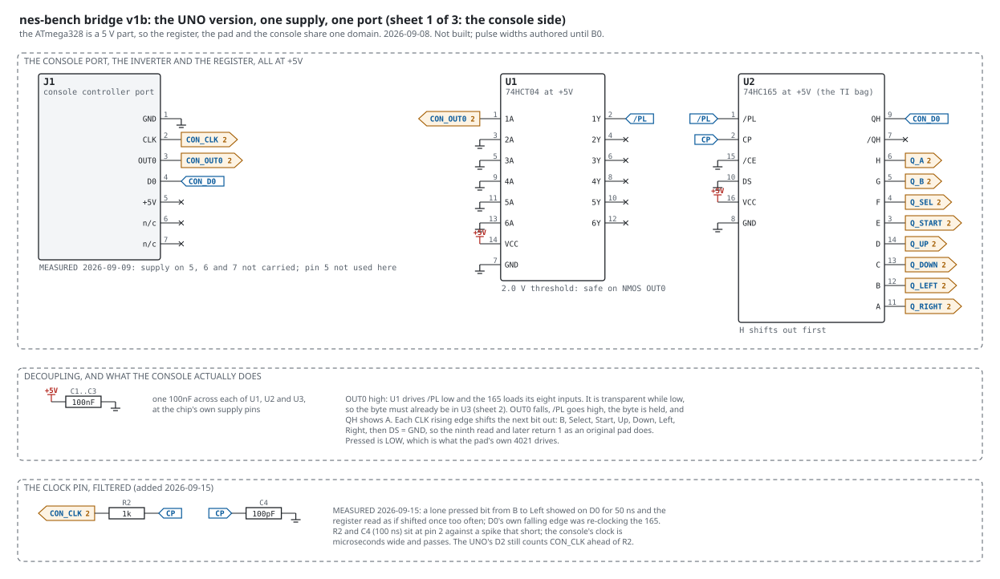
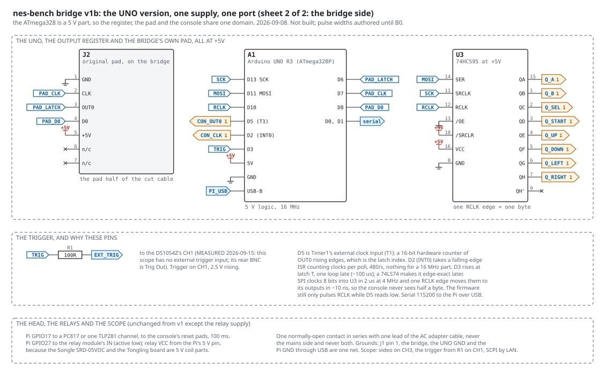
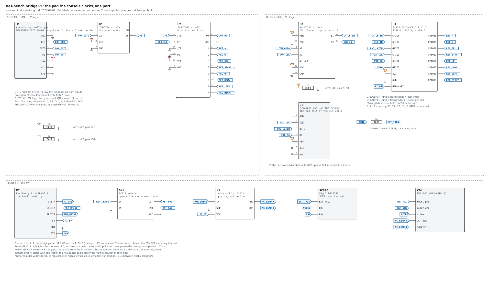
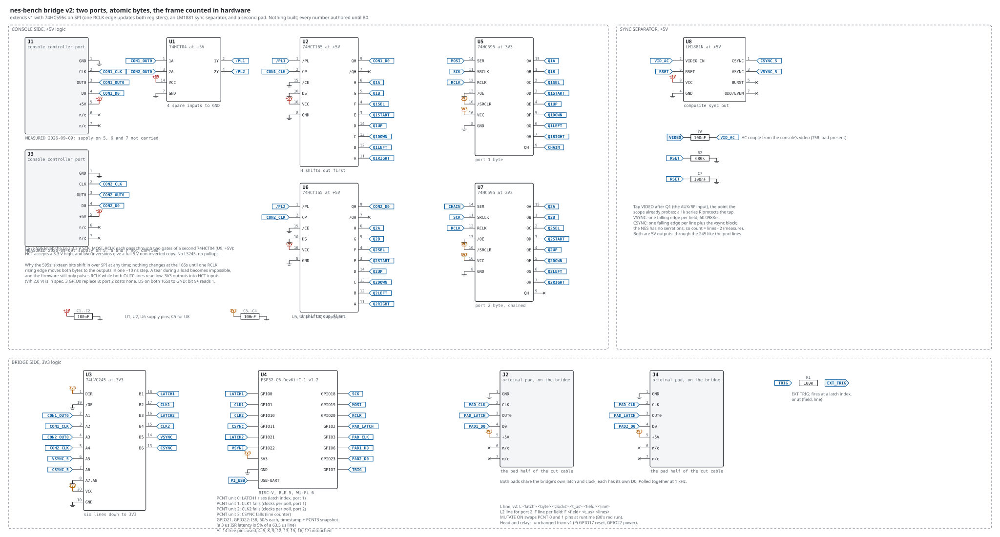
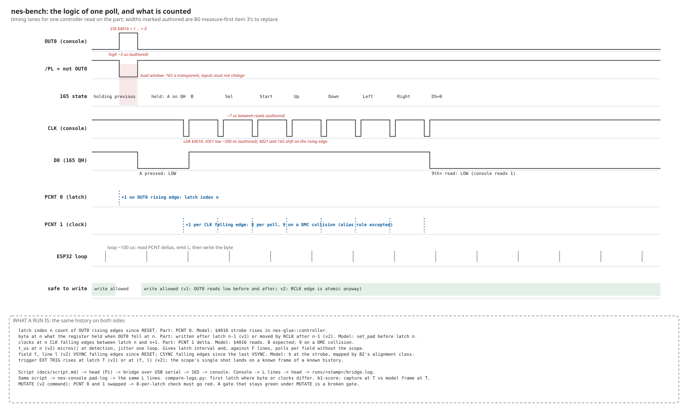
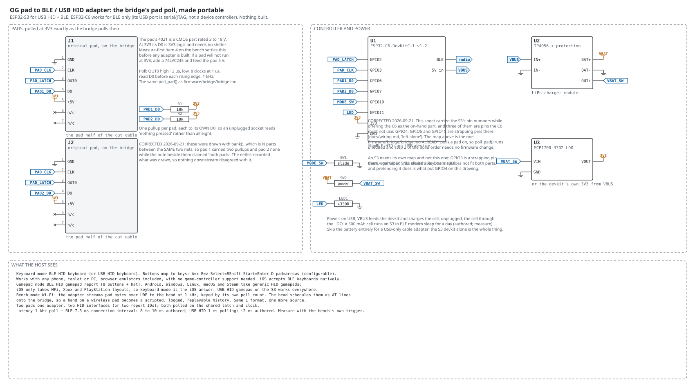

# nes-bench: schematics, parts, build order, the head's role, and the pad adapter

Drafted 2026-09-07 against `nes-bench` main (`docs/wiring.md` revised
2026-09-07, `firmware/bridge/bridge.ino`, `head/headd.py`), from the
bench's electronics review, and taken into the repository the same
day. Five drawings go with this document, all generated by
`tools/draw-schematics.py` so they can be regenerated after any table
change; `tools/check-sheets.py` holds the v1 sheet's every C6 pin to
`docs/wiring.md`, the v1b sheet's every UNO pin to
`docs/bench-v1b-uno.md`, and the committed SVGs to the generator, so no
sheet and its table can drift apart:

**Build v1b first.** The 74HC parts that arrived need a 3.5 V high at
5 V, which the C6's 3.3 V does not give; the UNO is a 5 V part and
removes every level shifter. `docs/bench-v1b-uno.md` is its document
and `firmware/bridge-uno/` its sketch. v1 below stays in the set as the
C6 version, for when v2's counters need it.

- `bench-v1b-1.svg` and `bench-v1b-2.svg`: the same bridge on an Arduino
  UNO, one supply, on two landscape letter sheets. No
  74LVC245 and no LS245 up-shifter: the UNO reads the console's OUT0
  and CLK directly and drives the 595 at 5 V.
- `bench-v1.svg`: the bridge exactly as `wiring.md` has it. One port,
  eight GPIOs to the register, a PC817 and a relay on the Pi.
- `bench-v2.svg`: the extended bridge. Two ports, the registers fed
  by 74HC595s over SPI so a byte changes in one edge, an LM1881 sync
  separator so every latch carries a field and line number.
- `logical-timing.svg`: one controller read on the part as timing
  lanes, the load window, what each counter counts, what a run *is*
  on both sides, and where the write is safe.
- `pad-adapter.svg`: an original pad to BLE or USB HID for phones,
  with a bench mode that feeds the head.

Regenerate with `python3 tools/draw-schematics.py docs/` (Python 3,
no dependencies); rasterise with cairosvg or rsvg-convert. The PNGs
are not committed.

Convention on all four: net-label schematics (same name, same wire),
three supplies and one ground, pressed = LOW at the register. Nothing
is built. Every timing width is authored until B0's measure-first
item 3 replaces it, and the sheets say so where the number appears.

## 1. v1: what is in `wiring.md`, drawn as a schematic

The v1 sheet adds nothing to the wiring document; it is the same pin
table in schematic form with two things made visible that a table
hides:

- The 165's load window. /PL is low for the whole time OUT0 is high,
  and the register is transparent then. The `logical-timing` sheet
  shades it. Any write to REG_A..REG_RIGHT inside that window can be
  latched half old and half new. The firmware review's fix (write all
  eight in one port store, only while OUT0 reads low before and after)
  is a v1 firmware change, no hardware, and is in `bridge.ino` now:
  one store to the GPIO output register, gated on OUT0 low before and
  after, deferred to the next loop otherwise (`STATUS` counts the
  deferrals); the loop reads the counters and logs the latch before it
  writes; and `MUTATE ON` puts the two counters on each other's lines,
  so B0's sabotage is a script line.
- The three supply domains as three rail symbols. +5V from J1 pin 7
  feeds U1 and U2 only; 3V3 from the C6 feeds U3 and the pad; the Pi
  feeds the C6 over USB. The only net that crosses all three is GND.

### v1 parts

| qty | part | on hand | note |
|---|---|---|---|
| 1 | ESP32-C6-DevKitC-1 v1.2 | yes | U4 |
| 1 | Raspberry Pi 4 Model B | yes | the head |
| 1 | 74HCT165 DIP-16 | | U2, at +5V |
| 1 | 74HCT04 DIP-14 | | U1, one gate used |
| 1 | 74LVC245 (DIP or SOIC on a breakout) | | U3, at 3V3 |
| 1 | PC817 optocoupler module | yes | OK1 |
| 1 | relay module, 3V3 logic input, contacts rated above the adapter's current | | K1, VCC from the Pi's 3V3 pin |
| 3 | 100 nF ceramic | | C1..C3 |
| 1 | 100 R | | R1, trigger |
| 1 | BNC to open-end cable | | to EXT TRIG |
| 1 | breakout or crimp pins for the controller harness header | | J1 |
| 1 | second controller-port housing with harness (the console's own) | yes | J2 |
| | breadboard or perfboard, 22 AWG wire, USB-C cable C6 to Pi | | |

### v1 build order

The order is chosen so nothing 5 V ever meets the C6 before it has
been measured.

1. **Meter, console off.** Continuity from each harness wire to its
   port pin at the board header. Write the colour table into
   `bench.local.md`. Colours are not evidence.
2. **Meter, console on, nothing plugged in.** Port pin 7 to pin 1 reads
   5 V; pins 2 and 3 read high; pin 4 reads high (pulled up by R14/R15
   through the 40H368).
3. **Scope, an original pad on the other port, a game running.** Latch
   pulse width, clock pulse width, clocks per poll, D0 idle and pressed
   levels. These four numbers replace every "authored" on the timing
   sheet.
4. **Build the console side alone:** U1, U2, C1, C2 on the board,
   powered from J1's +5V, nothing else connected. Tie U2's inputs H..A
   to a known pattern with wire links (say A and Start low, the rest
   high) and watch QH on the scope while a game polls the port. The
   eight bits appear in pad order after each latch, then LOW. This is
   measure-first item 6, and it proves U1 and U2 before the C6 exists.
5. **Build the bridge side alone:** U3, C3, the C6, J2. Power the C6
   from the Pi. Plug the pad into J2. `STATUS` over serial shows the
   pad byte following the buttons (`pad_byte`). This is measure-first
   item 4, and it settles whether the 4021 runs at 3V3.
6. **Join the two sides.** REG_* from the C6 to U2's inputs (remove
   the wire links from step 4), CON_OUT0 and CON_CLK into U3, GND
   between the planes. Console on, `MODE PASS`, a game: the L stream
   appears, 8 clocks per latch. That is B0's first check.
7. **Trigger.** R1 to EXT TRIG. `TRIG 300` and the scope's single
   shot fires. Sign of the horizontal offset gets settled here and
   written to the capture's `.toml`.
8. **Reset.** Meter the reset button's two pads (which is ground,
   what the other sits at). OK1's OUT to the pulled-up pad, GND to the
   ground pad, IN+ to Pi GPIO17. `RESET` in a script drops the console
   to latch zero; the L stream restarts.
9. **Power.** K1 in series with one lead of the adapter cable. Never
   the mains side. `POWER OFF` / `POWER ON` in a script.

## 2. v2: the extended bridge

Three changes, each independent, each with a reason the review gave.

### 2a. 74HC595 in front of each 165

Sixteen bits shift into the two chained 595s over SPI at any time; the
165s see nothing until one rising edge on RCLK moves both bytes to the
595 outputs in one step. The tear during a load becomes impossible
rather than unlikely, and the firmware's "only write while OUT0 is
low" check stays as belt to the braces. Three GPIOs (SCK, MOSI, RCLK)
replace eight, and a second port costs no pin at all.

The 595s run at 3V3 from the C6 and drive the HCT165 inputs directly:
HCT's Vih is 2.0 V, so a 3V3 high is a clean high. /OE to GND, /SRCLR
to 3V3.

### 2b. A second port

J3 on the console's other port header, U6 a second 165, U1's second
gate for /PL2, U3's A3/A4 for CON2_OUT0 and CON2_CLK. The second pad
J4 shares the bridge's own PAD_LATCH and PAD_CLK with J2 and has its
own D0. Two-player histories become one script with `AT` and `AT2`
lines and one log with `L` and `L2` lines.

### 2c. LM1881 sync separator

The console's composite video, AC-coupled into an LM1881 at +5V,
gives clean VSYNC and CSYNC outputs. Through U3 to the C6:

- VSYNC on a GPIO interrupt (60/s): the field counter, with a
  timestamp and a snapshot of the line counter.
- CSYNC on PCNT unit 3: the line counter. The NES emits no serration
  pulses, so the count per field is the line count minus a small
  constant; measured once, recorded, used.

Every L line then carries `<field> <line>`: the poll's position in the
frame, measured in hardware, which the model knows as `h` at the strobe
and B2's alignment class maps between. B0's polls-per-frame check closes
inside the bridge without the scope.

### v2 pin budget on the C6

Fourteen free pins, all used:

| C6 pin | role | peripheral |
|---|---|---|
| GPIO0 | LATCH1 (CON1_OUT0 rises) | PCNT 0 |
| GPIO1 | CLK1 (CON1_CLK falls) | PCNT 1 |
| GPIO10 | CLK2 | PCNT 2 |
| GPIO11 | CSYNC falls | PCNT 3 |
| GPIO21 | LATCH2 | GPIO ISR |
| GPIO22 | VSYNC | GPIO ISR |
| GPIO18, 19, 20 | SCK, MOSI, RCLK | SPI2 |
| GPIO2, 3 | PAD_LATCH, PAD_CLK (shared by both pads) | GPIO out |
| GPIO6, 23 | PAD1_D0, PAD2_D0 | GPIO in |
| GPIO7 | TRIG | GPIO out |

LATCH2 on an interrupt rather than a PCNT unit is the compromise: the
C6 has four units. A latch is 60/s and a 3 µs ISR latency is a
timestamp jitter of 5% of one scanline, which is acceptable for port 2
and stated. Port 1 keeps its hardware counter.

### v2 parts, delta from v1

| qty | part | note |
|---|---|---|
| 1 | 74HCT165 | U6, port 2 |
| 2 | 74HC595 DIP-16 | U5, U7, at 3V3 |
| 1 | LM1881N DIP-8 | U8, at +5V |
| 1 | 680 k | R2, LM1881 RSET |
| 2 | 100 nF | C6 (video coupling), C7 (RSET) |
| 1 | 1 k | series protection on the video tap |
| 4 | 100 nF | decoupling for U5, U6, U7, U8 (seven chips, seven capacitors in all) |
| 1 | breakout for the second port header | J3 |
| 1 | the console's other port housing and harness | J4 |

### v2 firmware, delta

- `write_register` becomes one 16-bit SPI transfer and an RCLK pulse,
  gated on both OUT0 lines reading low before and after.
- PCNT units 2 and 3; two GPIO ISRs that store `micros()` and the
  PCNT 3 count.
- `L n hh c t_us f l`, `L2 ...`, `F f t_us lines`.
- `AT2 n hh`, `TRIG n` unchanged, `TRIGF f l` new.
- `MUTATE ON|OFF`: reconfigure PCNT 0 and 1 to each other's GPIO. The
  8-per-latch check must go red with it on: B0's sabotage, scripted.
- Loop order: read counters, emit lines, then write. Fixed-size line
  buffer instead of `String`. A cursor into the schedule instead of a
  scan.

## 3. The Raspberry Pi's role

The Pi is the head. It is the only always-on Linux box at the bench,
and it does the four things the C6 cannot:

1. **USB host.** The C6 is a USB device (its UART port). Something has
   to be on the other end, reading the L stream and writing commands.
2. **Ethernet and SCPI.** The DS1054Z is driven over a raw TCP socket
   on the LAN. A 12 M point capture is 12 MB; the head reads it in
   chunks, writes the `.u8` and `.toml`, and serves the run directory
   over HTTP. The C6 has Wi-Fi but no storage for that.
3. **Relays.** Two 3V3 GPIOs (17 reset through the PC817, 27 power)
   with the isolation between them and the console handled by the
   modules. Keeping the relays on the Pi keeps 5 V and mains-adjacent
   wiring away from the C6 entirely.
4. **Orchestration.** `headd.py` plays one script line by line, keeps
   `head.log` and `bridge.log`, arms the scope before the trigger,
   waits for the capture, and stays up as a systemd service. The
   workstation can sleep mid-run; the run finishes.

The split is: **the C6 owns the microseconds** (writing the register
between polls, counting edges in hardware, raising the trigger at a
latch); **the Pi owns seconds and megabytes** (scripts, relays, SCPI,
captures, HTTP). Neither is in the nanosecond path; that is the 165's.

Could the C6 replace the Pi? It could drive the relays and could talk
SCPI over Wi-Fi. It cannot hold a capture, cannot be a USB host, and
its one loop would then be doing serial, TCP and timing at once. The
Pi costs nothing extra (it is on hand) and keeps the firmware small
enough to reason about. Keep it.

## 4. The pad adapter: original pad to BLE or USB HID

The bridge already contains the adapter: `poll_pad()` in
`bridge.ino` polls a real pad at 3V3 on three GPIOs. The adapter is
that function with a radio behind it instead of a shift register.

### Which ESP32

| | ESP32-C6 | ESP32-S3 |
|---|---|---|
| BLE HID (keyboard, gamepad) | yes, BLE 5 | yes |
| USB HID | **no**: its USB port is a serial/JTAG bridge, not a device controller | yes, USB OTG with TinyUSB |
| Bluetooth Classic | no | no |
| Wi-Fi (bench mode) | yes | yes |

The S3 is the right part for an adapter that should also work as a
cable: one devkit, no battery, USB HID gamepad or keyboard to any host.
The C6 works for a BLE-only adapter and is on hand, so a first
prototype can be a C6 with the bench firmware's `poll_pad` and a
NimBLE HID service, before an S3 is ordered.

### What the host sees, and why two modes

- **Keyboard mode.** A BLE (or USB) HID keyboard; buttons map to keys
  (A = x, B = z, Select = right shift, Start = enter, D-pad = arrows;
  configurable). Every phone, tablet and PC accepts a keyboard, and
  every browser emulator takes keys. iOS accepts BLE keyboards without
  any pairing app. This is the mode for phones.
- **Gamepad mode.** A HID gamepad report: eight buttons and a hat.
  Android, Windows, Linux, macOS and Steam accept a generic HID
  gamepad. iOS accepts only MFi, Xbox, PlayStation and Switch Pro layouts, so on
  iOS gamepad mode is not useful and the switch says so.
- **Bench mode.** Wi-Fi to the head: pad bytes over UDP at the poll
  rate, keyed by the adapter's own poll count. The head schedules them
  as `AT` lines onto the bridge, so a hand on a wireless pad becomes a
  scripted, logged, replayable history in the same L format. One more
  input source for B3's `record`, and a way to measure the adapter's
  own latency with the bench's trigger.

### Adapter parts

| qty | part | note |
|---|---|---|
| 1 | ESP32-S3-DevKitC-1 (or the C6 for BLE only) | U1 |
| 2 | controller-port housing with harness, or a 7-pin NES socket | J1, J2 |
| 2 | 10 k | pullups on D0, so an unplugged pad reads nothing pressed |
| 1 | slide switch | mode |
| 1 | LED and 330 R | status |
| optional | TP4056 charger module with protection, 500 mAh LiPo, MCP1700-3302 LDO, power switch | battery version only |

For a cable-only adapter the S3 devkit, two sockets and two resistors
are the whole thing.

### Adapter build order

1. Measure-first item 4 on the bench first: an original pad at 3V3
   follows its buttons. If it does not, the adapter needs a 74LVC245
   and 5 V to the pad, and the sheet says where.
2. Wire J1 to GPIO4, 5, 6 and 3V3/GND. Flash the bench's `poll_pad`
   and print the byte. Buttons appear.
3. Add the HID service (NimBLE on either chip; TinyUSB on the S3).
   Keyboard mode first, since a phone will show it working with no app.
4. Gamepad mode behind the switch.
5. Second socket on GPIO7, shared latch and clock.
6. Bench mode: a UDP sender and a `PAD` request on `headd.py`.
7. Battery last, and only if the cable version proves wanted.

Latency, authored, to be measured with the bench: 1 kHz poll plus a
7.5 ms BLE connection interval is 8 to 10 ms; USB HID at 1 ms polling
is about 2 ms. The measurement is the bridge's trigger on the adapter's
latch line against the host's first report, on the scope.

## 5. Notation used on the sheets

- **Net flag** (blue tag): the wire's name. Every pin with the same
  name is connected. `CON_*` is the console side at 5 V; `*_IN`,
  `LATCH*`, `CLK*` are the same signals after the 245 at 3V3; `REG_*`
  and `Q*` are register inputs; `PAD_*` the bridge's own pad lines.
- **Rail symbols**: red bar `+5V` (console), orange bar `3V3` (C6),
  ground symbol `GND` (the one shared net).
- **X on a pin**: not connected.
- **Pin numbers** are the DIP package's; the C6's are GPIO numbers.
- **Shaded red** on the timing sheet: the register's load window,
  when its inputs must not change. **Shaded green**: where a write is
  safe. **Dashed blue ticks**: the edges the PCNT units count.
- **Red italic**: an authored number, waiting for its measurement.

## 6. Amendments made on the double-check, 2026-09-07

- LM1881 pins 5 and 7 were swapped on the v2 sheet: pin 5 is the
  burst/back-porch output, pin 7 is odd/even. Both are unused (NC);
  the labels are now the datasheet's.
- The relay module's VCC on the v1 sheet was drawn on the C6's 3V3
  rail; it is the Pi's 3V3 pin (`PI_3V3`), as the wiring document
  implies by putting the relay on the Pi. The parts list says so.
- The authored latch-high width on the timing sheet was ~2 us; an
  LDA/STA pair between the two $4016 writes is about 6 CPU cycles,
  ~3.4 us, so it now reads ~3 us. Still authored.
- Build order step 4 was rewritten; it contradicted itself mid-sentence.
- v2 decoupling count corrected: seven chips, seven 100 nF, four new.
- iOS gamepad note now lists Switch Pro among the accepted layouts.
- `draw-schematics.py` takes an output directory argument instead of
  a hard-coded path.

Verified unchanged against the sources: 74HCT165, 74HC595, 74LVC245
and 74HCT04 pin numbers against their datasheets; every v1 net and
GPIO against `docs/wiring.md` (the 165's H..A on GPIO18..23, 10, 11;
the 245's B1/B2 on GPIO0/1; the pad on GPIO2, 3, 6; TRIG on GPIO7;
the Pi's GPIO17 and 27). The C6 has four PCNT units, which the v2
budget uses in full.
