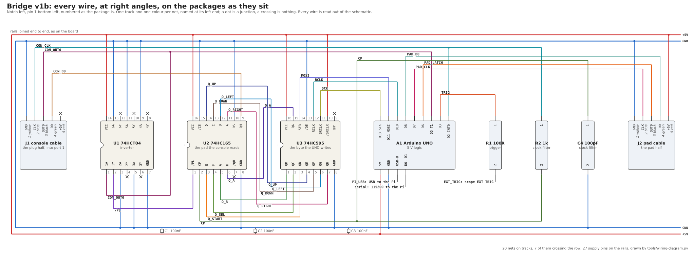
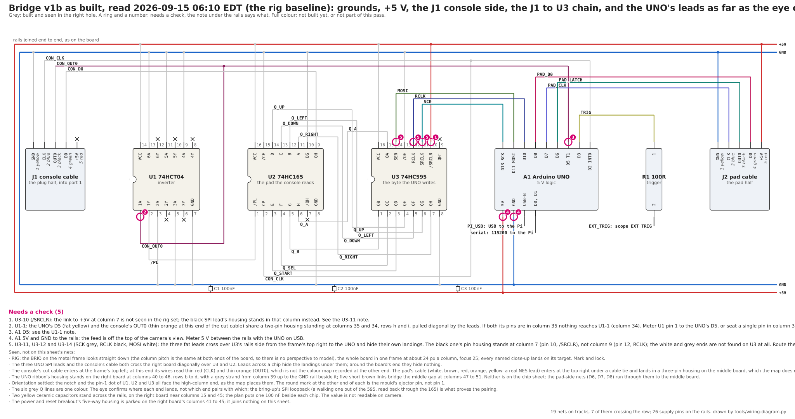
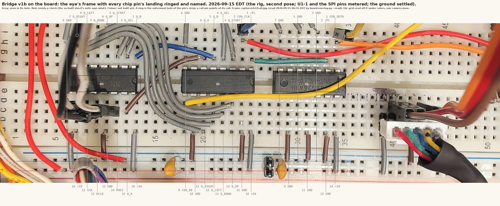
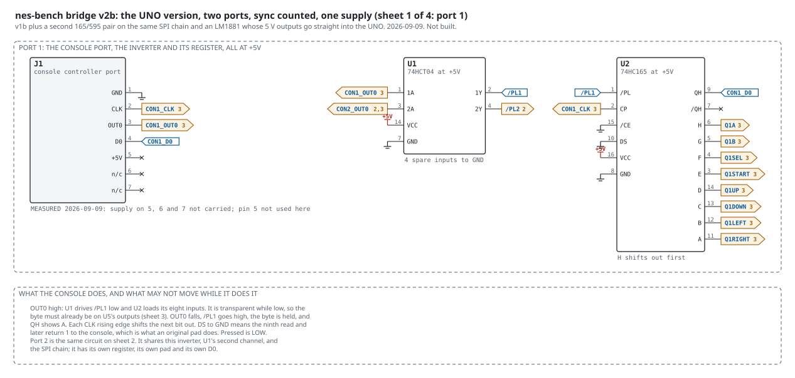
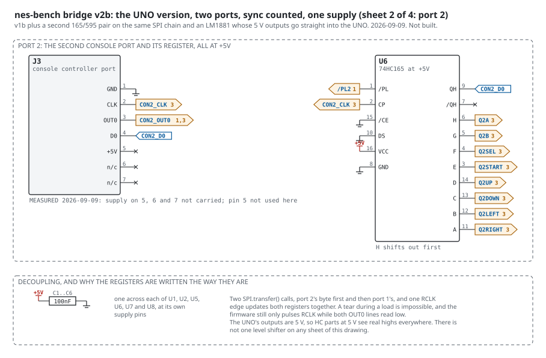
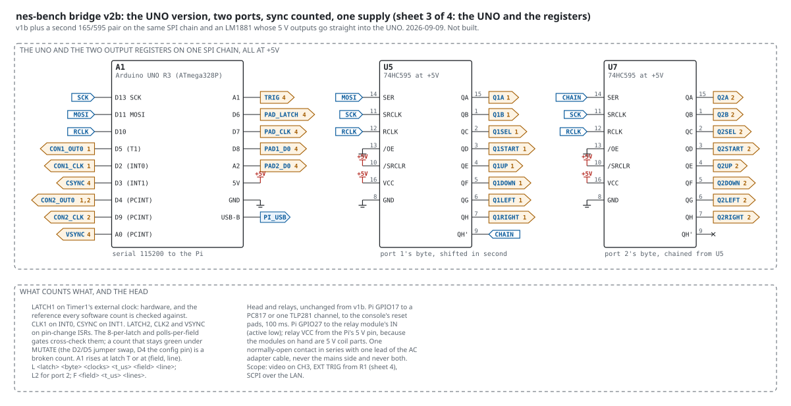
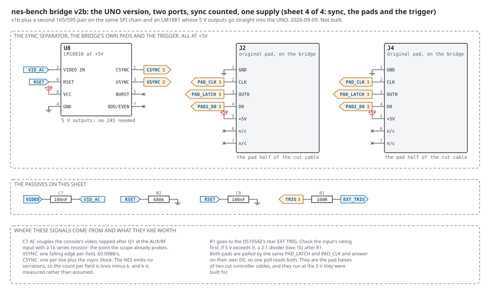

# v1b: the bridge on the Arduino UNO, all at 5 V

Added 2026-09-08 after the parts arrived. Supersedes v1 as the thing
to build first; v1 stays in the set as the C6 version for when v2's
counters need it.

## Why

The 74HC parts that arrived (HC165, HC595) need a 3.5 V high at
5 V. The ESP32-C6 gives 3.3 V. The UNO's ATmega328P is a 5 V part, so
with it in the middle every signal on the console side is 5 V and in
spec, and three things fall out:

- No 74LVC245: the UNO reads the console's OUT0 and CLK directly.
- No 74LS245 up-shifter with pullups: the UNO drives the 595 at 5 V.
- The pad is polled at the 5 V it was built for. Measure-first item 4
  (does the 4021 run at 3.3 V) no longer gates anything.

## Parts (all on hand)

| ref | part | from |
|---|---|---|
| A1 | Arduino UNO R3 | the pile |
| U1 | SN74HCT04N | the tube that arrived 2026-09-09. HCT: 2.0 V input threshold, safe on the 2A03's NMOS OUT0 |
| U2 | SN74HC165N | the TI bag |
| U3 | SN74HC595N | the box of 30 |
| C1..C3 | 100 nF | |
| R1 | 100 R (+ two 1 k if EXT TRIG needs a divider) | |
| J1 | console port header harness | |
| J2 | the console's other port housing | |
| | DIP-14 and DIP-16 sockets | the kit |

## UNO pins

| pin | function | why this pin |
|---|---|---|
| D13, D11 | SCK, MOSI to U3 | hardware SPI, 4 MHz, 8 bits in 2 us |
| D10 | RCLK to U3 | one rising edge moves the byte; pulsed only while D5 reads low |
| D5 | CON_OUT0 | Timer1 external clock input (T1): a 16-bit hardware counter of latch rising edges. Also readable as a level for the write gate |
| D2 | CON_CLK | INT0, falling-edge ISR: clocks per poll |
| D3 | TRIG | rises at latch T, one loop late |
| D6, D7, D8 | PAD_LATCH, PAD_CLK, PAD_D0 | the bridge's own pad poll, at 5 V |
| D0, D1 | serial to the Pi over the UNO's USB | 115200 |
| 5V, GND | the bridge's supply and ground | from the Pi through USB |

Timer1 in external-clock mode counts edges synchronously with the
16 MHz clock, so a pulse must be longer than one CPU cycle (62.5 ns)
to count; the console's latch pulse is microseconds. There is no
glitch filter; if the L stream ever shows a latch count that is not
one per poll, add a 100 pF to ground on D5 and record it.

## Firmware, delta from `bridge.ino`

The protocol in `docs/script.md` is unchanged, so `headd.py` and the
tools need nothing beyond the serial speed.

- `write_register(b)`: `SPI.transfer(~b)`, then if `digitalRead(5)`
  is LOW, pulse D10 high for one instruction and read D5 again; if it
  went HIGH across the pulse, flag the next L line. The complement is
  not cosmetic: pressed is LOW at the register. SPI is MSB first and
  the first bit sent travels furthest, so bit 7 sent first puts our
  bit 0 on QA, which is the A button. Reverse either and the pad is
  silently mirrored.
- Latch count: read `TCNT1` (16-bit), keep a 32-bit running total,
  handle wrap. Clock count: a volatile counter in the INT0 ISR.
- Loop order: read counts, emit L, then write. Fixed 64-byte line
  buffer, no `String`. Schedule cursor, not a scan.
- The schedule held 128 entries, not the C6's 2048. This part has
  2 KB of SRAM in total and the compiler is the authority: at 256 it
  reported 2161 bytes of globals, 105 percent, and refused to link; at
  128 it reported 1521 and left 527 for the stack. Since 2026-09-19 it
  holds 600, packed (the section below, "How the bridge works"). `tools/b3.py
  record` refuses a longer record before the run, `tools/fake-bridge.py`
  is bounded the same way so the failure can be rehearsed, and the head
  stops any run in which the bridge answers `# schedule full`.
- There is no `Serial.printf` on the AVR core and avr-libc's printf
  carries no 64-bit conversion, so the C6's `uint64_t` counters and
  `%llu` would have compiled to nothing useful. Every counter here is
  `uint32_t` and `%lu`: the latch index wraps after 2.2 years at 60
  polls a second.
- The L line stays at four fields, `L n hh c`. A timestamp is v2's
  `t_us` and does not belong here: `tools/b3.py`, `tools/compare-logs.py`
  and `head/headd.py` all require exactly four, so a fifth field would
  break the record, the comparison and the head's latch tracking at
  once. The head already timestamps what it receives.
- `MUTATE ON`: no jumper and no config pin. D5 is PD5, which is also
  PCINT21, so the latch line can raise a pin-change interrupt while
  Timer1 goes on counting it in hardware. Under MUTATE the clock
  counter is fed by that interrupt on rises only, and INT0 stops
  feeding it. That is B0's stated sabotage, the clock counter fed the
  latch line, done in software with nothing to forget to move back. A
  mutated run reports one clock per latch instead of eight, so the
  8-per-latch gate is red.

## How the bridge works: the UNO's job, its code and the ideas under it

This section is for a reader who wants to know what the Arduino is
actually doing between the console and the pad, line by line where it
matters. The sketch is `firmware/bridge-uno/bridge-uno.ino` with its
schedule in `schedule.h`; the head that drives it is `head/headd.py`.

### The job in one paragraph

The console believes it is reading a controller. The UNO makes that
true with a controller of its own choosing. It sits in the cut cable
between the console's port and an original pad, and does four things
at once: it presents a byte to the console exactly where a pad's
buttons would be; it counts every time the console asks for the
buttons (a poll, or latch), which gives the bench a clock that the
part and the model share; it reads the original pad itself, so a hand
can play through it; and it reports all of that to the head over USB
serial, one line per poll. What it presents is either the hand's byte
(`MODE PASS`) or a byte from a schedule the head loaded (`MODE
INJECT`). That is the whole trick behind replaying a person's play on
the console and on the model with the same inputs at the same polls.

### How a console reads a pad

An NES pad is one 8-bit parallel-in, serial-out shift register (a
4021) and eight buttons. The console reads it in three moves, all from
the game's own code:

1. **Strobe.** The game writes 1 then 0 to `$4016`; the console's
   `OUT0` line goes high and low. While it is high the register copies
   the eight buttons in; the fall freezes them. That fall is the
   latch, and the bench counts time in latches: latch 0 is the first
   poll after the bridge's `RESET`, and a Super Mario Bros. frame is
   one latch.
2. **Shift.** The game reads `$4016` eight times. Each read pulses the
   console's `CLK` line, and the register moves one bit onto the data
   line, in a fixed order: A, B, Select, Start, Up, Down, Left, Right.
3. **Active low.** A pressed button reads as 0 on the wire. The bench's
   byte is the other way up (bit 0 = A, set = pressed), and the
   firmware complements it on the way out.

The bridge's log line for each poll is `L <latch> <byte> <clocks>`:
the index, the byte the console was given, and how many clocks the
game spent reading it (eight for a normal poll, nine when a sample
fetch clocks the pad twice, which is a measured 2A03 behaviour).

### The two chips that stand in for the pad

The console must see a shift register that behaves like the pad's, so
the bridge has one: a 74HC165, wired where the pad's 4021 was, loaded
by `OUT0` and shifted by `CLK`, entirely by the console. The UNO never
touches its timing, which is the point: the console reads the bridge at
full speed with no software in the path.

The UNO sets the 165's eight parallel inputs through a second register,
a 74HC595, because the UNO does not have eight spare pins that change
together. The byte goes in serially over SPI (`SPI.transfer`), which
changes nothing yet, and one rising edge on `RCLK` (pin D10, the
`PORTB |= _BV(PB2)` line in `write_register`) moves all eight bits to
the 595's outputs at once. So the 165's inputs change in a single
62.5 ns step, never one bit at a time, and a poll can never read half
of an old byte and half of a new one from the shift.

Two details that were each a silent wrong answer if backwards: the
595's `QA` feeds the 165's `H`, and the 165 shifts `H` out first, so
`QA` is the A button; SPI sends the most significant bit first and the
first bit sent travels furthest, so sending bit 7 first leaves bit 0 on
`QA`. And the complement (`reg_byte_for`) is what makes a pressed
button a 0 on the wire. Reverse any one and the pad is mirrored.

### The load window

The 165 copies its inputs for the whole time `OUT0` is high. If
`RCLK` moved them inside that window, the console could latch a byte
in transition. `write_register` therefore reads the latch line before
the SPI transfer, after it, and after the `RCLK` edge: if the window is
open before the edge it defers the write to the next loop pass
(`deferred`), and if it opened across the edge it says so on the next
`L` line (`torn`). `STATUS` reports both counts; on the bench they have
stayed at zero.

### Counting without missing: a hardware counter and a snapshot

At 60 polls a second a missed latch is a replay one frame out of step
for the rest of the run, so counting cannot depend on the loop being
quick. The latch line is on D5 because D5 is `T1`, Timer1's external
clock input: set up as a counter (`TCCR1B = CS12|CS11|CS10`), Timer1
counts the latch's rising edges in hardware whatever the processor is
doing. The console's clock line is on D2, `INT0`, and an interrupt
counts its falling edges.

The same D5 pin also raises a pin-change interrupt (`PCINT21`). Its
handler asks Timer1 whether the count moved (a rise, not a fall, is
told apart by the counter rather than by reading the pin, because the
latch pulse is 3.6 microseconds wide and the interrupt can arrive after
it has ended), and if so it records, in the same instant, the clock
count at that rise (`clocks_at_rise`) and the number of rises. The
loop later reads that pair with interrupts off. Both rules were
measured into existence on 2026-09-15: reading the pin missed 7 of
1,202 latches, and reading the two counters a few instructions apart
booked clocks to the wrong poll.

### The loop

`loop()` runs about every 100 microseconds, in a fixed order:

1. **Commands.** Bytes from the serial port are gathered into a 64-byte
   line buffer and each complete line is handled (`handle`).
2. **The pad.** Once a millisecond the UNO polls the original pad on
   its own three pins (`poll_pad`, the same strobe-and-shift the
   console does, at leisure), keeping the result as `pad_byte`.
3. **Book the polls.** If the interrupt has seen new latch rises, the
   loop prints the `L` line for the poll that just ended, with the byte
   the register held for it and the clocks between its rise and the
   one before; then it advances the latch index. Printing before
   writing a new byte is what makes the `L` line's byte the one the
   console actually read.
4. **The trigger.** If `TRIG n` is armed and latch n has passed, D3
   goes high for a millisecond: the scope's trigger, on CH1.
5. **The byte.** In `PASS` the wanted byte is the pad's; in `INJECT`
   it is the schedule's for the current latch. If it differs from what
   the register holds, `write_register` changes it.

### The line protocol

The head talks to the bridge in short text lines at 115200 baud, and
the bridge answers each with a `#` line: `MODE PASS|INJECT`, `SET hh`
(the byte to hold now), `AT n hh` (from latch n on, hold hh; n must
not go backwards), `TRIG n`, `RESET` (zero the counters, clear the
schedule and the trigger), `STATUS`, and `MUTATE ON|OFF` (B0's
sabotage: the clock counter fed from the latch line, so the
eight-clocks check must fail). A line it cannot parse comes back as
`# ? ...`.

The head waits for each line's answer before it sends the next, and
checks that an `AT`'s answer carries the latch and byte it sent. It did
not always: on 2026-09-18 a hand's record of 125 `AT` lines, sent back
to back, overran the UNO's 64-byte receive buffer, some lines came back
`# ?`, others were taken with digits missing (`AT 2219 00` as `at 2210
00`), and Mario ran the wrong way on the replay while every check stayed
quiet. The head also drops its count of latches when it sees the
bridge's `# reset`, so a `WAIT n` after a reset cannot be satisfied by
the session before (the cold-boot "Start is ignored" finding of the same
day was exactly that).

Waiting for every echo made loading slow: a whole minute's schedule,
290 lines, takes about 15 seconds. So the head holds the console in
reset from `RESET` through the `SET`, `AT`, `TRIG` and `ARM` lines that
follow and lets it go at the first other word (after half a second at
least), and latch 0 is still the release. Before that, the replay's
`TRIG 1000` arrived at latch 1060, the bridge fired it at the next latch
as it was built to, and two captures of the game 60 frames on read as a
divergence. A `TRIG` whose latch has already passed now stops the run.

### The schedule, packed

`AT n hh` means: from latch n on, hold hh, until the next entry. The
protocol keeps n absolute, and so do the head, the tools and the C6
build. Only the UNO's RAM holds it differently, because it has 2048
bytes in total and the first build spent five of them per entry (a
32-bit latch and a byte), which held 128 entries. A minute of a hand
playing Super Mario Bros. through 1-1 is 289 changes of the byte.

`schedule.h` stores each entry as two bytes: the GAP in latches from
the previous entry (0 to 254), and the byte. A gap of 255 or more is
paid for with FILLER entries, each "advance 255 latches, change
nothing" (the gap value 255 is reserved for them), so a filler never
has to name a byte. `append` converts an absolute n into fillers and an
entry, refusing whole if they do not fit (`# schedule full`) and
refusing an n before the last one. `due` walks a cursor forward as the
latch index grows, adding up the gaps, and applies every entry whose
latch has come; it copes with the index jumping by more than one,
which happens when the loop was busy.

What paid for the room:

| build | entry | entries | globals | left for the stack |
|---|---|---|---|---|
| to 2026-09-18 | 5 bytes | 128 | 1533 bytes | 515 |
| packed | 2 bytes | 320 | 1615 | 433 |
| packed, strings in flash | 2 bytes | 320 | 967 | 1081 |
| packed, strings in flash (flashed) | 2 bytes | 600 | 1527 | 521 |

The second row is the surprise worth knowing about the AVR: a plain
string literal is copied from flash into RAM at boot, so every message
the sketch prints cost RAM, and two new messages cost 82 bytes. Every
literal now stays in flash (`F("...")`, `PSTR`, `snprintf_P`,
`strcmp_P`; a flash string passed to `%` needs `%S`), which gave back
648 bytes. The schedule then grew until the stack had what the old
build ran on.

The compiler's figure is an estimate of the stack; the firmware
measures it. `setup` paints the free RAM between the globals and the
stack with `0x5A`, and `STATUS` counts how much paint is still intact
(`# stack N bytes never touched`). After a full minute's schedule was
loaded and replayed it read 355 bytes never touched: the stack's
deepest reach was about 130 bytes.

The packing is tested off the chip. `tools/test-uno-schedule.sh`
builds `schedule.h` natively and plays 400 random schedules (gaps from
0 to 2000, entries past latch 254 so fillers come first, latch indices
that jump) and any real record against the protocol's absolute
meaning, latch by latch, plus the capacity edge; `MUTATE=1` makes a
filler set the byte to zero and must fail (it fails 384 of 402).
`tools/b3.py record` counts a record in packed entries by the same rule
(`entries_for`), and `tools/fake-bridge.py` refuses the same records the
UNO does.

### What the bridge still cannot do

It holds 600 entries, about two minutes of lively play; longer needs
the C6 bridge's 2048 or a schedule streamed from the head during the
run. It does not watch the console's data line (D0 is not wired back),
so what the console actually shifted out is inferred from the register
and the clock count, not read. And it serves one port: the second
controller is not bridged.

## The wiring, drawn to build from

The same drawing with the build's state on it, from `docs/build-status-v1b.json`
(dated, read off the bench's eye): grey is built and seen right, a ringed number
needs a check and the note under the rails says what, full colour is not built yet.

And the same state on the photograph: the eye's frame of the right
breadboard, every chip pin's landing ringed and named with its net,
grey, pink and colour as on the sheet (`tools/board-overlay.py`, the
hole grid read off the frame once in `docs/board-map.json`, one camera
pose).

Each chip is its package seen from above, notch left, pin 1 bottom
left, numbered as the package is; every wire is horizontal or vertical,
one track and one colour per net, named at its left end, a dot where
wires join and nothing where they merely cross. Drawn by
`tools/wiring-diagram.py` from the same netlist as the wiring list, so
it cannot show a wire the schematic lacks or lack one it has, and the
tool refuses to draw a pin the schematic does not know. It replaced the
breadboard picture as the sheet to build from on 2026-09-10: that
picture still says which hole each part goes in (`breadboard-v1b.svg`),
and its curved jumpers are what this one straightens out. The same
day the inverter's five spare inputs went onto the schematic as pins
tied to GND rather than a note, so the wiring list now says to tie them.

## Build order (replaces v1's)

1. Meter the harness (unchanged).
2. Meter the port with the console on (unchanged).
3. Scope the original pad in the other port for the four pulse widths
   (unchanged; these replace every authored number).
4. U1 + U2 + wire links on H..A, console on, QH on the scope: the
   pattern appears in pad order. Proves the console side alone.
5. UNO + U3 + J2, console off: `STATUS` shows the pad byte following
   the buttons; `SET 08` puts 08 on U3's outputs (meter them).
6. Join: U3 outputs to U2 inputs, D5 and D2 to J1 pins 3 and 2, GND
   to GND. Console on, `MODE PASS`, a game: L lines, 8 per latch.
7. Trigger, reset, power as before.

## What v1b gives up

- The C6's 50 ns glitch filter and its second hardware counter. The
  UNO has one external timer input free (T0 is used by `millis`).
- Wi-Fi and BLE on the bridge. Irrelevant; the Pi is the head.
- v2's six counted lines. Those go on the classic ESP32 (8 PCNT
  units) when v2 is built, with the UNO still owning the 5 V register
  and pad side. Two microcontrollers, each in its own voltage domain,
  joined only by the Pi's USB.

## v2b, the UNO version of v2, added 2026-09-09

`bench-v2b-1.svg` to `bench-v2b-4.svg` are one schematic on four
landscape letter sheets: v1b plus a second 165/595 pair on the same SPI
chain and an LM1881 whose 5 V outputs go straight into the UNO. It
removes the last 74LVC245 from the UNO designs and it removes the second
microcontroller: every count lands on the UNO, Timer1's hardware input
on LATCH1 and interrupts for the rest. The README that came with the
sheets says to build v1b, then v2b.

The board for these sheets is placed and routed: two layers, ground
poured on the back and supply on the front, every net carried, and no
unconnected item or clearance violation on the finished file. The
fabrication set and what it was checked against are in
`docs/fab/bench-v2b/README.md`.

Two things about it are open, and both are named here rather than drawn
as settled:

- **Its L line has six fields**, `L <latch> <byte> <clocks> <t_us>
  <field> <line>`, plus `L2` for the second port and an `F` line per
  field. This document already records that a fifth field breaks
  `tools/b3.py`, `tools/compare-logs.py` and `head/headd.py`, all of
  which require exactly four. v2b therefore cannot be built without a
  protocol version and three tools updated together, and that is a
  decision, not an oversight. The four field line is v1b's and stays.
- **The CSYNC load is authored.** The sheet says 15.7 kHz on INT1 is
  about 5 percent of a 16 MHz part. That is arithmetic, not a
  measurement, and it is the number that decides whether one UNO can
  carry all six counted lines. Measure it before trusting it.

## Amendments made when the firmware was written, 2026-09-08

The sketch is `firmware/bridge-uno/bridge-uno.ino`, and it compiles:
8,018 bytes of flash, 24 percent, and 1,521 bytes of SRAM, 74 percent.
Writing it settled six things this document had left open or wrong, and
the bullets above now say what was built rather than what was planned.

- `SPI.transfer(b)` had to become `SPI.transfer(~b)`, and the bit order
  through the 595 into the 165 had to be reasoned about rather than
  assumed. Both are silent-mirror bugs.
- The `micros()` field would have broken three tools that require four.
- The MUTATE jumper and its D4 config pin are not needed; PCINT21 on
  the latch line does it in software.
- The schedule does not fit and never could; 128 is measured, not
  chosen, and three places now refuse rather than truncate.
- The 64-bit counters do not exist on this part.
- The relay modules on hand are 5 V coil parts with opto inputs, so the
  v1 sheet's 3.3 V rail was wrong for them too; both sheets now show
  the Pi's 5 V pin and an active-low input.

One part changed after all of that, 2026-09-09: **U1 is an SN74HCT04N
now, not an HC04.** HCT's input threshold is 2.0 V rather than HC's
3.5 V, which is what makes it safe on the 2A03's NMOS OUT0 output, and
the "LS04 until measured" hedge this document carried is gone with it.
The same part does the C6 sheets' 3.3 V to 5 V job in two gates, so no
LS245 and no pullups remain anywhere in the set.

One correction that came from the instrument rather than the compiler:
both sheets put the console's video on the scope's CH1. It is on CH3.
That is where `scope-capture.py` has always defaulted, it is where the
probe actually sits (measured 2026-09-07, 1,512 sync pulses), and CH1
is B2's master-clock channel, so the drawing was claiming the one
channel the alignment classifier needs for something else.
