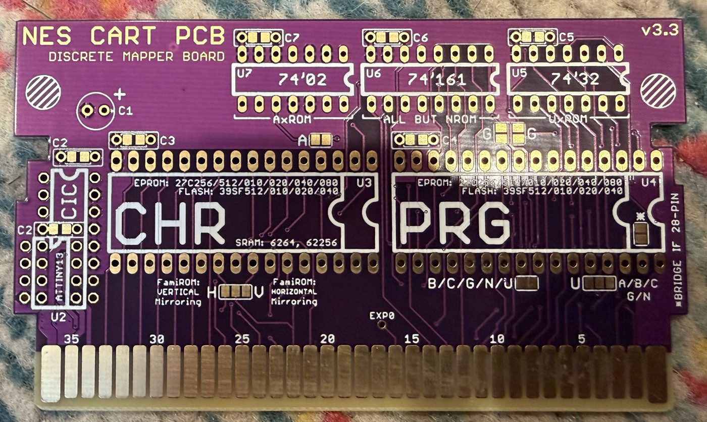
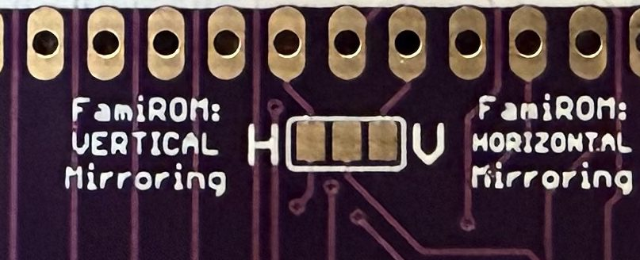
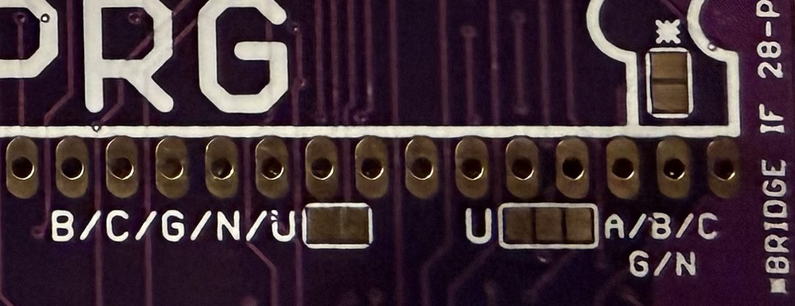
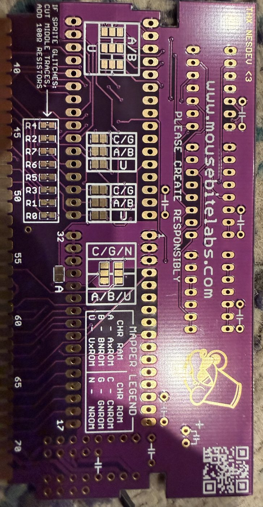
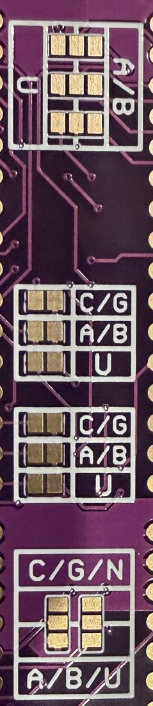
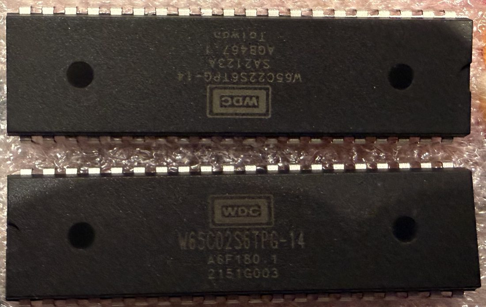
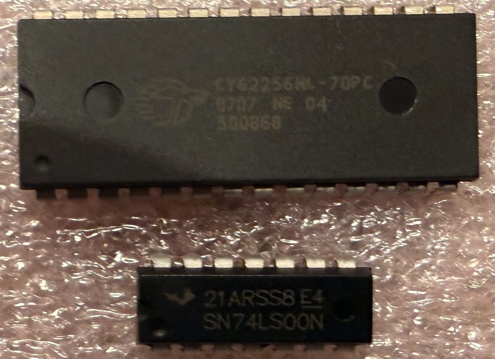
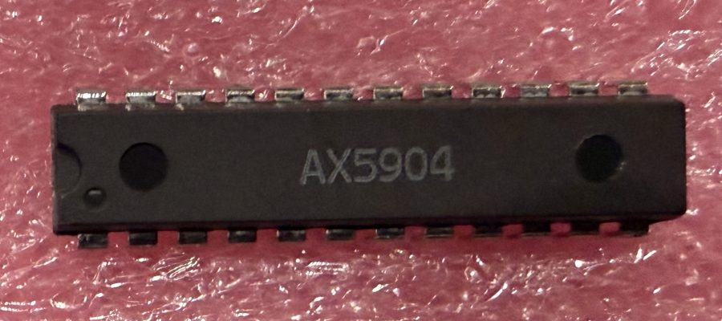
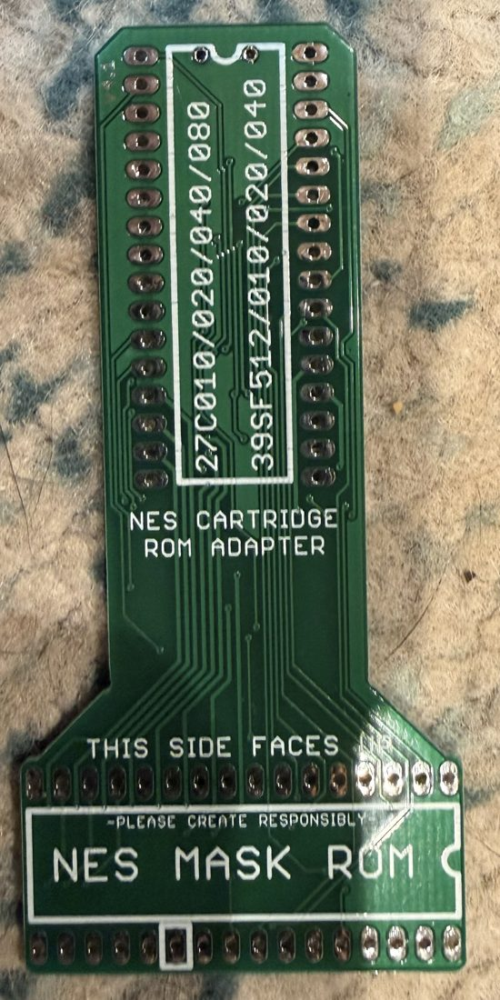

# The calibration cart: the build, as it goes

Started 2026-09-30, the evening the flash chips reached the bench. The
plan is `calibration-plan.md` (the part side of C0), the recipe is
section 8 of `build-the-cal-cart.md`, and the blank boards are in
`cart-blanks.md`. This page is the record of the build itself: what was
done, in order, what each step said back, and what is still open. It
grows as the build goes, and a step is marked held only when something
was measured.

## Where the build stands

| step | what it proves | state |
|---|---|---|
| The programmer answers | the bench can write a chip at all | held 2026-09-30 |
| Chip 1 identifies, and is blank | the part is an SST39SF040 and not a relabelled one | held 2026-09-30 |
| Chip 1 carries `prg.bin` | the program image is on the part, whole | held 2026-09-30 |
| Chip 2 identifies, is blank, and carries `chr.bin` | the tile image likewise | held 2026-09-30 |
| The first board: five bridges, three capacitors, two chips | a cart exists | built 2026-10-01; a gray screen in the console |
| Both chips read whole after the first board | the gray screen is not the chips | held 2026-10-01 |
| The second board | a cart whose soldering is not in question | open: the checklist is below |
| The console's lockout is defeated | a cart with no lockout chip can run at all | by eye 2026-10-01: the gray was steady; not yet off the reset line (`lockout.md`) |
| The reader's dump | what the console will see is `cal.nes`: body crc32 `21091B99` | open |
| The cart in the console | the strip reads off a grabbed frame (`tools/cal.py grab`) | open |

## The programmer is on the bench Pi, driven by minipro

The tutorial was written for the vendor's Windows program. What was
used is `minipro`, on the Pi that already sits on the bench, because
that is where the programmer's USB lead reaches and it keeps the burn
a command that can be read back afterwards.

- **The programmer** enumerates as a TL866II Plus (MEASURED 2026-09-30,
  off its USB descriptor), firmware 04.2.83. `minipro` expects 04.2.132
  and says so on every run; it is a warning, and every read and write
  below went through on the older firmware.
- **`minipro`** is 0.7.4, built on the Pi from
  `gitlab.com/DavidGriffith/minipro`. The repository of the same name
  on GitHub is an older tree (it calls itself 0.2-dev) that does not
  know this programmer or this chip; it builds, installs and then
  answers "Unknown device", which reads like a fault in the bench.
- **The device name** is the bare `SST39SF040`. The names with a
  suffix are the PLCC and TSOP packages.

```bash
minipro -p SST39SF040 -D                 # the chip's ID; the part's is 0xBFB7
minipro -p SST39SF040 -b                 # blank check, the whole chip
minipro -p SST39SF040 -w prg.bin         # erase, write, verify
minipro -p SST39SF040 -r readback.bin    # then sha256sum it beside the image
```

`minipro -t` is the programmer's self-test and **must be run with the
socket empty**: it drives the programming voltage onto the pins one at a
time. It was run here with chip 1 seated, because its warning was lost
in a pipe. The chip identified, erased, wrote and verified afterwards,
so nothing shows for it, but that is luck and not a procedure.

## The first chip: two wrong seatings, then the part's own ID

Seated the first time, every ID read tripped the programmer's
overcurrent protection (four of four, MEASURED 2026-09-30), and the one
blank check that got further read an ID of 0x0000. Reseated, the
overcurrent was gone and the ID read 0xFFFF three times; a read of the
whole chip returned 524,288 bytes of 0xFF. Reseated again, the ID read
0xBFB7 twice and the blank check passed over the whole chip.

Two things worth keeping from that:

- **A full read of 0xFF cannot tell a blank chip from an empty
  socket.** Only the ID can, because the part answers the ID command
  whether or not it is blank. Read the ID first and believe nothing
  else until it is right.
- **Overcurrent on the ID read is a seating fault until proven
  otherwise.** The chip that tripped it four times is the chip that now
  carries the program. What exactly was wrong with each seating was not
  recorded; the rule that ended it is the tutorial's: the chip in the
  32 positions farthest from the lever, the notch toward the lever, the
  eight positions nearest the lever empty.

## The first chip carries the program image

`tools/nesprep.py roms/cal.nes` wrote the two images, and their sha256
are the ones in the tutorial's table (checked before anything was
written). Chip 1 was written with `prg.bin`: the programmer's own
verify passed, a separate read of the whole chip hashed equal to the
image (MEASURED 2026-09-30), and the ID read 0xBFB7 afterwards. It is
the PRG chip and goes in U4.

Why the whole chip is compared and not the first 32 KiB: the image is
tiled sixteen times to fill the part, so a short or relabelled die
verifies in the low pages and fails only higher up.

## The second chip carries the tile image

Chip 2 went in seated right the first time: ID 0xBFB7, blank over the
whole chip, then `chr.bin` written, the programmer's verify passed, a
separate read of the whole chip compared equal to the image byte for
byte and hashed to the tutorial's figure, and the ID read 0xBFB7
afterwards (all MEASURED 2026-09-30). It is the CHR chip and goes in
U3. Here the image is tiled sixty-four times, so the whole-chip
comparison matters more than it did for the program.

Both chips are now what the tutorial's table says they should be. They
are identical to look at, so each is marked before it leaves the
programmer: PRG for U4, CHR for U3.

## The board takes five solder bridges for NROM



The board is the v3.3 discrete mapper board. Its letters are on its own
back, in a legend: A is AxROM, B is BNROM, U is UxROM (the three with
CHR RAM), C is CNROM, G is GNROM, N is NROM (the three with CHR ROM).
The calibration ROM is NROM, so every jumper whose label carries an N
is made, and every one whose label does not is left open. READ OFF THE
SILKSCREEN 2026-09-30; not yet proven on the part. What proves it is
the reader's dump.

| side | jumper, as labelled | for this cart |
|---|---|---|
| front | H, V (mirroring) | middle pad to **H** |
| front | B/C/G/N/U (two pads) | bridge |
| front | U against A/B/C G/N (three pads) | middle pad to the A/B/C G/N side |
| front | BRIDGE IF 28-PIN (two pads inside U4's outline, starred) | open: the chip has 32 pins |
| front | A (two pads, above CHR) | open |
| front | G, G (four pads, above PRG) | open |
| front | EXP0 | open |
| back | C/G/N against A/B/U, two columns of three pads | middle pad to the C/G/N side, on both columns |
| back | C/G, A/B, U (two blocks of three two-pad jumpers) | open, all six |
| back | A/B against U (the block by the CHR rows) | open |
| back | A (two pads by pin 32) | open |
| back | R0 to R7 | leave the traces as they are |



**The mirroring letters are backwards, and the board says so in
words.** `cal.nes` has vertical mirroring. The pad marked H has
"VERTICAL Mirroring" printed beside it and the pad marked V has
"HORIZONTAL Mirroring", and the board's guide admits it: "Solder the
middle pad to either H (for vertical mirroring) or V (for horizontal
mirroring). Yes, I know it's backwards". So it is H, by the words and
not by the letter. The picture never scrolls and uses one nametable, so
the wrong pad would show the same screens; the board and the file
should agree anyway.







The close-up runs down the back between the ROM rows: the A/B against
U block, the two blocks of C/G, A/B and U, and at the bottom the one
that matters here, C/G/N over A/B/U, whose two columns each get their
middle pad joined to the upper one.

On the back, the resistor positions R0 to R7 carry a note: if sprites
glitch, cut the middle traces and add 100 ohm resistors. That is a
repair for a fault not yet seen, so nothing is cut.

## The parts the board takes for this cart

From the board's guide
(<https://mousebitelabs.com/2020/09/11/nes-reproduction-quick-guide-custom-pcb/>)
and its silkscreen. The values are the guide's; none has been measured.

| position | part | for this cart |
|---|---|---|
| U4 | SST39SF040 carrying `prg.bin` | fit: chip 1 |
| U3 | SST39SF040 carrying `chr.bin` | fit: chip 2 |
| C1 | about 22 uF electrolytic, 10 V or more, polarised (the + is marked) | fit |
| C3, C4 | about 0.1 uF ceramic, 10 V or more, one beside each ROM | fit |
| C2 | about 0.1 uF ceramic, beside the lockout chip's position | fit, or leave with U2 |
| U2 | the lockout chip (a CIC, or an ATtiny13 programmed as one) | empty: the console's lockout is said to be defeated, and `lockout.md` is how that gets measured |
| U5, U6, U7 | 74'32, 74'161, 74'02 | empty: marked for UxROM, "all but NROM" and AxROM |
| C5, C6, C7 | their capacitors | empty with them |

The capacitors are not in the pile photographed on the day; they come
from stock. A pair of 32-pin sockets at U3 and U4 would let a chip go
back to the programmer when the ROM is revised; whether a socketed chip
clears the shell has not been checked.

## The first board gave a gray screen, and it was not the chips

The first board was assembled on 2026-10-01 and went into the console
bare, without a shell. **Which way up a bare board goes:** chip side
up. In a front-loader the cartridge goes in label up, "pins 01-36 are
the top side of the connector", and on an NES cartridge "most chips and
components appear on the label side" (nesdev, Cartridge connector, read
2026-10-01). This board agrees with that: its edge is numbered 5 to 35
on the chip side and 40 to 70 on the back. A bare board has no shell to
key it, so it fits upside down and a pin to either side, and pin 36 is
+5 V with ground at 72 across from it.

Powered on, the screen was gray: steady, not blinking (the owner's
report the next day).

Both chips then came off the board and back to the programmer. Each
identified (0xBFB7), and each read back with no byte differing from
its image: the one in U4 was `prg.bin`, the one in U3 was `chr.bin`
(MEASURED 2026-10-01). So the chips were right, in the right
positions, and unharmed by the board or the console. The program
image's reset vector reads $8000 at the top of every one of its
sixteen copies, which is where the console starts.

That leaves two things, and they are being taken separately:

- **The board.** Its builder's verdict on the soldering was that it
  was poor, and a second board is being built. The two bridges beside
  the program ROM are the ones that would stop the program being read
  at all.
- **The console.** This cart has no lockout chip, so it runs only on a
  console whose lock is out of the way, and that had been taken on
  trust. What the lock does to a keyless cart, how to tell by eye, and
  a measurement of the reset line are in `lockout.md`. A steady gray
  is not the lock's signature: a live lock blinks. This one was
  steady, so the lock is not what stopped the cart, and the board is.

The step the tutorial puts before the console was skipped here and
should not be next time: the reader's dump reads the two halves
separately and takes the console's connector out of the question.

## The second board, in the order it is soldered

The two tables above, as one list to work down at the bench. Nothing
here is new; it is the jumper table and the parts table in the order
that makes the work easier, and the checks that come before a chip
goes in.

| part | position | note |
|---|---|---|
| 32-pin socket, then the PRG chip | U4 | notch to the outline's notch |
| 32-pin socket, then the CHR chip | U3 | notch to the outline's notch |
| about 22 uF electrolytic, 10 V or more | C1 | long leg in the hole marked + |
| 0.1 uF ceramic | C3 | beside CHR |
| 0.1 uF ceramic | C4 | beside PRG |
| nothing | U2, U5, U6, U7, C2, C5, C6, C7 | left empty |

Five bridges are made:

| side | jumper, as labelled | do |
|---|---|---|
| front | H, V | middle pad to H |
| front | B/C/G/N/U | join the two pads |
| front | U against A/B/C G/N | middle pad to the A/B/C G/N side |
| back | C/G/N over A/B/U, left column | middle pad to the C/G/N pad |
| back | C/G/N over A/B/U, right column | middle pad to the C/G/N pad |

Left open: the starred BRIDGE IF 28-PIN pads inside U4's outline, the
front A and G G pads, EXP0, and every other jumper block on the back.
Nothing is cut; the R0 to R7 traces stay as they are.

The order:

1. **The five bridges first**, while the board lies flat. Look at the
   starred pads inside U4's outline before going on: the socket covers
   them, and they have to be clean.
2. **The two ceramics.**
3. **The sockets.** Tack two diagonal corner pins, check the socket
   sits flush and its notch is the right way, then the rest.
4. **The electrolytic last**, long leg to the +.
5. **Before a chip goes in, the meter.** Pin 32 to pin 16 of each
   socket is +5 V to ground and must read open. Each of the five
   bridges reads closed, and on each three-pad jumper the side that was
   not made reads open.
6. **Chips in**, PRG in U4 and CHR in U3, then the reader before the
   console.

On a three-pad jumper, flux both pads and use one small blob, kept
away from the third pad. If a blob will not span the gap, a clipped
piece of component lead laid across and soldered does.

The iron, as advice and not as anything measured here: a
temperature-controlled iron of 60 to 70 W and not a soldering gun (the
wattage is for holding temperature against this board's copper, not
for running hotter); 320 to 350 C with leaded 63/37 rosin-core solder,
350 to 380 C with lead-free; a small chisel tip, about 1.6 to 2.4 mm,
because a needle point passes heat poorly; solder of 0.6 to 0.8 mm; two
to three seconds a joint, heating pad and pin together and feeding the
solder into the joint.

## The rest of the pile is for other builds

| item | marking | what it is | where it belongs |
|---|---|---|---|
| Mapper 30 board | NES CART PCB (MAPPER 30) v1.2 | a flash and CHR RAM board | not this cart (`cart-blanks.md`) |
| SxROM board | NES CART PCB (SxROM) v3.1 | an MMC1 game board with save RAM | not this cart (`cart-blanks.md`) |
| 24-pin chip | AX5904 | the part the SxROM board names at its mapper position, beside MMC1 | the SxROM board's U5 |
| Black adapter | TL866, mousebitelabs v3.2 | seats 40 and 42-pin EPROMs in the programmer | not needed: a 32-pin chip sits in the programmer's own socket |
| Green adapter | NES CARTRIDGE ROM ADAPTER, NES MASK ROM | carries a 27C or 39SF part into a mask ROM's position on an original board | a donor-board build, not this one |
| 40-pin chip | WDC W65C02S6TPG-14 | a CMOS 6502 processor | not an NES part; a 65C02 computer's |
| 40-pin chip | WDC W65C22S6TPG-14 | a 65C22 interface adapter: two ports and two timers | the same computer's |
| 28-pin chip | CY62256NL-70PC | 32 KiB of static RAM, 70 ns | the CHR position of a CHR RAM board (both purple boards list 62256 there); not this cart, whose tiles are ROM |
| 14-pin chip | SN74LS00N | four two-input NAND gates | none of these boards: the discrete board takes '02, '161 and '32 |









The processor, the interface adapter, the RAM and the NAND are the
usual set for a breadboard 65C02 computer (a reading of the pile, not
something anyone said). The W65C02 is the CMOS part and not the NMOS
6502 whose die the simulator runs.

## What is open

- The lockout off the reset line: it is answered by eye, and
  `tools/lockout-check.py` would make it a record (`lockout.md`).
- The second board: five bridges, the capacitors, the two chips.
- The reader's dump of the finished cart, whose body crc32 must be
  `21091B99`. It is also what proves the jumper table above.
- The cart in the console, and the strip read off a grabbed frame.
