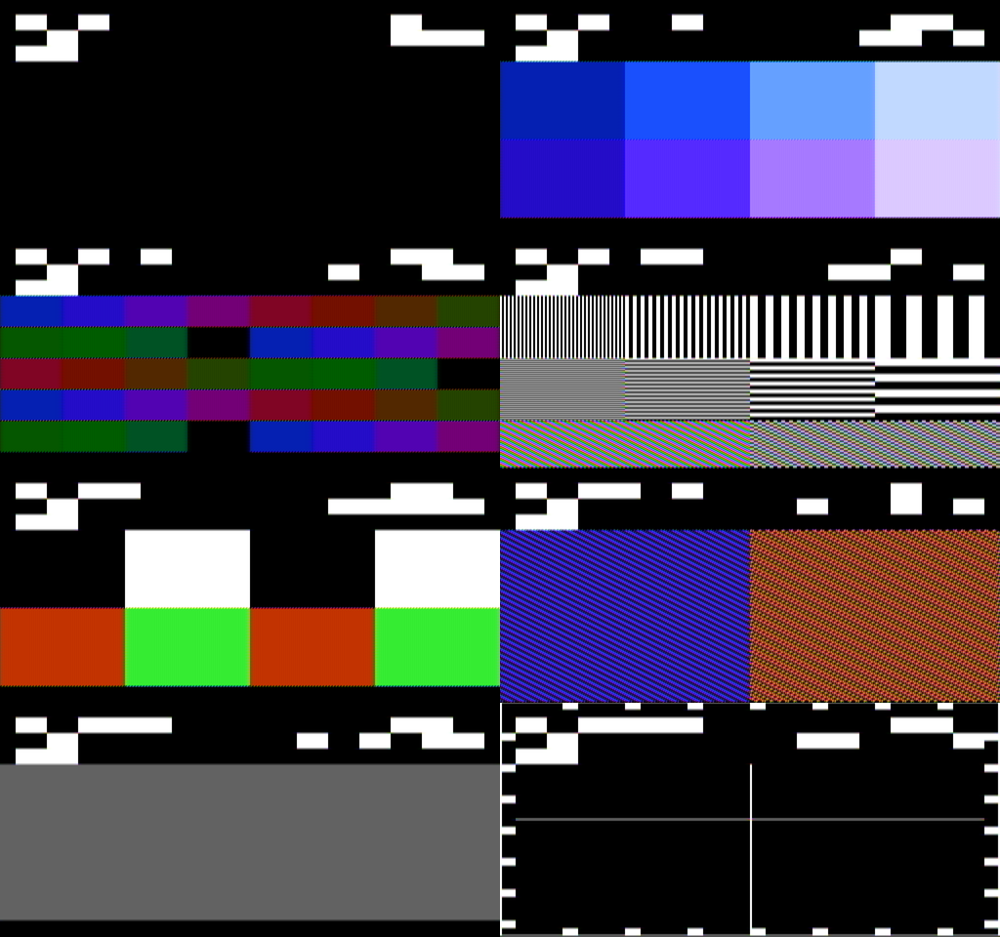
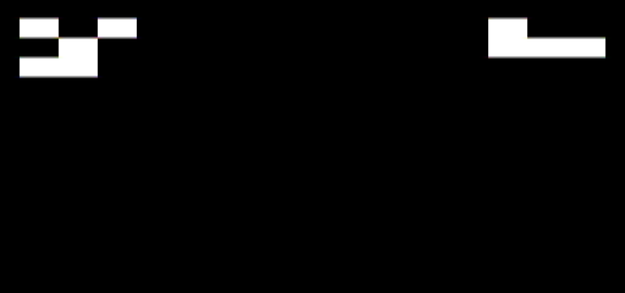
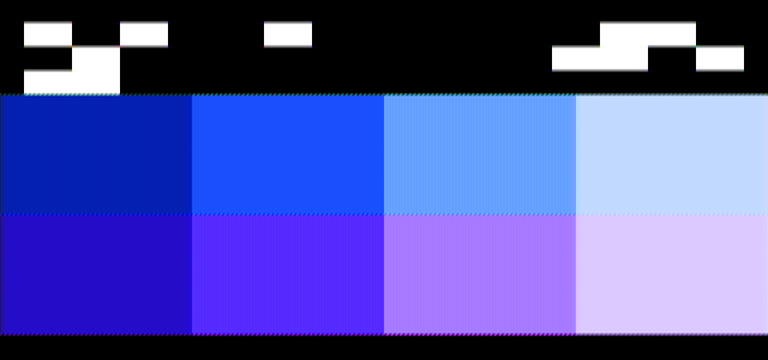
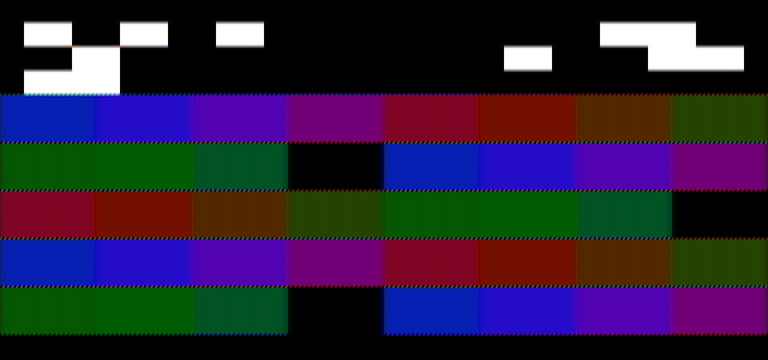
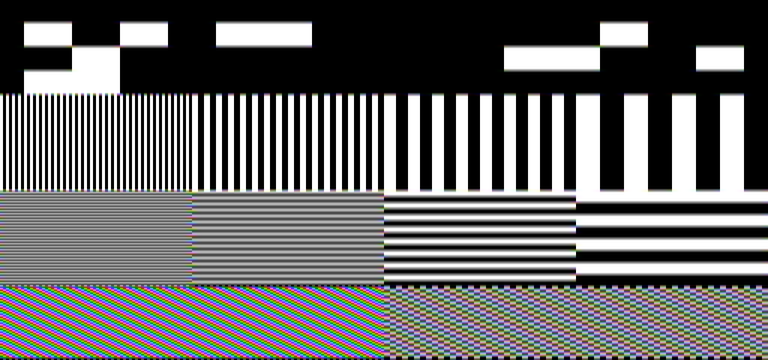
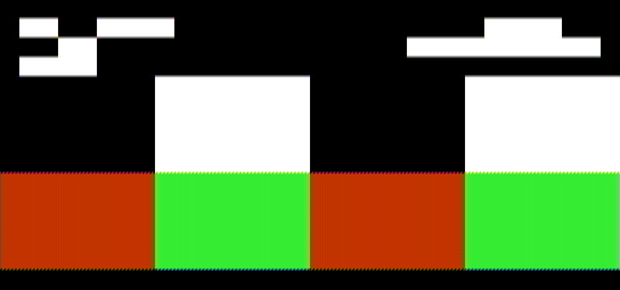
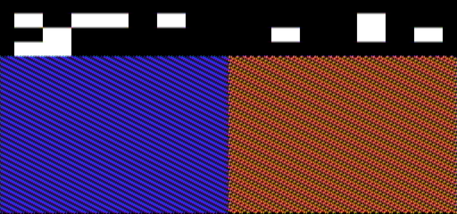
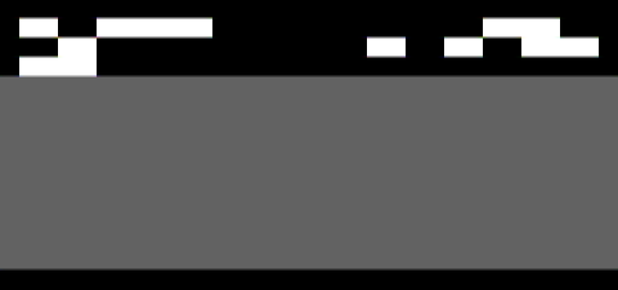
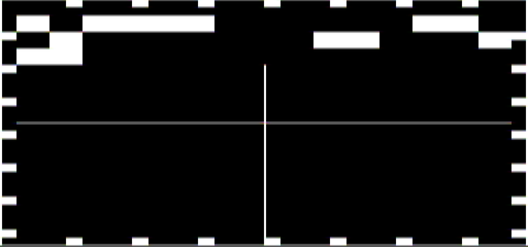

# The calibration screens

The eight screens of the calibration cartridge (`calibration-plan.md`,
`build-the-cal-cart.md`) as the family's own decoder sees them: the
console model runs `cal.nes`, presses Select as a hand would, and every
frame goes through ntsc-crt's NES source and decoder, the same chain a
scope record is decoded with. MEASURED 2026-09-13, `nes` @ 35cfe6e,
`cal-screens`. Each picture is the decoded grid reduced to the console's
256 by 240 dots; the strip along the top was read off each by the same
reader (`tools/cal.py`) that reads the part's frames.

Left to right, top to bottom: strip, palette, bars, gratings, edges,
dot crawl, pad, geometry. The strip on each reads screen 0 to 7,
variant 0, hold set (the hand pressed Start first), the frame counter
six frames apart.

## The strip

Three rows of fifteen blocks, each two tiles square. Row A: the sync
pattern `101`, the screen id, the variant, the hold flag, a parity bit.
Row B: `010` and the frame counter's low twelve bits. Row C: `110`, the
counter's top four bits, and the byte the console read from the pad at
its last poll. White is palette entry `$30`, black `$0F`, the two the
decoder reads with the least chroma error. A frame with no readable
strip is refused by the tool, never guessed at.

## Palette

Eight patches, 64 by 80 dots, two rows of four. This is page 0 of
seven: hues 1 and 2 at the four lumas. The variant steps every sixty
frames through seven pages and eight emphasis states, so every one of
the 64 entries shows, in every emphasis, over the cycle. The scorer's
synthetic roundtrip reads all eight of a page within the plan's
tolerances; the part's reading is what C1 is for.

## Bars

Forty 32-dot cells in the slot order of the original bars cartridge,
eleven hues a variant over eight variants (luma, then which eleven of
the twelve), so every hue shows at every luma. This is variant 0, the
darkest luma.

## Gratings

Vertical lines at 1, 2, 4 and 8 dots across the top band, horizontal
at the same pitches across the middle, a 1-dot and a 2-dot
checkerboard below. The decoder already shows what a 1-dot vertical
grating does at NTSC's bandwidth: the left band is a grey field with
colour in it, which is the point of the screen.

## Edges

Black and white fields 64 dots wide, then red and green: luma steps
both ways, and a chroma step, with wide flats either side for the
settling.

## Dot crawl

The 1-dot checkerboard in blue on the left, the 2-dot in orange on the
right. Through the decoder each is a flat colour field with the crawl
in it.

## Pad

One field, grey with nothing pressed and green with any button; the
strip's third row echoes the byte. The echo lands two frames after the
blanking that polled the pad, on the part and the model alike.

## Geometry

A one-dot border at the picture's edge with a full tile every 32 dots
as a tick, and a one-dot crosshair through the centre.

## The part's frames

None yet. When the cartridge is in a console (`cart-blanks.md`), the
grabber's frames of these screens go here beside the model's, read by
the same tool, with the strip's screen and frame under each.
