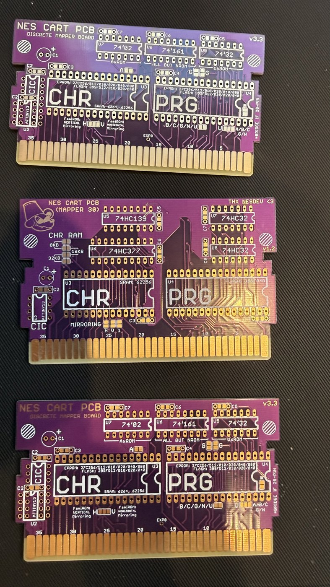
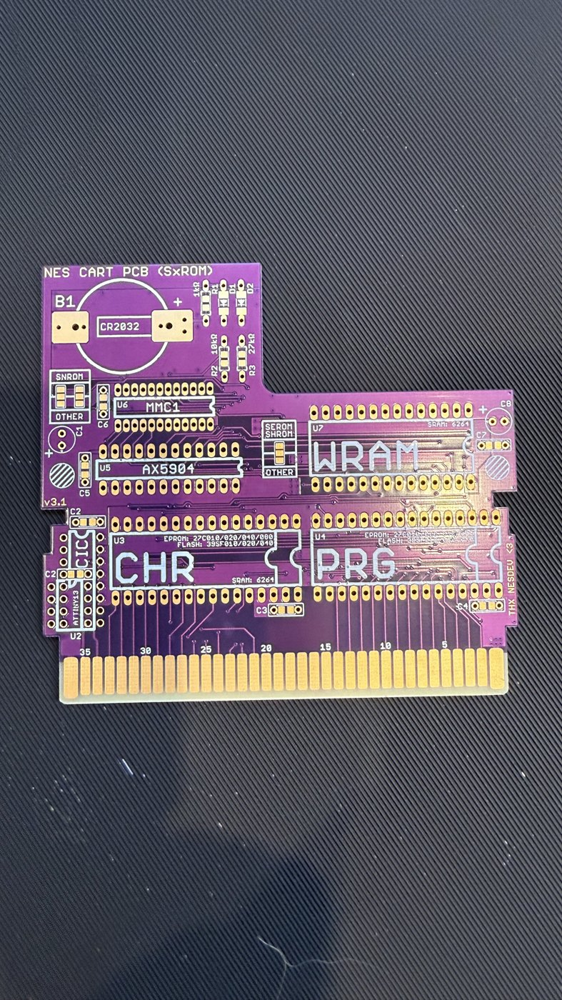
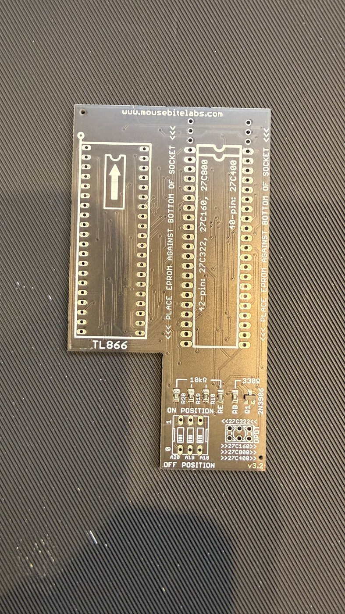
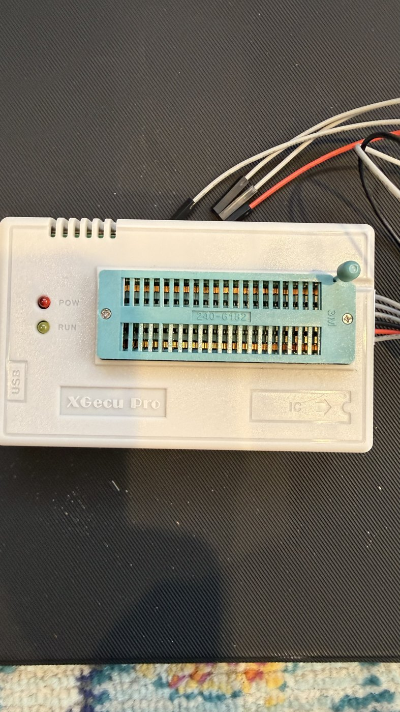

# The cart blanks, and the programmer

Photographed 2026-09-13 on the bench, the day the calibration ROM was
built and before its chips arrived. What each board is, read off its
own silkscreen, and what it means for `cal.nes`: an NROM image, 32 KiB
of program and 8 KiB of tiles (`build-the-cal-cart.md`). Nothing here
has been soldered or programmed yet; that is the open half of C0 in
`calibration-plan.md`.

## The discrete mapper boards, and a mapper 30 board

Two copies of a board marked NES CART PCB, DISCRETE MAPPER BOARD, v3.3:
footprints for a CHR ROM and a PRG ROM, a CIC, three logic parts
(74'02, 74'161, 74'32) whose rows are marked for which mapper they
serve (AxROM, UxROM, "all but NROM"), a mirroring jumper marked H and
V, and a row of letters (B, C, G, N, U) for the mapper families the
board takes. For the calibration cart this is the board: **NROM needs
no logic part fitted**, only the two ROMs, the CIC question settled,
and the mirroring jumper set (the ROM never scrolls and uses one
nametable, so either setting shows the same picture; the file declares
vertical for the model).

Between them a board marked NES CART PCB, MAPPER 30, v1.2, with
74HC139, 74HC377 and 74HC32 and a CHR RAM footprint marked 8 KB, 16 KB
and 32 KB. Not for this ROM: mapper 30 is a flash-and-CHR-RAM board.

## An SxROM board

NES CART PCB (SxROM), v3.1: an MMC1 position marked MMC1 and AX5904, a
WRAM footprint, a CR2032 holder for the save RAM, CHR and PRG ROMs and
a CIC. A game board, not a test board; the calibration ROM would need
its mapper registers written, which it does not do.

## The EPROM adapter for the programmer

An adapter from mousebitelabs.com, v3.2, that sits in a TL866-class
programmer's socket and takes 42-pin (27C322, 27C160, 27C800) and
40-pin (27C400) EPROMs, with the instruction to place the EPROM against
the bottom of the socket, and switches for A20, A19 and A18 marked with
their ON and OFF positions. Those are large parts for banked boards;
the calibration ROM's two images are 32 KiB and 8 KiB, which are
27C256-class and 27C64-class parts and sit in the programmer's own
socket without an adapter.

## The programmer

An XGecu Pro (the TL866 family) with a 40-pin ZIF socket, its USB lead
and the two jumper wires that came with it. This is what writes the
two images `dd` splits out of `cal.nes` into the ROMs.

## What is not known yet

- Which ROM parts will be fitted (EPROM or flash, and their sizes), and
  so where in a larger part the 32 KiB image goes: at the top, so the
  vectors land at `$FFFA`.
- Whether the console is a front loader, which wants the CIC satisfied
  on the board, or a top loader, which does not.
- The reader's dump of the finished cart, whose body crc32 must be
  `21091B99` (MEASURED 2026-09-13 on the exported file).
