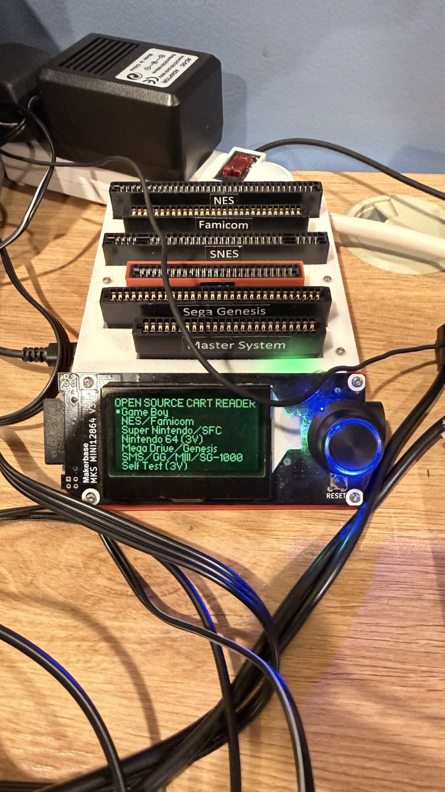
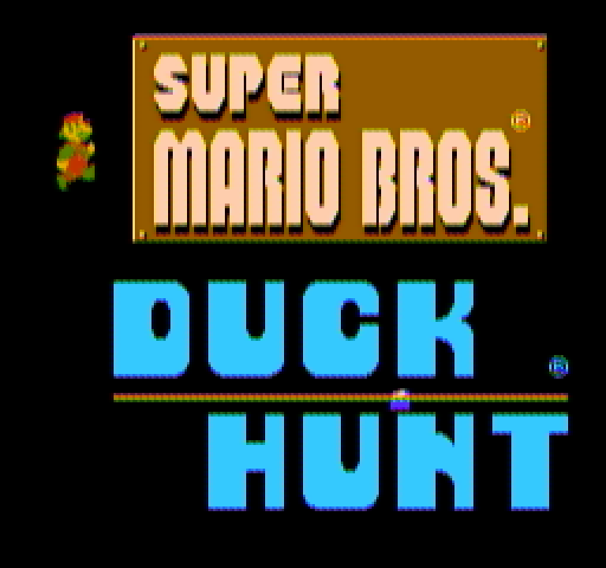
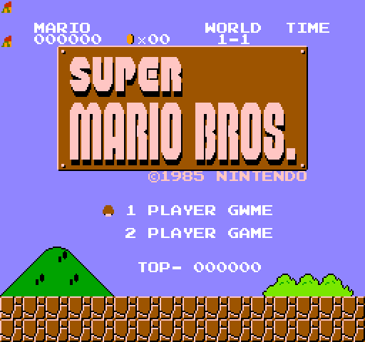

# The cartridge in the model: from the reader to the third picture

Added 2026-09-12. To compare the console against the model on a real
game, the model has to run the same bytes. That means the cartridge on
the bench dumped, its dump verified, and the console taught the board
the cartridge uses. This page is that path, and the third picture it
opened: the model's frame of the title beside the two the bench already
had, the scope's decode and the grabber's.

## The reader

The bench's cartridge reader is an OSCR (Open Source Cartridge Reader,
HW5) flashed with firmware V15.6, on the Pi's `/dev/ttyUSB0`. Its
screen and dial drive it; the serial channel is the firmware updater
only, so a dump is a hand on the dial and the file leaves on the SD
card.

The cartridge is Super Mario Bros. and Duck Hunt on one board, the
game the console had in it for the picture tests. The reader guessed
wrong first, and the way it guessed is worth keeping. It identifies a
cartridge from a checksum of 512 bytes read at two fixed addresses,
not from the whole ROM. On this board that window matched plain Super
Mario Bros., so the reader offered that entry and read with that game's
sizes, mapper 0, 32 KB of program and 8 KB of characters. The result's
checksum matched nothing: it had read one bank of a two-bank board, the
other half `FF`. "CRC not found" was the reader being honest about a
half-read image, not a broken cartridge.

## The card, and the dump that checked out

Two things had to be true. First the reader's database had to know the
cartridge: the card still carried the old firmware's database, so it
was refreshed from the Pi (`card-plan.md`; a USB card reader on the Pi,
the 45 files copied and read back identical, `nes.txt` from 9,330 lines
to 22,143). Then the read had to use the right board. On the reader:
Change Mapper to 66, 64 KB program, 16 KB characters, then Read iNES
Rom rather than Read PRG/CHR, so the reader switches both program banks
and both character banks itself and writes a headered `.nes` file.

That dump is 81,936 bytes, and its checksum is the database's own:

| | |
|---|---|
| CRC32 (body) | `D26EFD78` |
| database name | Super Mario Bros. + Duck Hunt (USA).nes |
| mapper | 66 (MHROM) |
| program | 4 x 16 KB = 64 KB |
| characters | 2 x 8 KB = 16 KB |

A named cartridge is not a checked one until the checksum matches; this
one does. It was banked off the card into the workstation's ROM store
(never a repository) with a manifest recording all of the above.

## The board the model had to grow

The console's model knew one cartridge board, NROM (mapper 0): program
and characters wired straight to the buses, nothing switched. This
cartridge is mapper 66, GxROM: one write-only register selects which
32 KB bank of program and which 8 KB bank of characters the buses see.
So the model gained that board (`nes-bus` gained `Gxrom`), with the one
detail that makes it the part rather than a description of it: the
board has no protection against a bus conflict, so a write to the
register is ANDed with the ROM byte at the address it lands on, exactly
as the silicon does it, which is why games write bank numbers to
addresses whose ROM already holds that number. The change moved
through the family's crates by version so the console and the picture
encoder still share one frame type, and every repository's tests stayed
green.

## Three pictures of one title

With the dump in the model and the board under it, the console's title
screen exists three ways: the scope's record decoded by the family's
own decoder, the grabber's frame, and now the model's own render
through the same decoder chain.

The two eyes agree, as the previous page found: on this static title,
flat blocks to 0.57 of 255 and hue to 0.7 degrees. The model against
them is the new measurement:

| | flat blocks, mean abs difference | hue median, saturated pixels | luma correlation |
|---|---|---|---|
| model against the scope decode | 0.67 of 255 | 12.6 degrees | 0.95 |
| model against the grabber | 1.26 of 255 | 14.1 degrees | 0.95 |

The flat blocks agree because most of a title screen is black; the
saturated colours do not. The logo brown is (148, 92, 0) in the model
against (132, 73, 0) off the scope and (121, 69, 0) off the grabber;
the lettering cyan is (59, 200, 251) in the model against about
(45, 200, 205) and (67, 202, 202). Two different decoders on the one
composite signal agree to a degree of hue, and the model sits twelve to
fourteen degrees off both, bluer in the cyan and warmer in the brown.

The full three-panel picture, and the reasoning about which stage of
the model's picture chain is the odd one out, is on the eyes-versus-scope
page. What this page records is how the third picture became possible:
a cartridge read correctly, verified against the checksum the reader
itself keys on, and a board added to the model so it runs the bytes the
console runs. The measurement it produced, the model's hue against the
part with two witnesses, is the bench doing the job it exists for.

## The first trace, and the tile it found

With the cartridge in the model, the next step of the plan was to make
a console run into files the 6502 stack reads: the CPU at its pins
every half-cycle in the pin crate's own format, the input pins as a
stimulus file, and an events file for what the console knows and the
pins do not (frame ends, every latch of the pad with its byte and its
reads, every PPU register write with its dot and line, every write into
ROM space, every NMI edge). The tool is the console's `trace` example;
the trace plan on this site records its gates and how they were run.

The first run of the family's cartridge was three hundred frames with
Start pressed at the two-hundredth latch. The events file showed the
multicart's menu flipping its CHR bank twice a frame to animate, the
bank switch to the Super Mario Bros. program on Start, and sprite DMA
as it looks at the pins: two hundred and fifty-six writes to $2004
after every write to $4014. The last frame was the title screen, with
one tile wrong.

`1 PLAYER GWME`. The events file located the write: the byte sent to
$2007 for that tile was $20, the letter W, where the ROM's string, read
out of CHR-ROM through $2007 a moment earlier, carried $0A, the letter
A. The pins walked it back: the byte came from an `LDA ($00),Y` whose
pointer and index crossed a page, and the CPU read the un-carried
address, $0300, and never did the fixed-up read at $0400 where the A
had been stored. Five instructions reproduced it on the 6502
repository's own lockstep of the switch-level chip beside the fast
rung: after `INY`, the fast rung chose its variant of the next
instruction by asking Y as stored, one instruction stale, because the
result of the increment was still in the ALU's hold register and lands
one half-cycle later. The switch-level chip has no such question to
ask; the carry falls out of the transistors with the right Y.

None of the ladder's own oracles had this sequence: the pin golden's
opcode traces set their registers by loads, and the instruction test
ROMs never pair an index increment with a crossing form. The fix is in
the 6502 repository with twenty-two register-then-crossing pairs, in
both directions, held to the switch-level chip, and a mutation that
asks the stored register and goes red on the nine that matter. A first
version of that fix passed a one-sided test (every case in it crossed)
and jammed this cartridge's menu by frame nine; the same trace, run at
the two revisions and diffed line by line, named the half-cycle, and
five instructions reproduced that too. Rebuilt on the second, the same
run reads:

That is what the trace is for. A commercial cartridge is a program no
context was written for, and the first one found a defect in the fast
rung that a golden as wide as every node could not see, because a
golden is only as wide as the programs it ran.
