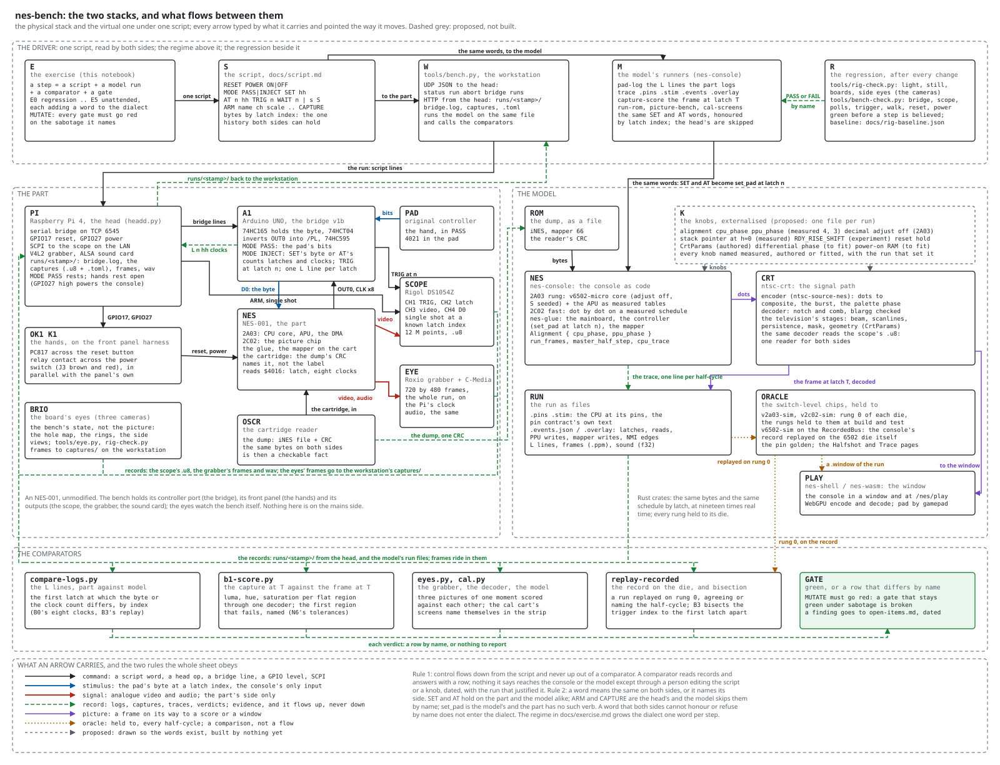

# Exercising the bench: the regime, and the dialect it shapes

Written 2026-09-17, the evening the head's hands first held: reset and
power from the Pi, the bridge passing bytes into the console and reading
every one back, the trigger stopping the scope, all of it green under
`tools/bench-check.py` twice from the workstation. That is the v1 bench.
This document is the plan for exercising it: a regime that gets harder
one step at a time, where every step is the same four things (a script,
a model run, a comparator, a gate), and where every step adds a word to
the language the automation will be written in. Three programmes ride
on the regime, and each has its own section below: the model tuned to
the part, games learned from the pad to the picture, and the x-ray of a
game's code.

## The two stacks, and what moves between them

The sheet above is the logical diagram, drawn by
`tools/draw-schematics.py` beside the schematics and held to the
committed copy by `tools/check-sheets.py`. Four bands, top to bottom:

- **The driver.** One script (`script.md`), read by both sides. The
  workstation's client hands it to the head and runs the model's own
  runners on the same file. The regression (`rig-check.py` for the
  cameras, `bench-check.py` for the electrons) sits beside it and is
  green before any step is believed.
- **The part.** An NES-001, unmodified. The head is a Raspberry Pi on
  the LAN with the bridge on its serial port, the two hands on its
  GPIO, the scope on SCPI, the grabber and the sound card on USB. The
  bridge holds the console's controller port; the hands hold its front
  panel; the scope and the grabber hold its outputs. The eyes watch the
  bench itself, not the picture.
- **The model.** Rust crates: the console as code, the signal path, the
  run written out as files, and the switch-level chips every fast rung
  is held to. The same bytes as the part (the reader's dump, by CRC) and
  the same schedule (bytes by latch index).
- **The comparators.** Each reads records only and answers with a row
  by name, or nothing to report. The gate is green or it names the row,
  and MUTATE must turn it red.

Every arrow is typed by what it carries, and pointed the way the thing
moves:

| type | what it carries | where it may go |
|---|---|---|
| command | a script word, a head op, a bridge line, a GPIO level, SCPI | down, from the script toward the part or the model |
| stimulus | the pad's byte at a latch index, the console's only input | into the console's port, or into `set_pad` |
| signal | analogue video and audio | out of the part only; the model has no wire |
| record | logs, captures, traces, verdicts | up, into a run directory and then a comparator; never down |
| picture | a frame | toward a score, or a window |
| oracle | held to, every half-cycle | a comparison between two things, not a flow |
| proposed | drawn so the word exists | nowhere yet |

Two rules the whole sheet obeys. **Control flows down from the script
and never up out of a comparator.** A comparator answers with a row;
nothing it says reaches the console or the model except through a
person editing the script or a knob, dated, with the run that justified
it. That is what keeps a fitted model from fitting itself. **A word
means the same on both sides, or it names its side.** `SET` and `AT`
hold on the part and the model alike. `ARM` and `CAPTURE` are the head's,
and the model's runners skip them by name. `set_pad` is the model's, and
the part has no such verb. A word that both sides cannot honour or refuse
by name does not enter the dialect.

## The dialect today, layer by layer

The automation platform will be written in whatever words the regime
teaches, so the words are recorded as they enter. These are the ones that
exist, with who honours them:

| layer | words | honoured by |
|---|---|---|
| the wires | the bridge's lines `MODE PASS`, `MODE INJECT`, `SET hh`, `AT n hh`, `TRIG n`, `RESET`, `STATUS`; GPIO levels; SCPI | the UNO's firmware; `pinctrl` on the Pi; the scope |
| the head | the ops `status`, `run`, `abort`, `bridge`, `runs` over UDP JSON; `runs/<stamp>/` over HTTP | `head/headd.py` |
| the script | `RESET`, `POWER ON`, `POWER OFF`, `MODE`, `SET`, `AT`, `TRIG`, `ARM`, `CAPTURE`, `WAIT` | the head plays all of them; the model's runners honour `SET` and `AT` by latch index and skip the rest by name |
| the model | `set_pad`, `run_frames`, `master_half_step`, `cpu_trace`, `Alignment`; the runners `pad-log`, `trace`, `capture-score`, `split-score`, `run-rom` | `nes-console` |
| the comparators | `compare-logs.py`, `b1-score.py`, `split-score.py`, `eyes.py`, `cal.py`, `replay-recorded` | the workstation |
| the regression | `rig-check.py` and `bench-check.py`, each answer `PASS`, `FAIL` or `SKIP` by the check's name | the workstation, or the Pi for the hands |

The layer above the script is the one this regime builds, and it has no
words yet. The nouns it will need, proposed here and entering one per
step below: **step** (a script, a model run, a comparator and a gate,
named), **run** (one playing of a step, stamped), **latch** (the index
both sides count), **frame** (the picture at a latch), **window** (a
span of a run the die's pages can stand in), **screen** (a class of
frames with a name), **episode** (a script from a start to an end),
**knob** (a named parameter of the model with its provenance),
**pattern** (a named shape in a game's code). The verbs: **exercise**
(play a step), **compare**, **replay**, **bisect**, **fit**, **reach**,
**xray**. Each is proposed until a step honours it, and a step that
needs a word not on this list adds it here with the step.

## The regime, one step at a time

Each step is the same four things, and each closes on a gate stated
before it runs. `bench-plan.md` states B0 to B3 and their gates and
nothing here changes them; the steps below are how they are reached in
order, with what each adds to the dialect.

| step | what runs | the gate | MUTATE | the word it adds |
|---|---|---|---|---|
| E0, holds today | `rig-check.py`, then `bench-check.py --hands head` with the console's switch off, `--hands manual` with it on | every check `PASS`; the two hands pause the poll stream; the walk reads every byte | the checks' own: a stale baseline, a swapped byte | `step`, `run`: the regression is the first step, and its output the first run |
| E1, one turn | the closed cycle on the calibration cartridge (`closed-cycle-plan.md`): power, reset, the bars screen, `TRIG`, the capture decoded, the model's frame at the same latch | B1's bars gate: N6's regions and tolerances on the part, terminated | the script shifted one latch on the model only | `frame`, `compare` |
| E2, a game | a game's title reached by script: `MODE INJECT`, `AT n` bytes through the title into the first screen that depends on input, a trigger there, `b1-score.py` | the first region that fails, named, or none | the same shift | `episode` |
| E3, a hand | B3: a hand on the pad logged in `MODE PASS`, the log replayed on the part and on the model, captures at the same trigger indices | part against part agrees region for region; model against part names the first latch apart, by bisection over the trigger index | the replay with one byte dropped | `replay`, `bisect` |
| E4, a sweep | B2: a hundred scripted power-ons with the master clock on the scope's spare channel; the reset relay's release to the first fetch; the mixer ROMs on the audio jack | the alignment histogram printed; the reset hold measured; the audio scored against the model's stage | the classifier fed a capture shifted one clock period | `knob`, `fit`: the first knobs set from measurement rather than typed |
| E5, unattended | the steps above from a list, nightly, one report | every step's row, and a step that fails names its row and stops nothing else | a step deliberately broken in the list | `exercise` |

The order is forced by what exists. E1 waits on the calibration
cartridge's part side (the flash chips, `cart-blanks.md`), so E2 on a
game is the first step to run after E0, with the same mechanism. E3
needs nothing new. E4 needs the scope's spare channels on the master
clock, which is a probe and a sitting. E5 is a list and a cron entry
once the steps are scripts, and it is where the platform starts: a step
is a file, a run is a directory, and the report is the rows.

## E2, played: 2026-09-18

The first step past E0 ran the night the regime was written, twice, on
the multicart's Super Mario Bros. title: `exercise/e2-title.txt`, the
script above the head and the model share, `MODE INJECT`, `SET 00`,
`RESET`, Start (`08`) at latches 200 and 201, the scope armed on CH1
with the video on CH3, `TRIG 300`, the capture. In the order the
diagram's flows run:

- **The head became a unit.** `head/setup.sh --bridge /dev/ttyACM0
  --baud 115200 --scope <ip>` on the Pi: `nes-bench-head.service`,
  enabled, which conflicts with `serial-bridge.service` (the two open
  one port, and Linux lets two readers split its bytes without a word)
  and puts both pins back at the boot levels when it stops.
- **E0 first.** `hands-head.sh --no-walk`: bridge, scope, polls (1203
  in 20 s, eight clocks each), trigger and reset (the polls paused
  2.50 s from GPIO17) PASS; power FAIL, no pause in 30 s. The console's
  front switch was on, bypassing the relay: a fact about the switch,
  not the relay, which paused the console twice the day before with the
  switch off. E2 needs the reset hand only, so it ran with the switch
  on. Later that night, the switch off: no poll in 3 s with the relay
  open, then a head script (`MODE PASS`, `RESET`, `POWER ON`, `WAIT 12
  S`, `POWER OFF`) logged 713 polls, the console quiet again after
  the off. Both hands hold under the head, which is what E1 needs.
- **The part.** Run `20260918-000139`: reset, Start at 200 and 201,
  the trigger at latch 300, 12 M points on CH1 and CH3 at 50 MSa/s, the
  trigger at sample 5,000,000 with 140 ms of record behind it, read off
  the scope in 58 s. The bridge's log against `pad-log` for the same
  script: 315 latches, bytes and clocks agreeing on every one.
- **The model.** `b1-score.py` runs `capture-score` to the first frame
  after latch 300: two flat regions in the model's frame, `$17` (the
  title box, rows 40..68, x 128..215) and `$22` (the sky, rows 32..127,
  x 216..256). The part's frame decoded from the trigger: recovered
  -4.1 ppm, worst burst residual 0.028, anchor line 266.
- **The second run**, `20260918-000521`, the same script with the
  video at 200 mV a division instead of 500: residual 0.009, anchor
  line 268, the same regions.

| region | record | dY | dsat | dhue |
|---|---|---|---|---|
| `$17` rows 40..68 | 500 mV/div | -0.039 | -0.045 | -3.0 deg |
| `$22` rows 32..127 | 500 mV/div | -0.039 | -0.060 | -9.1 deg |
| `$17` rows 40..68 | 200 mV/div | -0.054 | -0.062 | -3.1 deg |
| `$22` rows 32..127 | 200 mV/div | -0.067 | -0.079 | -9.1 deg |
| `$17` rows 40..68 | 200 mV/div, `20260918-152924`, cold power + warm reset | -0.038 | -0.046 | -3.5 deg |
| `$22` rows 32..127 | 200 mV/div, `20260918-152924`, cold power + warm reset | -0.037 | -0.061 | -9.3 deg |

**Rerun 2026-09-18, afternoon, under the frame rule** (the model's
picture placed from the latch's position against the vertical sync,
`mario-dissection.md` "The split"; nes @ efbcc46). Two checks. The
morning's 200 mV record rescored: latch 300 falls at PPU line 249 dot
65, after the onset, so the model's picture moved one frame, and every
number in its two rows above came back to the thousandth (a still
picture cannot tell the frames apart, which is the claim). And a
third record, `exercise/e2-title-warm.txt` (the console cold-powered
by the relay, the warm-reset recipe, the same press and trigger; the
morning's console had been running an hour): the third pair of rows.
The hue repeats again, to four tenths of a degree, on a third capture.
Luma and saturation land 0.017 to 0.03 from the morning's 200 mV
record, the same size as the difference the two scales had been
credited with under point 2 below, so that attribution does not stand
alone: two records at one scale differ by as much, and what else
differs is the console's warmth (an hour running against seconds) and
the record's rate error (-4.3 against -8.0 ppm). Recorded, not fitted;
the E1 bars cartridge with the scope alone is where the luma level
gets a number of its own.

**The luma spread, answered the same day (2026-09-18, evening): the
scorer's quantised levels, and the console's warmth.** A warm-up
series (`tools/warmup.sh`, `exercise/warmup-first.txt` and
`warmup-step.txt`): the console powered from off, E2's press and
capture at once, then again every five minutes with the power left on,
ten captures over 47 minutes at 200 mV a division (runs 194516 to
203018). Scored as E2 was, the regions' luma held near -0.034 for
three captures, stepped to -0.050 and -0.061 between 698 and 1002
seconds, and stayed there; the rate error drifted smoothly from -4.3
to -3.1 ppm and did not step. The record itself did not step either:
its blanking's mean climbed 88.48, 88.51 codes across the step, a
hundredth of a code, and its median went 88 to 89. `ntsc-crt` read the
levels as medians, whole codes on a u8 record, and the sync is 22.5
codes deep there, so the gain every region is scored at moved 4.5%
when the porch crossed a half code. ntsc-crt v0.2.11 reads them as a
trimmed mean (held on a quantised synthetic record, the median red).
Rescored under it the step is gone and what is left is a smooth drift,
`$17` from -0.039 at power-on to about -0.048 and `$22` from -0.042
to about -0.055, flat from about thirty minutes on, with the hue at
-3.1 and -9.2 degrees throughout: the console's warmth, about a
hundredth of luma over its first half hour (a knob since 2026-09-19:
Programme 1, "The warmth"). E2's records rescored
under v0.2.11: the 500 mV record -0.043 and -0.047, the cold 200 mV
record (152924) -0.042 and -0.045, the morning's hour-warm 200 mV
record -0.050 and -0.059, on the warm plateau. So point 2 below is
superseded: the two scales agree once the levels are read between the
codes, and what separated the records was the estimator and the
warmth. The rows in the table above are as scored at the time.

The gate as the table above states it: the first region that fails,
named. `$17`, rows 40..68, on every axis; and `$22` behind it. What
the two records say beyond the verdict:

1. **The hue repeats to a tenth of a degree** across two captures and
   two vertical scales: the model's sky is nine degrees bluer than the
   part's, its brown three degrees warmer, the same sign and about the
   size the two eyes measured on the title in September (`eyes.py`,
   12.6 and 14.1 degrees). Three instruments now agree that the model's
   picture chain is the odd one out; the open item under Programme 1
   (the encoder's level-dependent phase) has a number on the part to
   be held to.
2. **Luma and saturation move with the scope's scale** (superseded
   the same evening, above: the scorer's quantised levels), by 0.015 to
   0.02, which is one level of the coarse record: at 500 mV a division
   the picture covered 43 of the 256 levels, at 200 mV 100. In volts
   the two records agree (sync tip near 0 V, blanking 0.40 V, peak
   0.76 V into the scope's megohm), so the finer record is the one to
   believe, the script now arms at 200 mV, and the level a recovery
   reads off a coarse record is a knob-sized error of its own. The
   remaining miss (luma -0.05 to -0.07, saturation -0.06 to -0.08)
   is not settled here: the same sky read saturation 28 percent hot
   through the direct capture of 2026-09-02, and two readings of one
   part through one scope that disagree by that much put the probe,
   the coupling and the termination inside the number. E1's terminated
   bars capture is what decides it, and it waits on the flash chips.
3. **Three tools broke on the first real run and were fixed that
   night**, which is what the rehearsal on synthetic runs could not
   do: `b1-score.py` scored the trigger line (the `file =` line of a
   two-channel capture names CH1) until it learned `--channel`, and
   refuses a capture without the channel by name; it handed the model
   a path relative to the wrong checkout; `bench.py` died when the
   head fell silent for the minute it spends reading the scope.
4. **The word.** An *episode* is one script played from its `RESET` to
   its last capture on one ROM: the run directory, keyed by the ROM's
   CRC, the script and the captures. Two episodes were played; every
   later step is made of them.

## E2 on a second game, Duck Hunt's field: 2026-09-19

Super Mario Bros.' title gave the scorer two flat colours, so the hue
miss had two points and no curve, and the luma gap could not say
whether it was a gain or an offset. Duck Hunt, the multicart's second
game, has a field of large flat colours. The script,
`exercise/dh-field.txt`, was found on the model first (`capture-score`
gained `SHOW=path.ppm`, the chosen frame decoded): the menu takes Select
at latch 200 and Start at 240; Duck Hunt's title ignores Start until
about latch 500, and takes one held ten latches from 600; Game A's
field is captured at latch 900. Played twice (runs `20260919-183613`
at 24 seconds on and `183919` at 211), then Super Mario Bros.' title
once more at the same warmth (`184121`, `warmup-step.txt`).

**The scorer's regions were not the largest rectangles.** The first
model run found one region on the field, a strip of ground, and not
the sky. `capture-score` merged rows greedily, each following the first
run that overlapped it and keeping the intersection, so the tree's
leaves cut the whole sky down to an eight-dot sliver at the left edge.
The regions are now the largest all-one-colour rectangle per colour
(the maximal rectangles of its mask), as its comment always said
(`MUTATE_REGIONS=1` runs the old merge). On the bars cartridge nothing
moves: 13 of 13 regions on every luma row, the late-trigger mutation
still red. On Super Mario Bros.' title the two old regions move by
0.0002 in luma and 0.1 degree in hue, and two more appear, the greens
`$1a` and `$29` along the bottom.

The part reached the field on both runs, and its picture is the
model's screen (coarse shape r 0.998 against the model; 0.9997 against
itself two frames on). Six colours at two luma levels, warmth knob on:

| region | luma | hue (model) | dY | dsat | dhue |
|---|---|---|---|---|---|
| `$1a` title, rows 200..208 | 0.35 | -118.5 | -0.036 | -0.049 | -0.2 |
| `$17` field, rows 166..173 | 0.33 | +150.1 | -0.043, -0.045 | -0.052, -0.054 | -3.5, -3.4 |
| `$17` title, rows 33..72 | 0.34 | +149.8 | -0.041 | -0.052 | -3.3 |
| `$18` field, rows 226..240 | 0.35 | -177.2 | -0.028, -0.031 | -0.046, -0.047 | -7.9, -7.9 |
| `$22` title, rows 23..192 | 0.65 | 0.0 | -0.045 | -0.068 | -9.2 |
| `$29` field, rows 168..181 | 0.65 | -149.9 | -0.045, -0.048 | -0.067, -0.069 | -10.5, -10.5 |
| `$29` title, rows 200..208 | 0.65 | -148.8 | -0.040 | -0.065 | -10.9 |
| `$21` field, rows 0..122 | 0.65 | -30.0 | -0.044, -0.047 | -0.067, -0.069 | -11.9, -11.9 |

What the eight rows say, recorded and not fitted:

1. **The hue miss grows with the level.** The three colours of the
   high luma row miss by -9.2 to -11.9 degrees, the three of the low
   row by -0.2 to -7.9. The level carries most of it (the means are
   -10.6 and -3.8); within a row the hue carries the rest, and more of
   it on the low row. Each hue repeats to 0.4 degrees across runs,
   games and regions. That is the shape of a level-dependent phase in
   the part's output (the open item in Programme 1's table, and the
   eyes' finding under load), now with six points on the part. The
   bars cartridge gives it every level and every hue, and the constant
   is fitted there.
2. **The luma gap is an offset, not a gain.** Both levels miss by about
   the same amount (-0.041 to -0.048 on the upper rows at 0.33 and at
   0.65), where a gain would miss twice as much on the high row.
   Saturation is the other way: the part's chroma is 12 to 15 percent
   short of the model's at both levels, a gain.
3. **The lowest rows miss less.** The regions at rows 200 and below
   read -0.028 to -0.040 in luma, the ones above -0.041 to -0.048, and
   `$29` shows it on one colour (-0.040 at rows 200..208, -0.045 and
   -0.048 at 168..181). A level that moves down the field would do
   this; so would the regions near the frame's bottom sitting where the
   recovery's lines end. Not separated yet.
4. **The frame is one off.** The part's picture matches the model's
   frames F-1 and F+1 at full resolution (r 0.94) better than F (0.91),
   where Super Mario Bros.' split and E3 found F. The field is still
   where the regions are, so the colours do not depend on it; the
   frame (or its dot-crawl phase) is recorded in `open-items.md`. The
   registration is 4 samples, half a dot, the same direction as the
   quarter-dot item and a little more.

The warmth knob's seconds were wrong on the second run as first
written: the script opens with `POWER ON`, the relay was already
closed, and the head logs the word all the same, so the knob counted
from the second run's own start. `tools/knobs.py` now counts from the
first `on` after the last `off` (the warm-up series' seconds do not
move). Between 24 and 211 seconds the field's luma moved by 0.002 to
0.003 more than the curve takes out, about the curve's worst residual
on the evening it was fitted.

## E3's machinery on the part: 2026-09-18

Everything in E3 but the hand, run on the part the evening E2's luma
was answered: a record typed in the form `b3.py record` writes
(`exercise/e3-scripted.txt`: the menu's Start at 200, the title's at
330, Right from 520, four jumps, the pad released at 1100), replayed
twice with a capture at latches 400, 800 and 1150 (`runs/e3-a`,
`runs/e3-b`), the two replays set against each other, and a bisection
over 0..1150. What met the part first was the tool: its arm fell back
to the old `EXT` trigger the head refuses, its status poll died in the
minute the head is silent reading a record (and left the run playing,
so every later call was refused), and its rule for calling a capture
the model's was B1's region tolerances, which every real capture
misses by its calibration. The rule is now the picture's correlation,
two readings of `split-score`'s new fourth section: the screen by its
coarse shape (30 by 32 blocks, at least 0.99), the frame by the full
resolution (F no worse than its neighbours). Full resolution alone
could not say which screen: the game's black world card at latch 400
is small text, and reads 0.71 against every model frame while the part
against itself reads 0.999; the two picture chains differ at fine
detail, and the blocks average that away.

| latch | screen | the part against the model | the two replays |
|---|---|---|---|
| 400 | the black world card | screen 0.9988, frames alike (still) | agree |
| 800 | 1-1, Mario walking | screen 0.9990, frame r 0.916 against neighbours 0.689 | agree |
| 1150 | 1-1, the pad released | screen 0.9992, frame r 0.921 | agree |

The two replays' correlations came back identical to the third
decimal: the game is deterministic on the part from a reset. The
bisection's first step, latch 1150, agreed, so there is no divergence
in 0..1150. The mutation, the latch-800 capture scored against the
record with `AT 520 80` dropped (Mario never walks): screen 0.66,
disagrees. The step left is the hand: `exercise/e3-hand.txt` (`MODE
PASS`, about 25 seconds of play, short because the UNO bridge's
schedule holds 128 changes), then `b3.py record`, and the same replay,
agreement and bisection on what it wrote.

## E3, a hand: 2026-09-19

The step's gate met on a person's play. The record: `exercise/e3-hand.txt`
(power cycled, `MODE PASS`, a reset, a minute), the owner on the
original pad through the bridge, the multicart's menu, the title, and
1-1 played to the flag (run `20260919-012524`). A minute of play is
289 changes of the pad's byte; the UNO bridge holds 128, so `b3.py
record --until 1850` replays the first 31 seconds (127 changes). Two
replays with captures at 500, 1000, 1500 and 1840 (`runs/e3h2-a`,
`runs/e3h2-b`), the agreement, and the bisection over 400..1840:

| latch | the part against the model, replay a / b | the two replays |
|---|---|---|
| 500 | screen 0.9997 / 0.9993, the title (frames alike) | agree |
| 1000 | screen 0.9992, frame r 0.917 against neighbours 0.899 / 0.900 | agree |
| 1500 | screen 0.9993, frame r 0.927 / 0.863 against neighbours 0.666 / 0.657 | agree |
| 1840 | screen 0.9985, frame r 0.916 against 0.914 (Mario standing) | agree |

The bisection's first replay, at 1840, agreed: no divergence between
the part and the model in the first half minute of a hand's play of
Super Mario Bros., latch for latch.

Four things broke first, each found by the hand and none by the typed
record, which is what the step was for:

1. **The head overran the bridge.** 125 `AT` lines sent back to back
   overflowed the UNO's serial buffer: some came back `# ?`, some were
   taken with digits missing (`AT 2219 00` as `at 2210 00`), and the
   console played a different history from latch 1015 with every check
   silent. The owner saw it on the screen ("you are running the wrong
   way"). The head now waits for each line's echo and stops the run on
   a mismatch (`send_checked`, d6ac715); a schedule-only replay then
   matched the record on 1965 of 1965 latches.
2. **The record carried the session before its reset.** `b3.py
   record` read the bridge's whole log; it now starts at the bridge's
   `# reset`.
3. **The replay started from the wrong place.** A replay from a bare
   `RESET` came back up in whatever bank the run before left, which
   after a game is the game: Super Mario Bros. restarted without the
   menu, the menu's presses went to the game, the screens matched the
   model's a frame off and the bisection walked to latch 1 (`runs/e3h-*`,
   void). Seen by dumping the part's frame at latch 142
   (`split-score DUMP=`): 1-1 where the model showed the menu. A record
   now keeps its run's power words before the reset.
4. **The window was too short and the schedule too small.** Twenty-five
   seconds ended on the title; a minute is more than the UNO held, so
   `--until` replayed a prefix.

**The whole minute, the same night.** The UNO's schedule was packed
(`bench-v1b-uno.md`, "How the bridge works": two-byte entries and the
sketch's strings in flash, 600 entries where 128 fitted, the stack's
room measured), and the hand's run replayed to the flag: all 289
changes, 3601 latches (`exercise/e3-replay-full.txt`, `runs/e3f-a`,
`runs/e3f-b`).

| latch | the part against the model, replay a / b | the two replays |
|---|---|---|
| 1000 | screen 0.9992, frame r 0.862 / 0.917 against neighbours 0.848 / 0.900 | agree |
| 2000 | screen 0.9989, frame r 0.917 against 0.735 | agree |
| 3000 | screen 0.9985 / 0.9982, frame r 0.953 / 0.909 against 0.753 / 0.810 | agree |
| 3580 | screen 0.9988 / 0.9992, the flag (frames alike) | agree |

The bisection over 400..3580 agreed at its first replay: no divergence
between the part and the model across a minute of a person playing
1-1 to the flag. Three more things broke on the way, all in the tools:
the model's frame ceiling (2000 frames, about 1985 polls) scored
nothing past latch 2000 until `b3.py` sized it to the latch; loading
290 echoed lines took 15 seconds against a running console, so the
replay's `TRIG 1000` fired at latch 1060 and two captures of the game
60 frames on read as a divergence (the head now holds the console in
reset while a replay loads, and refuses a trigger whose latch has
passed); and the head once missed the request to start a run, which
`b3.py` now asks about before asking again. `agree` compares the two
replays by the frame each lands on, since their luma differs by the
console's warmth.

## Programme 1: the virtual stack tuned to the part

The model is not a picture of the console; it is the console's chips at
their switches, with fast rungs held to them. So "tuning" here does not
mean adjusting behaviour until it looks right. It means finding the few
places where the model carries a number it could not measure, measuring
that number on the part, and recording where it came from. Those places
are the knobs, and they are already scattered through the crates:

| knob | where it lives | today | what the bench measures to set it |
|---|---|---|---|
| alignment (`cpu_phase`, `ppu_phase`) | `nes-console` `Alignment` | one measurement (4, 3), the default | E4's histogram over a hundred power-ons: the distribution, and whether the console prefers one |
| the decimal adjust off; the stack pointer at the first half-cycle | `v2a03-micro`, the two knobs on the 6502's rung 3 | measured on the die, proven against the pin golden | nothing: these are the die's, not the bench's |
| the RDY rise | `replay-recorded`'s `RDY_RISE_SHIFT` | an experiment knob, answered (the core sees the release one cycle after the pin) | nothing: the bench has no address bus |
| the reset hold | `nes-glue`, a labelled placeholder | authored | E4: the relay's release to the first fetch, on the capture |
| the television's stages (`CrtParams`) | `ntsc-crt` | authored, and labelled so | nothing yet: the bench's television is not measured, and the grabber is a different television |
| the encoder's level-dependent phase | not built | the model sits 12.6 and 14.1 degrees off both eyes in hue on the saturated colours, located in the part's analogue output under load (`eyes-vs-scope.md`) | the bars cartridge captured under the eyes' load and with the scope alone; the constant fitted per load, MUTATE red |
| the DAC's load | not built | the untriggered captures ran hot in saturation; probe or DAC undecided | a terminated capture of the bars cartridge (B1's first gate) |
| the part's warmth | `nes-console` `[warmth]` `seconds_on` on `[warmth_curve]` `depth`, `tau_s`, built 2026-09-19 | the seconds measured off the head's logs; the curve fitted to the warm-up series (depth 0.0214, tau 1050 s, rms 0.001) | a second warm-up series, and one on the bars cartridge, where every level says whether it is a gain or an offset |
| power-on RAM | `nes-console` `[ram] fill` or `seed`, built 2026-09-18 | authored: blank, or a fill, or a seeded pattern; the first game it was built for (the multicart's menu after a cold boot) turned out not to need it: the part takes the press cold once the head's `WAIT` was fixed (`open-items.md`) | a cartridge of our own that shows its RAM, OAM and VRAM at power-on |

Externalising them is the proposal on the sheet's dashed box: one file
per run, `knobs.toml` in `runs/<stamp>/`, read by the model's runners.
Every key carries where its value came from (`measured`, `authored` or
`fitted`) and the run stamp that set it, so a report can say which of
its figures rest on a fitted number. The runners refuse a key they do
not know, so a typo cannot silently run the defaults. A fitted knob
prints its residual with the fit. And a knob has a MUTATE: moved off its
fitted value, the gate that fitted it must go red, or the knob was never
doing anything. Nothing is tuned by eye. A knob whose fit would improve
the score without a mechanism named for it stays authored, and the
mismatch goes to `open-items.md`.

**Built 2026-09-18, the second move.** The file is `knobs.toml` in
`runs/<stamp>/`, written by `tools/knobs.py init` from the model's
measured defaults and the run's `ARM` line, and read by every runner
in `nes-console` from `KNOBS=path` (`nes-console/src/knobs.rs`, the
flat subset of TOML the bench writes, no dependency). Two tables
today, each with `source` and `by`: `[alignment]`, measured off the two
dies' clock recipes until E4 sets it from the part, and `[capture]`,
the scope's window on the video from the script, which the scorer
takes its channel from. `init` refuses to overwrite; the reader refuses
a table or key it does not know by name (`ppu_phaze` names itself), a
missing source, a fitted knob without its residual, a value out of
range; `tools/knobs.py check` runs that reader on a run's file. The
one knob the model acts on is proven to act: moved, the scheduler's
CPU half-cycle count at the first frame's end moves with it, and
`MUTATE=1` on that test is red. `b1-score.py` writes the file for a run
that has none and its report now opens with the knobs and their
sources, which is what the two E2 runs print. What is not in the file,
deliberately: the hue. E2 measured it at two levels on the part, and
two points fit a line with no residual, so it stays an open item with
its numbers until the bars cartridge gives it every level (E1). The
reset hold stays a labelled constant in `nes-glue`: nothing in the
console reads it yet, and a knob that reaches nothing is not a knob.

**The warmth, built 2026-09-19: the first fitted knob.** The warm-up
series (above, "The luma spread") left one thing the model could not
know: how long the part had been on. Its picture shrinks against its
sync as it warms, and scoring every run against a cold model reads that
as a luma and saturation error that grows over the first half hour.
Two tables carry it. `[warmth]` `seconds_on` is measured:
`tools/knobs.py` reads the run's trigger off its `head.log` and the last
`power on` before it across every run's log, and writes nothing when
the head never switched the power (the front switch by hand), so such a
run is scored cold. `[warmth_curve]` is fitted: the model's picture
gain `1 - depth * (1 - exp(-t / tau))`, fitted by `tools/warmth-fit.py`
to the series' ten captures, luma and saturation of both regions under
one curve, each series' own start solved exactly: depth 0.0214, tau
1050 seconds, rms 0.00098 over forty numbers, worst 0.0023.
`capture-score` scales the model's encoded frames about blanking by
that gain before the card model's front end; the sync and the burst are
left alone, which is what the scorer's levels and the decoder's phase
come from (`tests/knobs.rs`, `MUTATE_WARMTH=1` red).

What it does to the series, scored again with the knob in each run's
file (`warmth-fit.py --check`): the luma error that went from -0.039 to
-0.048 on `$17` and from -0.042 to -0.055 on `$22` now holds at -0.041
and -0.042 across the whole 45 minutes, a spread of 0.0035 and 0.0040
against 0.009 and 0.013 without it. The knob's own gate: moved off its
fit to depth zero, the spread comes back. And one record the fit never
saw: the morning's 200 mV record of 2026-09-18, taken with the console
an hour on by the front switch (so its seconds are authored, and past
fifty minutes the curve is flat, so the hour need not be exact), scores
-0.043 and -0.046 with the knob, against -0.042 and -0.045 on the cold
record `152924`: the two records the evening had set apart by warmth
agree to a thousandth. The offset that is left, about -0.04 in luma
and -0.05 to -0.07 in saturation, is the part's own against the model
and belongs to E1's bars.

What the fit does not say. Luma alone wants a deeper curve than
saturation (0.024 against 0.018), and `$17`'s luma alone deeper than
`$22`'s (0.030 against 0.023): the drift is not a pure gain, part of it
behaves like an offset, and two colours cannot separate the two. The
shared curve is inside the scorer's tolerance on all four, so it
stands as one gain until the bars cartridge's levels can tell a gain
from an offset. The hue does not move with warmth (-3.1 and -9.2
degrees throughout), so the knob does not touch it.

## Programme 2: games learned from the pad to the picture

The console has one input, the pad's byte at each latch, and two
outputs, the picture and the sound. So a game, to the bench, is a
function from a byte schedule to a sequence of frames, and learning a
game means finding the schedules that reach the frames you want. What is
already machine: the model runs at nineteen times real time and takes
its pad by latch; the trace writes every latch and every read; the
picture comes out through the same signal path that decodes the scope's
record; and E2 gives a way to confirm any schedule on the part at chosen
latches. What is new is the vocabulary above that.

- **A screen is a class of frames with a name.** On the calibration
  cartridge every screen names itself in its strip, which is why the
  cartridge exists. On a game the signature is read out of the model's
  own state at the latch, not out of pixels: the nametable, the palette
  and the sprite set the picture chip was showing, and the model's
  picture through the signal path as the reference frame. A frame from
  the part (the grabber's, or the decoded capture at a trigger) is
  matched to a screen the way `b1-score.py` already scores: regions,
  luma, hue and saturation, plus a normalised correlation against the
  reference frame. A vision model enters as a labeller, proposing names
  (title, menu, first level, game over) from the model's pictures. The
  names are kept as authored, and the matching stays numerical, so a
  wrong name is a wrong label and never a wrong match.
- **Success is a screen reached within a latch budget.** `reach <screen>
  within <n> latches` from a start, where a start is power-on or a saved
  window of a run. An episode is a schedule from a start to an end, and
  its outcome is the screen it reached and the latch it reached it at.
- **Search on the model, confirm on the part.** Schedules are searched
  on the model, which is cheap, headless and runs many copies at once,
  and the found schedule is played on the part through E2's mechanism
  with triggers at the latches that matter. Agreement is the gate. A
  disagreement is a finding about the game (it seeds from uninitialised
  RAM or from frame timing, which E3 lists by name) or about the model,
  and either is worth more than the schedule.
- **The progression** starts where the frames are simplest: the
  calibration cartridge's pad screen, where every byte is its own
  screen and the mapping is the identity; then a game's title and its
  start; then the first thing the player can do wrong.

The words added: `screen`, `episode`, `reach`, and `label` for what the
vision model does. The mechanism is B1 and B3 with a loop around them.

## Programme 3: the x-ray, and an encyclopedia of code patterns

The trace already carries what an x-ray needs: every byte the CPU
fetched, every latch, every read of the pad, every write to the picture
chip with the dot and line it landed on, every write into cartridge
space, every interrupt edge. An x-ray of an action is two runs that
differ in one byte at one latch (the button pressed, and not), and the
half-cycle at which their fetches first differ. That half-cycle is an
instruction in a routine, and everything downstream of it in the trace
(the RAM the routine writes, the picture-chip registers it reaches, the
bank it switches to) is the code path of that action. The model's
runners can do this today with two runs and a diff; the tool is the
diff, the naming of the routine, and the window cut around it so the
6502's pages can show it on the die.

The part cannot show its fetches, because the bench has no address bus
(that stays the sixteen-channel logic analyser item in `bench-plan.md`).
So the x-ray is the model's, held to the die by the recorded bus, and
confirmed on the part by the action's effects: the picture at the next
trigger, the poll count, the sound. That is the honest scope of it, and
the sheet draws it that way.

The encyclopedia is what the x-rays add up to. The patterns a game is
made of are few and they recur: the poll routine (the strobe, eight
reads, the bits into a RAM byte, the edge against the previous byte);
the frame loop and the flag the interrupt handler sets; the sprite copy
through the DMA register; the scroll writes and the dot they land on;
the bank switch; the random number; the dispatch from the pad's byte to
the action; the music driver's tick. An entry is the pattern's name,
what it does, its signature (the addresses it touches, the event kinds
it raises, its cycle counts measured on the die), a window to stand in
on the Halfshot page, the games it was found in by CRC, and the
mechanism it teaches. That last field is the point: the encyclopedia is
the basis of a tool for building NES games, where each pattern comes
with a runnable example of our own and the x-ray of that example shows
the same shape the commercial game showed.

One constraint shapes every entry. A commercial cartridge's bytes are
ROM content and are never published, so an entry carries the shape of a
pattern (addresses, counts, event kinds, the window's overlay lines) and
never the bytes, and the worked examples that show code are ROMs whose
source is ours: the calibration cartridge, the family's test cartridge,
the pad cartridge. The trace tool already keeps a commercial trace where
the ROM store is, for the same reason.

The words added: `xray`, `diverge` (the first half-cycle apart),
`pattern`, and `window`, which T2 already built.

**Built 2026-09-18, the third move.** `tools/xray.py rom.nes <name>
--latch N --byte HH` traces the ROM twice through `nes-console`'s
`trace` (00 held, and HH at latch N for one latch), streams the two
`.pins` records side by side so a record of any length fits, and
reports: `diverge`, the first half-cycle apart, with the instruction
executing there disassembled from the 6502 site's own table
(`web/disasm.js`, the one place it lives); the path, every later
half-cycle the records differ at, in spans labelled with the
instruction and what it did (the RAM written, the picture-chip
register reached, the bank switched, from the pins and the action
run's events), the path proper ending at the next latch and what
differs after it reported as the byte's echo; `rejoin`, where the
records agree again to the end, or never; a signature line; and with
`--window`, a window of the action run cut around the divergence by
the 6502 repository's `replay-recorded`, the overlay lines inside it
carried, for the Halfshot page to stand in. The invariant is the
refusal: the pad's byte has one door into the CPU, a read of `$4016`
or `$4017`, so records that first differ anywhere else were not the
same run, and `MUTATE=1`, which corrupts one fetched byte of the base
record before the latch, must be refused there, and is. Without
`--bytes` the report masks every fetched byte and immediate operand, so
a commercial cartridge's x-ray carries addresses, mnemonics, counts and
event kinds and never its code; the traces go where the ROM store is.
The first two x-rays and the first two entries are in
`encyclopedia.md`: the poll routine, from the pad cartridge with its
code, and the multicart menu's bank switch on Start, shape only.
`tools/dissect.py` followed the same night: a game's frame in scanline
order (the handler's vector and `RTI`, every PPU write with its line,
the DMA, the VRAM bursts with the routine writing them, the `$2002`
spins, the pad's latch, the idle loops), the routine call tree with a
jump engine followed through its table, a RAM map, the code's pages,
and one line per frame; and `xray.py --script` puts both runs on a
script (the way into a game). Super Mario Bros. was the first game
taken apart with them: `mario-dissection.md`, and encyclopedia entries
3 to 7.

## What is machine today, and the first three moves

| piece | state on 2026-09-17 |
|---|---|
| the regression, both hands | holds; `scripts/hands-head.sh` and `scripts/hands-manual.sh` |
| one script, both sides | holds; `SET` and `AT` by latch on the part and in the model's runners |
| the trigger and the capture | hold; the decode through `ntsc-crt` |
| the model's trace, the recorded bus, windows on the die's pages | hold (T0 to T3) |
| the comparators | `compare-logs.py` and `b1-score.py` have met the part (E2, twice), `b3.py` too (E3's machinery, 2026-09-18, on a typed record); the terminated capture is still E1's |
| E3 | met 2026-09-19 on a hand's play, the whole minute to the flag: two replays agree, the part agrees with the model at every capture, no divergence (section above) |
| E2 | played 2026-09-18, twice: the first failing region named (`$17`, every axis), the hue miss repeatable to 0.1 deg, the luma miss one scope level wide (section above) |
| the calibration cartridge | the model side done, the part side waits on the flash chips |
| the knobs file | built 2026-09-18: `tools/knobs.py`, `nes-console/src/knobs.rs`, two tables with sources, refusals by name, the alignment knob proven to reach the scheduler (Programme 1) |
| screens, the search | proposed; `episode` is a word since E2 |
| the x-ray diff and the encyclopedia | built 2026-09-18: `tools/xray.py` (diverge, the path, rejoin, the window; the refusal proven by MUTATE), `encyclopedia.md` with seven entries; `tools/dissect.py` and `mario-dissection.md`, the first game taken apart (Programme 3) |

The first three moves, in order: E2 on a game, because it needs nothing
that does not exist and it is the loop every programme runs inside
(played, above); the knobs file, because E4's first measured knobs need
somewhere to land that is not a source edit (built, Programme 1: the
capture's window is in it, the hue is not, on purpose); and the x-ray
diff on the pad cartridge, whose source is ours, so the first
encyclopedia entry (the poll routine) can be published with its code
(built, Programme 3, and the second entry x-rayed the multicart's
Start the same night). All three moves are made; what comes next is
the regime's own next step, E3, a hand on the pad, and E1 when the
flash chips arrive.
