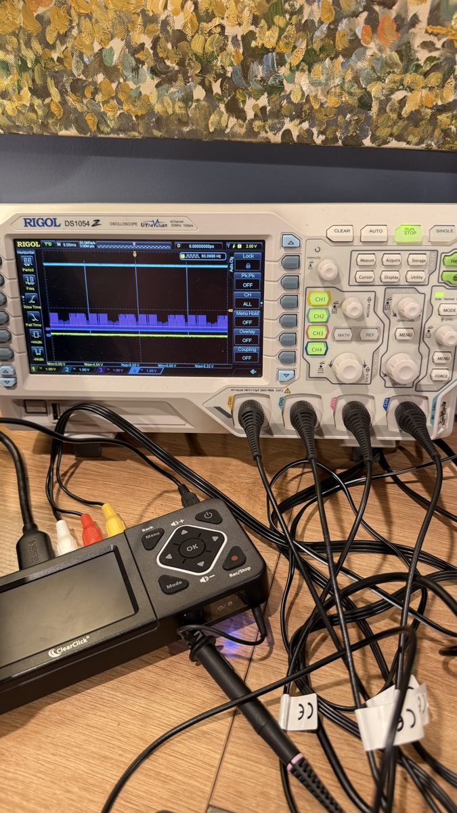
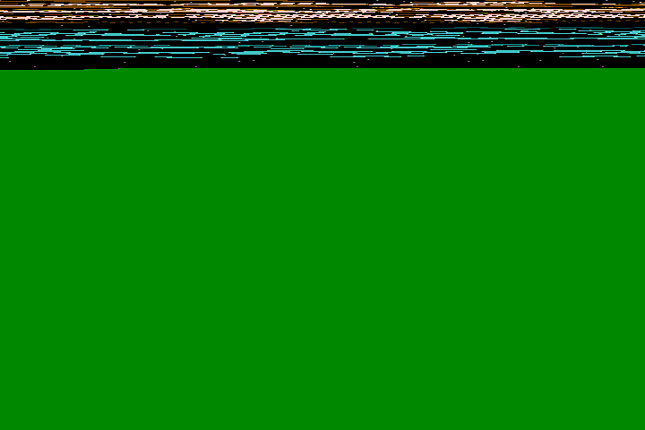
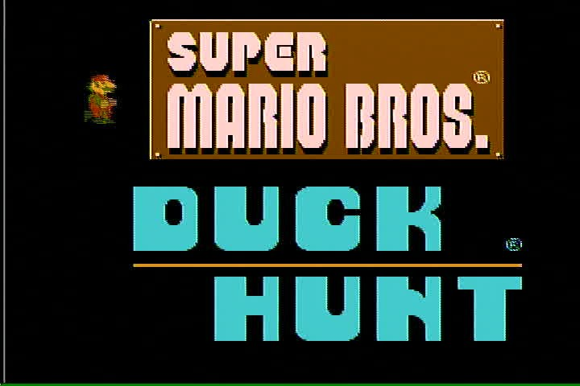
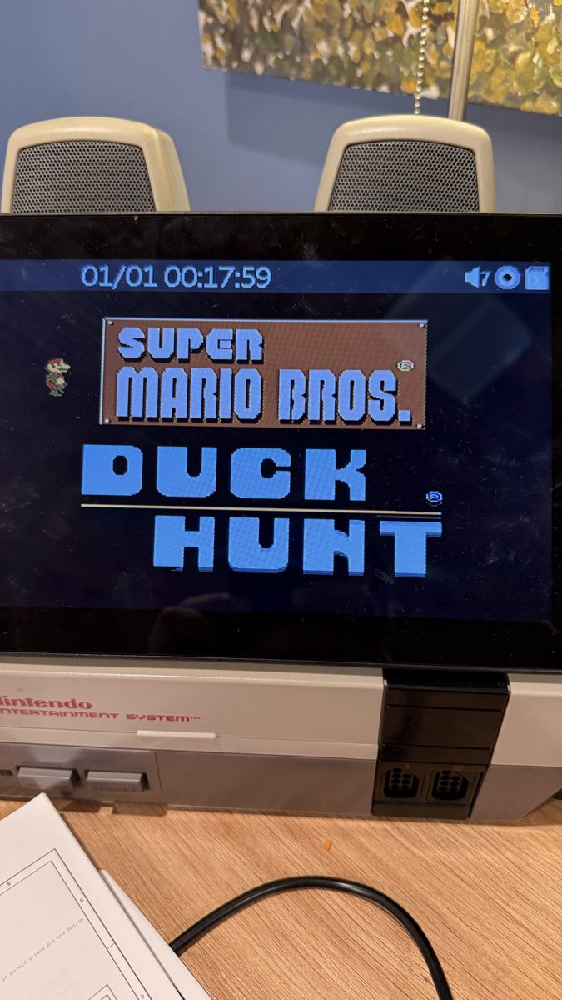
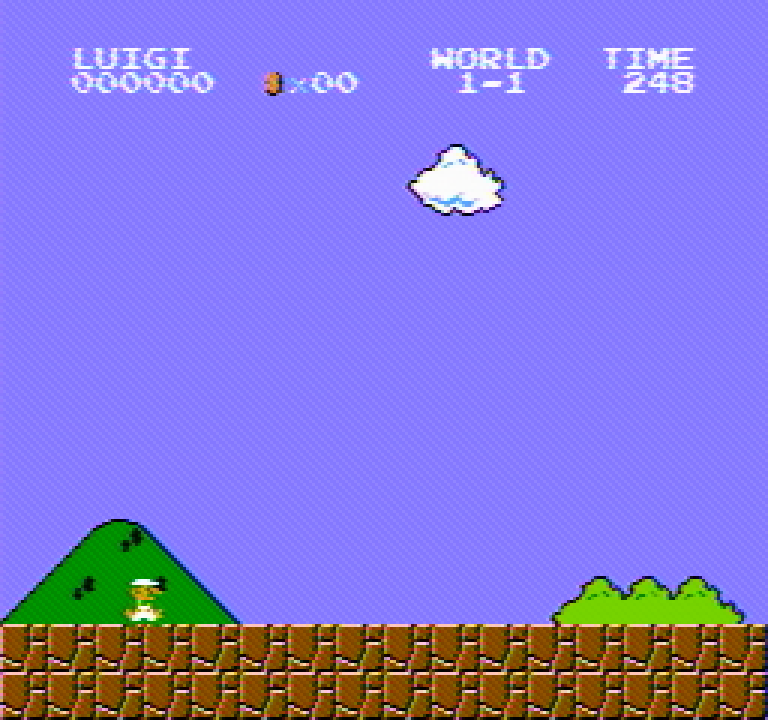
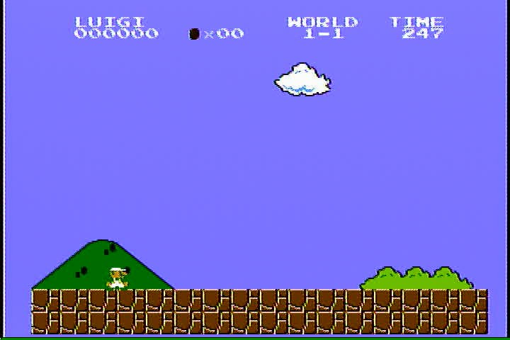
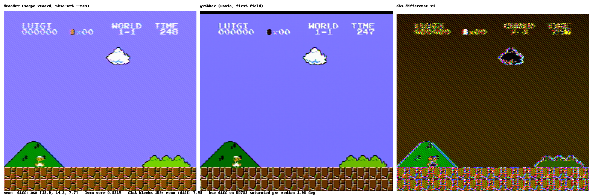
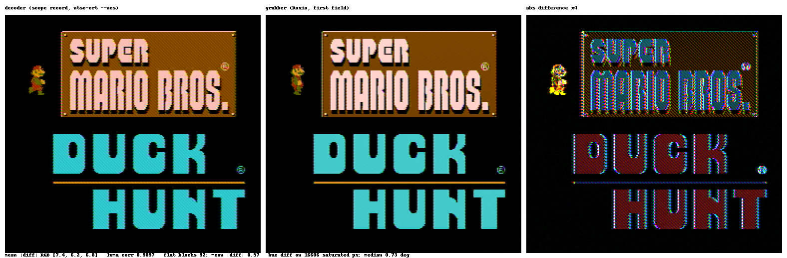
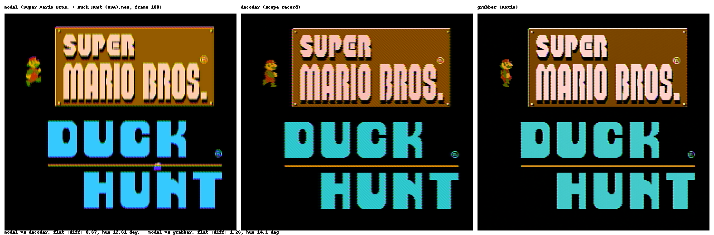

# Eyes versus scope: the grabber's picture against the decoded signal

Added 2026-09-12. The console's composite video now goes two ways at
once: to the scope, whose record is what the family's own decoder works
from, and to a USB frame grabber on the bench's Raspberry Pi, a TV
chip's own opinion of the same signal. `tools/eyes.py` takes both
together and scores the two pictures on the console's pixel grid. This
page is the setup, the pictures, and what the first comparison said.

## The setup

- **The console**, an NES-001, on the game that was in it (Super Mario
  Bros. and Duck Hunt on one cartridge), composite out at the RCA jack.
- **A T at that jack.** One leg to the scope's CH3 (DC, 200 mV/div, 1x
  probe: the channel ntsc-crt's own captures were scored on), the other
  to the grabber's yellow input. The 75 ohm load sits on whichever end
  is terminated, so the scope's input is as it was when those captures
  were scored.
- **The grabber**: a Roxio Video Capture USB stick on the Pi, `/dev/video2`
  through a driver built for it (below). Composite in, 720 by 480 frames
  out, in colour.
- **The scope**: a Rigol DS1054Z on the bench LAN, 12 million points
  at 50 MSa/s, 240 ms, about fourteen frames per record. The tool saves
  its whole setup before touching it and restores it afterwards, so the
  other experiment on the same scope is never disturbed.
- **The Pi**, `nesbench`, holds the grabber and the camera and answers to
  the workstation over ssh; the workstation holds the decoder, the tool
  and the record.



## The grabber, and how it came to work

The stick is an Empia chip marked EM2980 that reports chip id 146,
which no Linux kernel knew. The stock driver logs `unknown em28xx chip
ID (146)` and registers only the stick's audio half; a 2014 kernel-list
thread worked out that its firmware implies a Conexant-class decoder
integrated on the chip and stopped there, and an Arch forum post
concluded nobody ever would get it going.

What changed since is that mainline Linux gained, in 2026, the EM2828X
family with exactly such a built-in decoder, driven through the
bridge's own registers, for the new Hauppauge USB Live2. The EM2980 is
that family one number over. So the bench's driver is mainline em28xx
built out of tree against the Pi's 6.12 kernel, with a patch: two shims
so 7.x source builds on 6.12, the chip id, a board entry with the
built-in decoder and the USB id, and bulk transfer by default, because
the stick's isochronous endpoint delivers only the top sixth of each
frame at any setting.



Bulk delivers the picture. The first thing it showed was the cartridge's
title screen, which the TV beside the console was showing at the same
time:





One evening went into a limit that was not one. The driver seemed to
deliver 400 of 480 lines, and every register the decoder's setup writes
was tried in turn to no effect. The cause was the driver's answer to
the "which standard did you detect" query: the built-in decoder cannot
detect one, the stock code answered "all of them", and the capture
tool fed that answer straight back as the standard to use. A mask with
the 625-line bit in it made the driver program 576-line geometry with
a 480 over 576 vertical scaler, and each 240-line field arrived as 200.
ffmpeg never asks, so it always got whole frames, which is how the
difference showed: the two programs' ioctls, traced side by side. The
driver now answers with the standard in force, and both stream whole
frames. The patch, a pinned build script and the full account are in
the repository under `head/roxio-em28xx/`.

## The test

```
python3 tools/eyes.py pair --scope <ip> --pi <host> <name>   # both captures, together
python3 tools/eyes.py compare <name>                          # decode, align, score
```

`pair` sets the scope up as ntsc-crt's capture tool does, asks the Pi
for eight grabber frames through ffmpeg, and stops the scope the moment
they are in; on the run below the stop landed within a millisecond of
the last frame, so the record's last 240 ms and the frames are the same
picture. `compare` decodes the record with `recover-real --nes` (the NES
profile, the transcribed table's own levels), takes the grabber's first
field (the console is 240p, so every field is the whole picture), puts
both on the console's 256 by 240 grid, and finds the grabber's
horizontal window and vertical offset by luma correlation rather than
by assumption. It reports the mean absolute difference, the agreement
of flat blocks (where chroma filtering at edges cannot count), the hue
difference on saturated pixels, and the ten flat blocks that disagree
most, by console coordinates, and writes the three-panel picture and a
JSON beside the captures. `captures/` is ignored by git; the pictures
here are copies.

## What the first synchronized pair said (MEASURED 2026-09-12)

Super Mario Bros. world 1-1, the console idle.







The decoder recovered the record at a rate error of -3.5 ppm with a
worst burst residual of 0.17 grid samples. The grabber's console pixel
0 sits at sample 44 of its 720, four rows lower than the decoder's
frame; the correlations that found that are 0.95 horizontally and
0.996 vertically, so the alignment is not in doubt.

| | value |
|---|---|
| flat blocks, of 240 | 159 flat; mean absolute difference 7.6 of 255 |
| hue, grabber minus decoder, on 55,733 saturated pixels | median +2.0 degrees |
| saturation, grabber over decoder | 1.05 |
| whole picture, mean absolute difference R, G, B | 18.9, 14.2, 7.7 |

The worst flat blocks are all sky: the decoder reads it as
(137, 125, 255), the grabber as (121, 114, 255). Blue is clipped in both
and the grabber sits about fifteen lower in red and green, uniformly
across the picture: a black level or contrast setting in the Roxio's
chip, not a hue error. Hue agrees to two degrees and saturation to five
percent, which is the figure the picture work cared about; the
decoder's hue is not the odd one out.

The whole-picture difference is edges. The grabber's chroma is 4:2:2
through a filter that is not the decoder's, so every vertical edge
carries a halo in the difference panel. That is why the flat-block
figure is the one to read, and why a running game is the wrong subject:
a second's motion between two captures looks exactly like a decoding
disagreement.

What this is for: the grabber is a second opinion on the same signal.
Where the two agree, both are probably right. Where they differ on a
flat colour, the JSON names the colour and the block, and the question
goes to the console with a probe rather than to either decoder.

## Three ways, with the cartridge in the model (MEASURED 2026-09-12, `title1`)

The cartridge came off the reader the same day (`card-plan.md`; the
dump's checksum is the database's own, `D26EFD78`), and the console
gained its board, mapper 66, so the model could run the same bytes.
`eyes.py compare title1 --model <the dump> --frames 180` renders the
model's title screen through the same decoder chain as the scope
record and scores it against both eyes.





The two eyes first, on the title: flat blocks agree to 0.57 of 255,
hue to 0.7 degrees median on 16,606 saturated pixels, saturation
within 6 percent, luma correlation 0.99. That is the grabber's
calibration, and it is tighter than the moving game gave.

Then the model against each:

| | flat blocks, mean abs difference | hue median, saturated pixels | luma correlation |
|---|---|---|---|
| model against decoder | 0.67 of 255 | 12.6 degrees | 0.95 |
| model against grabber | 1.26 of 255 | 14.1 degrees | 0.95 |

The flat blocks agree, because most of a title screen is black. The
hue does not. The logo's brown is (148, 92, 0) in the model, (132, 73,
0) off the scope and (121, 69, 0) off the grabber; the lettering's
cyan is (59, 200, 251) in the model against (45, 200, 205) and
(67, 202, 202). Where the two eyes, two different decoders on the one
signal, agree to a degree, the model sits twelve to fourteen degrees
away on the same colours: bluer in the cyan, warmer in the brown.

So the odd one out is the model's side of the picture chain, not the
console and not either eye. The picture work (N6) had recorded hue
misses on a synthetic roundtrip and attributed them to the card model's
filter; this is the first time the part itself has been on the other
side of the comparison, and it says the same thing about the model's
hue with two witnesses. What it does not say yet is where in the chain:
the encoder's palette phase, the burst phase the model synthesises, or
the decoder's reading of its own synthesis. That is the next question,
and it now has a measurement to be answered against.
