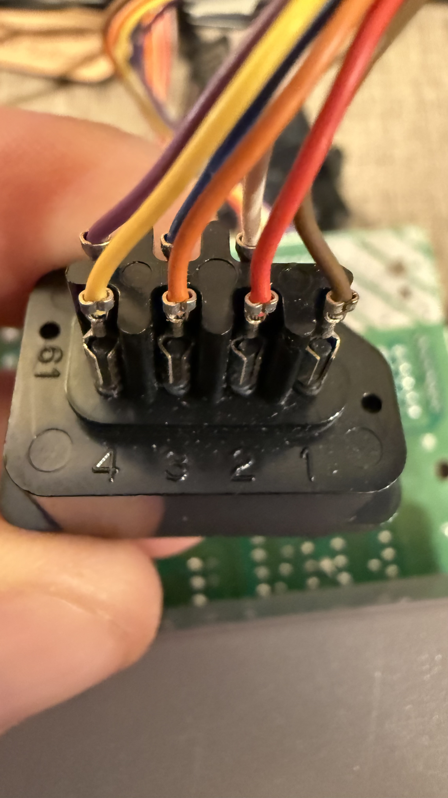
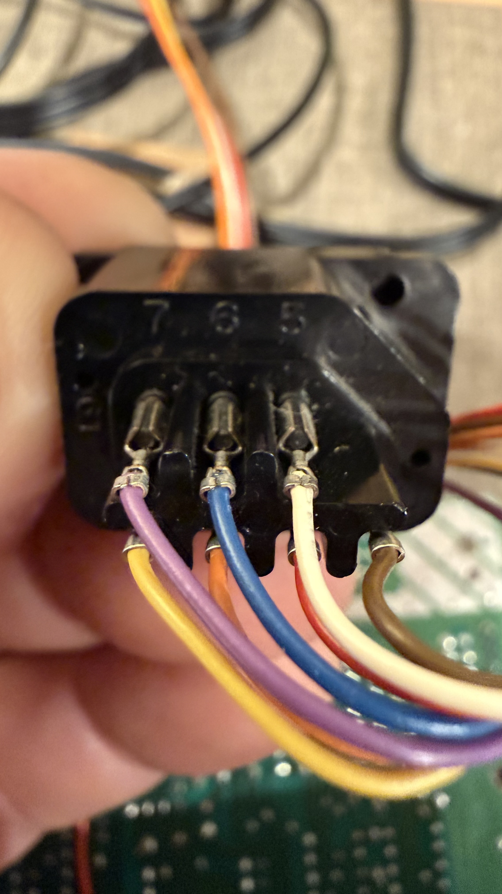

# Lab notebook: building the bench

Generated by `tools/lab-notebook.py` from `docs/lab-log.jsonl`,
which `tools/bringup.py` appends to as each step is attempted.
Nothing in it is typed by hand. Every attempt is shown, including
the ones that failed, because a step that took three tries is the
part of a notebook worth keeping.

The build is v1b, the bridge on an Arduino UNO with everything at
5 V (`bench-v1b-uno.md`). The steps and their checks are in
`tools/bringup.py`, which is the procedure as well as the record:
run it and it walks the build, measuring at each stop.

Before any of it touched hardware the tool was rehearsed against
stand-ins, 6 attempts between 2026-09-08 and 2026-09-08.
Those are in the log, marked, and are not counted below.

## Where the build stands

8 of 8 attempted steps hold, over 20 attempts.

| step | what it proves | attempts | state |
|---|---|---|---|
| 0.1 | The scope answers, and says what it is | 2 | held |
| 0.2 | The workstation can open a serial port | 2 | held |
| 0.3 | The bridge firmware is on the UNO and answers STATUS | 2 | held |
| 1.1 | The controller harness's colours against the port's pins | 1 | held |
| 1.2 | The port's idle levels with the console on | 1 | held |
| 2.1 | The scope on an original pad's port, a game running | 3 | held |
| 5.1 | The two halves joined, eight clocks per latch on a game | 7 | held |
| 6.1 | The trigger reaches the scope | 2 | held |

## Instruments

### 0.1  The scope answers, and says what it is

**Attempt 1, 2026-09-08 11:07:20**: held. DS1054Z, firmware 00.04.05.SP2

**Attempt 2, 2026-09-08 12:41:12**: held. DS1054Z, firmware 00.04.05.SP2

### 0.2  The workstation can open a serial port

**Attempt 1, 2026-09-08 11:07:24**: did not hold. no /dev/ttyACM* or /dev/ttyUSB*: is the UNO plugged in?

Photograph pending: `docs/lab/00-uno-bare.jpg`.

**Attempt 2, 2026-09-08 12:41:14**: held. socket://13.0.0.229:6545 opens

Photograph pending: `docs/lab/00-uno-bare.jpg`.

### 0.3  The bridge firmware is on the UNO and answers STATUS

**Attempt 1, 2026-09-08 12:41:15**: held. # mode pass latch 482 clocks 0 held 00

**Attempt 2, 2026-09-08 12:43:11**: held. # mode pass latch 0 clocks 0 held 00

## The harness

### 1.1  The controller harness's colours against the port's pins

Answers: wiring.md's port table is a published pinout until this step confirms it on THIS board.

**2026-09-08 13:26:56**: held. 7 of 7 pins mapped, read off the pin numbers moulded into the port housing; the numbering is the housing's own, and step 1.2's +5V reading is what tests it

Method: read off the pin numbers moulded into the port housing.

| port pin | signal | wire |
|---|---|---|
| 1 | GND | brown |
| 2 | CLK | red |
| 3 | OUT0 | orange |
| 4 | D0 | yellow |
| 5 | D3 | white |
| 6 | D4 | blue |
| 7 | +5V | purple |

Photograph pending: `docs/lab/01-board-header.jpg`.

### 1.2  The port's idle levels with the console on

**2026-09-09 21:33:50**: held. supply 5.0 V; OUT0 idles 0.091, CLK idles 5.002, D0 None, read with the scope CH4/CH1/CH2, 1x, grounds on the yellow lead; D0 not read

| | |
|---|---|
| the supply lead | 5 V |
| OUT0 idle | 0.091 V |
| CLK idle | 5.002 V |

Photograph pending: `docs/lab/01-meter-on-port.jpg`.

## The part's own timing

### 2.1  The scope on an original pad's port, a game running

Answers: wiring.md's authored 'latch high a few us, clock low a few hundred ns, ~7 us between clocks, 60 polls/s'.

**Attempt 1, 2026-09-09 21:06:59**: did not hold. the latch channel is flat (76 to 77 of 255): is the probe on, and the console running?

Photograph pending: `docs/lab/02-probes-on-port.jpg`.

Photograph pending: `docs/lab/02-scope-screen.jpg`.

**Attempt 2, 2026-09-09 21:14:12**: held. latch high 3.32 us, clock low 0.600 us, clock period 10.62 us, 60.10 polls/s, 8 clocks per latch over 15 latches

| | |
|---|---|
| latch pulse, high | 3.32 us |
| clock pulse, low | 0.6 us |
| between clocks | 10.62 us |
| between polls | 16.639 ms |
| polls per second | 60.1 |
| latches in the record | 15 |
| clocks per poll | 8 |

Clocks per poll: 8 clocks on 14 polls.

Photograph pending: `docs/lab/02-probes-on-port.jpg`.

Photograph pending: `docs/lab/02-scope-screen.jpg`.

**Attempt 3, 2026-09-09 21:24:27**: held. latch high 3.32 us, clock low 0.580 us, clock period 10.62 us, 60.10 polls/s, 8 clocks per latch over 15 latches

| | |
|---|---|
| latch pulse, high | 3.32 us |
| clock pulse, low | 0.58 us |
| between clocks | 10.62 us |
| between polls | 16.639 ms |
| polls per second | 60.1 |
| latches in the record | 15 |
| clocks per poll | 8 |

Clocks per poll: 8 clocks on 14 polls.

Photograph pending: `docs/lab/02-probes-on-port.jpg`.

Photograph pending: `docs/lab/02-scope-screen.jpg`.

## Joined

### 5.1  The two halves joined, eight clocks per latch on a game

Answers: the plan's B0 gate 1, which is the first thing the part gets to answer.

**Attempt 1, 2026-09-15 15:52:06**: did not hold. 1203 polls in 20 s (60.1/s), clocks per poll {0: 18, 1: 37, 2: 29, 3: 28, 4: 12, 5: 4, 6: 12, 7: 32, 8: 826, 9: 40, 10: 35, 11: 10, 12: 16, 13: 37, 14: 35, 15: 27, 16: 5}  <- 377 polls were not 8 clocks

| | |
|---|---|
| polls per second | 60.15 |
| polls logged | 1203 |
| polls with eight clocks | 0.687 |

Clocks per poll: 0 clocks on 18 polls, 1 clocks on 37 polls, 2 clocks on 29 polls, 3 clocks on 28 polls, 4 clocks on 12 polls, 5 clocks on 4 polls, 6 clocks on 12 polls, 7 clocks on 32 polls, 8 clocks on 826 polls, 9 clocks on 40 polls, 10 clocks on 35 polls, 11 clocks on 10 polls, 12 clocks on 16 polls, 13 clocks on 37 polls, 14 clocks on 35 polls, 15 clocks on 27 polls, 16 clocks on 5 polls.

Photograph pending: `docs/lab/05-bridge-joined.jpg`.

Photograph pending: `docs/lab/05-console-running.jpg`.

**Attempt 2, 2026-09-15 17:48:58**: did not hold. 1202 polls in 20 s (60.1/s), clocks per poll {0: 7, 8: 1188, 16: 7}  <- 14 polls were not 8 clocks

| | |
|---|---|
| polls per second | 60.1 |
| polls logged | 1202 |
| polls with eight clocks | 0.988 |

Clocks per poll: 0 clocks on 7 polls, 8 clocks on 1188 polls, 16 clocks on 7 polls.

Photograph pending: `docs/lab/05-bridge-joined.jpg`.

Photograph pending: `docs/lab/05-console-running.jpg`.

**Attempt 3, 2026-09-15 17:49:58**: did not hold. 1202 polls in 20 s (60.1/s), clocks per poll {0: 2, 8: 1198, 16: 2}  <- 4 polls were not 8 clocks

| | |
|---|---|
| polls per second | 60.1 |
| polls logged | 1202 |
| polls with eight clocks | 0.997 |

Clocks per poll: 0 clocks on 2 polls, 8 clocks on 1198 polls, 16 clocks on 2 polls.

Photograph pending: `docs/lab/05-bridge-joined.jpg`.

Photograph pending: `docs/lab/05-console-running.jpg`.

**Attempt 4, 2026-09-15 17:50:23**: held. 1203 polls in 20 s (60.1/s), clocks per poll {8: 1203}  <- B0 gate 1 held

| | |
|---|---|
| polls per second | 60.15 |
| polls logged | 1203 |
| polls with eight clocks | 1 |

Clocks per poll: 8 clocks on 1203 polls.

Photograph pending: `docs/lab/05-bridge-joined.jpg`.

Photograph pending: `docs/lab/05-console-running.jpg`.

**Attempt 5, 2026-09-15 17:51:24**: held. 1202 polls in 20 s (60.1/s), clocks per poll {8: 1202}  <- B0 gate 1 held

| | |
|---|---|
| polls per second | 60.1 |
| polls logged | 1202 |
| polls with eight clocks | 1 |

Clocks per poll: 8 clocks on 1202 polls.

Photograph pending: `docs/lab/05-bridge-joined.jpg`.

Photograph pending: `docs/lab/05-console-running.jpg`.

**Attempt 6, 2026-09-15 17:51:49**: held. 1203 polls in 20 s (60.1/s), clocks per poll {8: 1203}  <- B0 gate 1 held

| | |
|---|---|
| polls per second | 60.15 |
| polls logged | 1203 |
| polls with eight clocks | 1 |

Clocks per poll: 8 clocks on 1203 polls.

Photograph pending: `docs/lab/05-bridge-joined.jpg`.

Photograph pending: `docs/lab/05-console-running.jpg`.

**Attempt 7, 2026-09-15 17:52:14**: held. 1202 polls in 20 s (60.1/s), clocks per poll {8: 1202}  <- B0 gate 1 held

| | |
|---|---|
| polls per second | 60.1 |
| polls logged | 1202 |
| polls with eight clocks | 1 |

Clocks per poll: 8 clocks on 1202 polls.

Photograph pending: `docs/lab/05-bridge-joined.jpg`.

Photograph pending: `docs/lab/05-console-running.jpg`.

## The head's hands

### 6.1  The trigger reaches the scope

**Attempt 1, 2026-09-15 15:52:46**: did not hold. the scope did not trigger: check the resistor, the BNC, and EXT TRIG's level (1.5 V, rising)

Photograph pending: `docs/lab/06-trigger-cable.jpg`.

**Attempt 2, 2026-09-15 17:38:35**: held. TRIG 20 stopped the scope on CH1

Photograph pending: `docs/lab/06-trigger-cable.jpg`.

