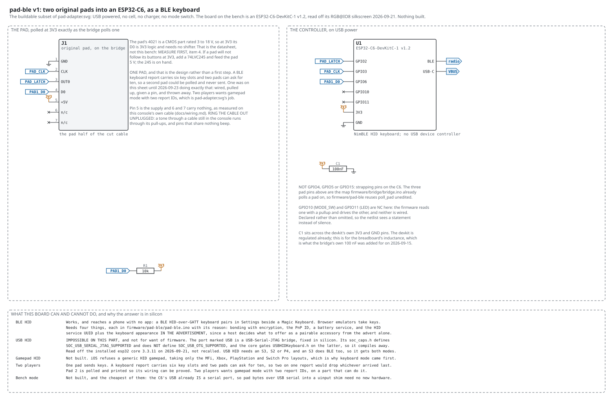
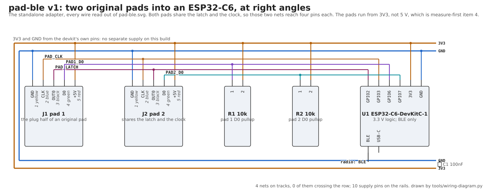
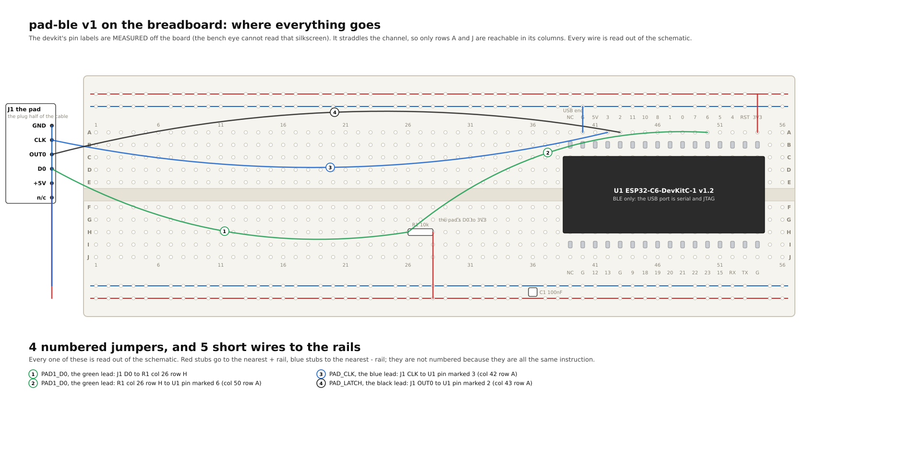

# pad-ble: an original pad as a Bluetooth keyboard, standalone

The bridge's own pad poll with a radio behind it instead of a shift
register. No Pi, no UNO, no console: a pad, the ESP32-C6 already seated
on the breadboard, and one resistor. It pairs to a phone, a tablet or
a laptop as a plain BLE keyboard, which is what lets a forty-year-old
controller drive a browser emulator with no app at either end.

Written 2026-09-21, updated 2026-09-23.

**Nothing here has been built, and nothing about the circuit has been
measured.** The firmware compiles and its key mapping is tested on the
desk, but the wiring below has never had current in it, no pad has been
wired to it, no host has paired it, and one thing it rests on has been
an open measure-first item since 2026-09-07.

What HAS been measured is the board, not the circuit: which part it is,
where it sits on the breadboard, and the order of its header pins. Each
of those says where it was read and by what. The two are kept apart on
purpose, because a page that mixes a measurement of the part with a
plan for a circuit launders one into the other.

## Why this and not the adapter sheet

`pad-adapter.svg` is the whole idea: two pads, a mode switch, a cell, a
charger, an LDO, and either an S3 for USB HID or a C6 for BLE. Most of
that is on order. This is the subset whose parts are all in the drawer,
and it is a sheet of its own for the same reason `bench-v1b` is a sheet
of its own rather than a note on `bench-v1`: a drawing somebody builds
from has to show the parts they have, or the evening goes on reading
around the ones they do not.

## What decided the part, and it was read not recalled

The board on the breadboard is an **ESP32-C6-DevKitC-1 v1.2**. That was
settled on 2026-09-21 off the bench eye at zoom 500, not from the parts
list: its silkscreen reads `RGB@IO8`, and the C6 devkit puts its RGB LED
on GPIO8 where the S3 devkit puts its on GPIO48. Both boards carry two
USB-C ports labelled UART and USB, so the ports do not tell them apart
and the LED does.

**That decides the Bluetooth question, in silicon rather than in
firmware.** The C6 cannot be a USB keyboard. Its port marked USB is a
USB-Serial-JTAG bridge, and its `soc_caps.h` defines
`SOC_USB_SERIAL_JTAG_SUPPORTED` while defining no
`SOC_USB_OTG_SUPPORTED`; the Arduino core gates `USBHIDKeyboard.h` on
the latter, so on this target it compiles to nothing. Checked against
the installed esp32 core 3.3.11. USB HID needs an S3, S2 or P4, and an
S3 would give both modes on one board, which is the one good reason to
order one.

So: BLE keyboard. Not a preference, the only HID this board can do.

## Parts, all on hand

| ref | part | note |
|---|---|---|
| U1 | ESP32-C6-DevKitC-1 v1.2 | already on the breadboard |
| J1 | an original pad | the plug half of the cable |
| R1 | 10k | the pad's D0 up to 3V3 |
| C1 | 100nF | across the devkit's 3V3 and GND |

No LDO, no charger, no cell, no switch. The devkit runs from whatever
USB supplies it and its own regulator makes the 3V3 the pad runs from.

## The wiring, drawn to build from

Three drawings of one circuit, all derived from the same netlist, so no
one of them can show a wire the others do not.

The breadboard sheet is the one that says **which hole**, and it needed
a fact the other two did not: the physical order of the pins along the
devkit's headers. That is measured (below) and lives in
`tools/breadboard.py` as `C6_HEADER`, read from the USB end.

## The wire list

Five conductors, one pad.

| pad plug pin | signal | lead colour | to |
|---|---|---|---|
| 1 | GND | yellow | GND |
| 2 | CLK | blue | GPIO3, driven by the C6 |
| 3 | OUT0 | black | GPIO2, driven by the C6 |
| 4 | D0 | green | GPIO6, with a 10k up to 3V3 |
| 5 | +5V | red | **3V3**, not 5 V |

**The colours are the bridge's own, confirmed at the bench on
2026-09-22 as the same five.** The table is `LEAD = {1: yellow, 2:
blue, 3: black, 4: green, 5: red}` in `tools/wiring-diagram.py`,
metered on the bridge's cable and printed on the pad connector of
`wiring-pad-ble.svg`. A listing of the five colours in another order
was a listing of the set, not of the pin order, and nothing needed
changing.

Ring the cable out anyway before power. Not because the table is in
doubt, but because this is a different cable from the one that was
metered, and the rule here is that colours are not evidence. Unplugged:
on 2026-09-09 a tone through a cable still in the console ran through
its pull-ups and pins that share nothing beeped, repeatably.

**Not GPIO4, GPIO5 or GPIO15.** Those are the S3's numbers for this job
and they are strapping pins on the C6. The three above are the pins
`firmware/bridge/bridge.ino` already polls a pad on, which is why
`firmware/pad-ble` reuses `poll_pad` unedited, and
`tools/check-sheets.py` holds the sheet and the firmware to each other
so they cannot drift apart again.

## Where it sits now, measured off the bench eye

Read 2026-09-22 from the board eye at zoom 500 and 1000, against the
breadboard's own printed column numbers:

| | |
|---|---|
| the devkit's PCB | the middle breadboard, spanning about **columns 37 to 56** |
| its headers | **sixteen pins a side, so sixteen columns**; the USB connectors overhang the rest of the PCB at one end |
| its rows | pins in **B and I**, straddling the channel, leaving A and J free |
| the cable | a cut pad cable is stripped and lying at the board's low-column end, five conductors |

Believed to within a column, exactly as the bridge's own placement was
("counted from the printed marks and believed to within one column").
The sheet draws the headers at columns 39 to 54, which is that reading
rounded to the pin count; nothing in the circuit depends on the choice,
only on the relative positions, so seat it where it suits you and read
the columns off the sheet.

**Only rows A and J are reachable in the devkit's columns.** It is wide
enough to cover C through H, so those holes are underneath it. Every
wire to a lower-header pin goes into row J and every wire to an
upper-header pin into row A. That is the one way a devkit differs from
a chip on this board, and the sheet's addresses already account for it.

**The eye could not read the pin labels, and that is now a recorded
limit.** They are about a millimetre and rotated, and at zoom 1000 they
are below what the BRIO resolves at this working distance; refocusing
onto the devkit's raised surface (focus 26 against the board plane's 18)
is blurrier, so it is resolution and not focus. The same eye reads the
BOARD perfectly, which is how the part was identified from its
`RGB@IO8` silkscreen, several times larger.

## The headers, measured

Read 2026-09-22 from photographs of the board taken by hand, since the
bench eye cannot. **Each row is read from the USB end**, the end the two
USB-C connectors are on. `G` is the board's own spelling of ground, and
it appears more than once.

| row | pins, from the USB end |
|---|---|
| the pad-ble side | NC, G, 5V, **3**, **2**, 11, 10, 8, 1, 0, 7, **6**, 5, 4, RST, **3V3** |
| the other side | NC, G, 12, 13, G, 9, 18, 19, 20, 21, 22, 23, 15, RX, TX, G |

Sixteen a side. This table lives once, in `tools/breadboard.py` as
`C6_HEADER`, and the sheet is drawn from it.

**Every pin this circuit needs is on one row.** GPIO2, GPIO3, GPIO6,
a 3V3 and a ground are all on the first row above, so no wire crosses
to the other side of the board. That is worth knowing before you start,
and it was not a given.

**The trap that row sets.** GPIO4 and GPIO5 sit immediately beside
GPIO6, and GPIO8 is four the other way. All three are strapping pins
on the C6. Counting one hole wrong along that row does not give you a
dead input, it gives you a board that may not boot. Count from the
printed labels, not from the end.

## Measure first

Before anything is powered, and in this order:

1. **Ring the pad's cable out with the plug in nothing.** Measure-first
   item 1 exists because of what happened on 2026-09-09: a tone through
   a cable still plugged into the console runs through the console's own
   pull-ups and port buffers, and pins that share nothing beep. That
   first pass put two port pins on one lead, repeatably, and it was the
   instrument talking. Write the result beside the colour table above.
2. **An original pad at 3V3 follows its buttons.** This is measure-first
   item 4 and it has been open since 2026-09-07. The 4021 is a CMOS part
   rated 3 to 18 V, so the datasheet says yes, but these pads are forty
   years old and some may not be genuine. If one will not run at 3V3,
   the fix is drawn on the adapter sheet already: a 74LVC245 and 5 V to
   the pad, and the 245 is on hand.

Nothing beyond this point is worth doing until item 2 has an answer,
because every version of this adapter rests on it.

## Build order

1. Wire one pad only: GND, OUT0 to GPIO2, CLK to GPIO3, D0 to GPIO6,
   supply to 3V3, and the 10k from GPIO6 up to 3V3.
2. Flash `firmware/pad-ble` and open the serial port at 115200. It
   prints `B <pad1> <pad2> unlinked` on every change of either pad.
3. **First light is that byte following your thumbs, and it needs no
   radio.** If it moves, the hardware half is done and everything after
   it is software. If it does not, no amount of Bluetooth would have
   helped, and the answer is measure-first item 2.
4. Only then pair it. It advertises as `NES Pad` and should appear in a
   phone's Bluetooth settings as an ordinary keyboard.

## What the host sees

A boot-protocol keyboard, report ID 1, with the layout browser
emulators default to: A is `x`, B is `z`, Select is right shift, Start
is enter, and the d-pad is the arrows. Select is a modifier rather than
a key slot because right shift is a modifier, and a host that tracks
modifier state separately would otherwise see shift held in a way no
keyboard produces.

**One pad, and that is the design rather than a first step.** A keyboard
report carries six key slots and two pads can ask for ten, so a second
pad could be polled and never sent. One was on these drawings until
2026-09-23 doing exactly that: wired, pulled up, given a pin, and
thrown away. It came off when the person holding the cable asked why a
standalone keyboard for a phone had two of them, which was the right
question and the sheet's own stated purpose was the argument against
it: a drawing somebody builds from has to show the parts they have.

Two players wants gamepad mode with two report IDs, which is
`pad-adapter.svg`'s job. Gamepad mode is not built for a second reason
anyway: iOS refuses a generic HID gamepad, taking only the MFi, Xbox,
PlayStation and Switch Pro layouts, which is what made keyboard mode
first.

## What is tested, and what is not

Kept apart deliberately, because the two halves are not comparable.

**Tested on the desk, with no pad and no host in the room.** The report
descriptor and the key mapping are plain C in
`firmware/pad-ble/keymap.h`, and `tools/test-pad-keymap.sh` compiles
that same header natively and exercises it: 76 checks, and `MUTATE=1`
plants two realistic bugs and produces twelve failures. The descriptor
is not compared against a copy of itself, it is parsed item by item the
way a host parses it, and what the parse says the report's size is gets
compared with what the code actually writes. Those two are worth
mechanising because a bad descriptor still pairs and a bad mapping still
types: neither announces itself.

**Not tested, and not to be described as working.** The radio, the
pairing, the pad's own timing at 3.3 V, and the wiring. The firmware
compiles for the C6 at 56% of flash and that is all that is known about
it.

## The trap that will cost the most time

A reflash can clear this board's bond store while the phone still holds
its side. A one-sided bond refuses to pair and reports nothing at either
end, on the phone or on the serial port. The `FORGET` command clears
this end and then says, in as many words, to forget the device on the
host as well, because doing only one is the failure.

## Open, and recorded in `open-items.md`

- The adapter has met no pad and no host.
- An original pad at 3V3 is unproven (measure-first item 4).
- The bench eye cannot read a devkit's silkscreen, which is why the
  header order above was read by hand. It will be true of the next
  devkit too.
- The latency is unmeasured. Worth measuring here rather than guessing,
  because this bench can: the bridge stamps every poll with its latch
  index, so the number is one subtraction of `head.log` against
  `bridge.log`.
