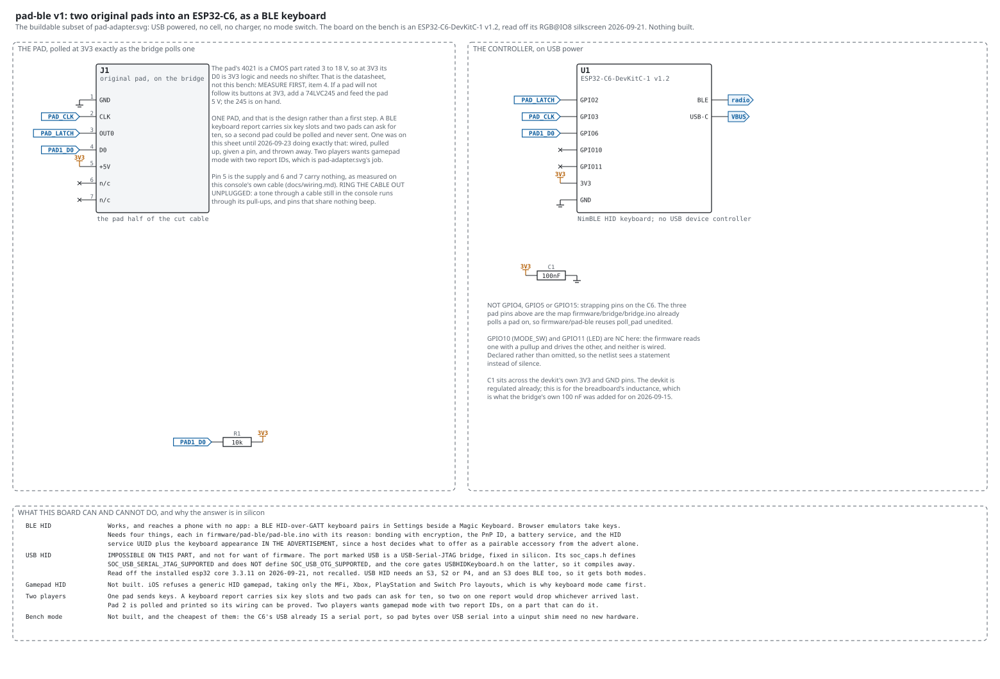
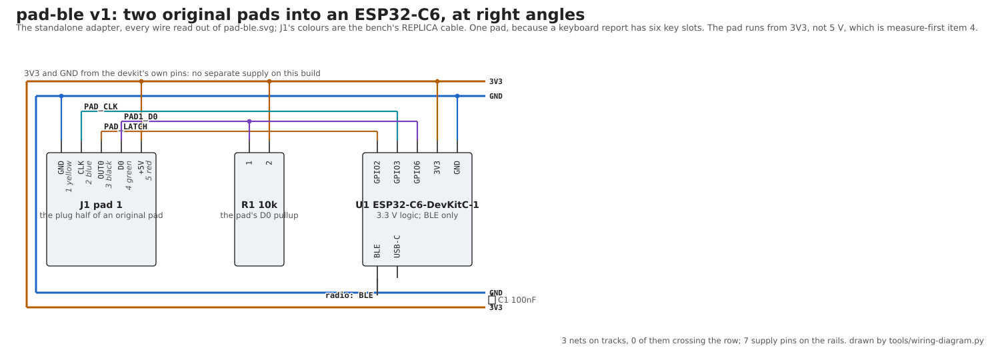
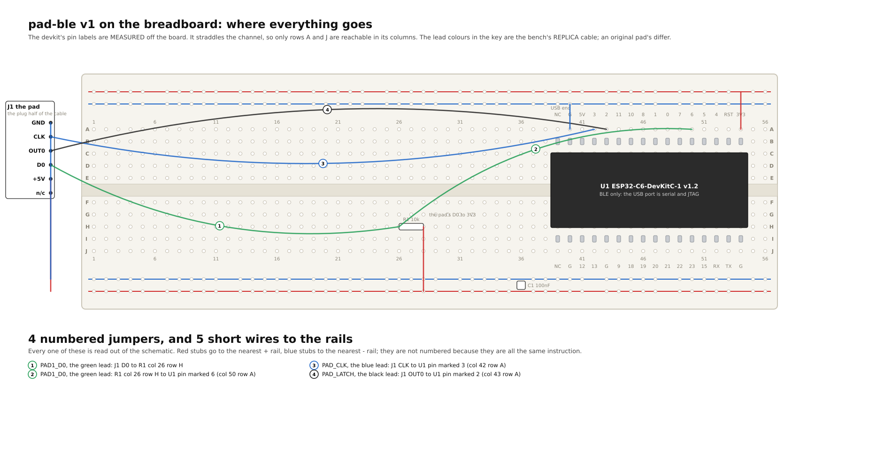

# pad-ble: an original pad as a USB or Bluetooth keyboard, standalone

The bridge's own pad poll with a host interface behind it instead of a
shift register. No Pi, no UNO, no console: a pad, one ESP32 board and
one resistor. It presents to a phone, a tablet or a laptop as a plain
keyboard, which is what lets a forty-year-old controller drive a
browser emulator with no app at either end.

**The board is a Waveshare ESP32-P4-Module-DEV-KIT and the interface
is USB**, both of which changed under this document; the reasoning is
in "The direction changed twice" below. The ESP32-C6 the early sheets
are drawn around never accepted a flash.

Written 2026-09-21, updated 2026-09-27.

**Built and working over USB, 2026-09-27.** An original pad, wired to
the P4 by signal, reads all eight buttons at 3.3 V (measure-first item
4, open since 2026-09-07, is closed), and a Linux host receives them as
key events: A `KEY_X`, B `KEY_Z`, Select `KEY_RIGHTSHIFT`, Start
`KEY_ENTER`, the d-pad the four arrows, chords included. The host was
the bench's Pi; **a phone has not been tried.** Bluetooth remains
unbuilt on this board. What each layer is and how each was proven is
`pad-usb-protocol.md`.

Until 2026-09-27 what had been measured was the board, not the circuit:
which part it is, where it sits on the breadboard, and the order of its
header pins. Since that evening the circuit is measured too: the pad
answers at 3.3 V and a host receives every button as its key ("Tested
on the bench" below, and `pad-usb-protocol.md`). Each measurement says
where it was read and by what. The two are kept apart on
purpose, because a page that mixes a measurement of the part with a
plan for a circuit launders one into the other.

## Why this and not the adapter sheet

`pad-adapter.svg` is the whole idea: two pads, a mode switch, a cell, a
charger, an LDO, and either an S3 for USB HID or a C6 for BLE. Most of
that is on order. This is the subset whose parts are all in the drawer,
and it is a sheet of its own for the same reason `bench-v1b` is a sheet
of its own rather than a note on `bench-v1`: a drawing somebody builds
from has to show the parts they have, or the evening goes on reading
around the ones they do not.

## What decided the part, and it was read not recalled

(The C6 design, kept as a record; superseded from "The direction
changed twice" below. The board built is the P4.)

The board on the breadboard was an **ESP32-C6-DevKitC-1 v1.2**. That was
settled on 2026-09-21 off the bench eye at zoom 500, not from the parts
list: its silkscreen reads `RGB@IO8`, and the C6 devkit puts its RGB LED
on GPIO8 where the S3 devkit puts its on GPIO48. Both boards carry two
USB-C ports labelled UART and USB, so the ports do not tell them apart
and the LED does.

**That decides the Bluetooth question, in silicon rather than in
firmware.** The C6 cannot be a USB keyboard. Its port marked USB is a
USB-Serial-JTAG bridge, and its `soc_caps.h` defines
`SOC_USB_SERIAL_JTAG_SUPPORTED` while defining no
`SOC_USB_OTG_SUPPORTED`; the Arduino core gates `USBHIDKeyboard.h` on
the latter, so on this target it compiles to nothing. Checked against
the installed esp32 core 3.3.11. USB HID needs an S3, S2 or P4, and an
S3 would give both modes on one board, which is the one good reason to
order one.

So: BLE keyboard. Not a preference, the only HID this board can do.

## Parts, all on hand

| ref | part | note |
|---|---|---|
| U1 | ESP32-C6-DevKitC-1 v1.2 | already on the breadboard |
| J1 | an original pad | the plug half of the cable |
| R1 | 10k | the pad's D0 up to 3V3 |
| C1 | 100nF | across the devkit's 3V3 and GND |

No LDO, no charger, no cell, no switch. The devkit runs from whatever
USB supplies it and its own regulator makes the 3V3 the pad runs from.

## The wiring, drawn to build from

Three drawings of one circuit, all derived from the same netlist, so no
one of them can show a wire the others do not.

The breadboard sheet is the one that says **which hole**, and it needed
a fact the other two did not: the physical order of the pins along the
devkit's headers. That is measured (below) and lives in
`tools/breadboard.py` as `C6_HEADER`, read from the USB end.

## The wire list

Five conductors, one pad.

| pad plug pin | signal | lead colour | to |
|---|---|---|---|
| 1 | GND | yellow | GND |
| 2 | CLK | blue | GPIO3, driven by the C6 |
| 3 | OUT0 | black | GPIO2, driven by the C6 |
| 4 | D0 | green | GPIO6, with a 10k up to 3V3 |
| 5 | +5V | red | **3V3**, not 5 V |

**The colours are the bridge's own, confirmed at the bench on
2026-09-22 as the same five.** The table is `LEAD = {1: yellow, 2:
blue, 3: black, 4: green, 5: red}` in `tools/wiring-diagram.py`,
metered on the bridge's cable and printed on the pad connector of
`wiring-pad-ble.svg`. A listing of the five colours in another order
was a listing of the set, not of the pin order, and nothing needed
changing.

Ring the cable out anyway before power. Not because the table is in
doubt, but because this is a different cable from the one that was
metered, and the rule here is that colours are not evidence. Unplugged:
on 2026-09-09 a tone through a cable still in the console ran through
its pull-ups and pins that share nothing beeped, repeatably.

**Not GPIO4, GPIO5 or GPIO15.** Those are the S3's numbers for this job
and they are strapping pins on the C6. The three above are the pins
`firmware/bridge/bridge.ino` already polls a pad on, which is why
`firmware/pad-ble` reuses `poll_pad` unedited, and
`tools/check-sheets.py` holds the sheet and the firmware to each other
so they cannot drift apart again.

## Where it sits now, measured off the bench eye

Read 2026-09-22 from the board eye at zoom 500 and 1000, against the
breadboard's own printed column numbers:

| | |
|---|---|
| the devkit's PCB | the middle breadboard, spanning about **columns 37 to 56** |
| its headers | **sixteen pins a side, so sixteen columns**; the USB connectors overhang the rest of the PCB at one end |
| its rows | pins in **B and I**, straddling the channel, leaving A and J free |
| the cable | a cut pad cable is stripped and lying at the board's low-column end, five conductors |

Believed to within a column, exactly as the bridge's own placement was
("counted from the printed marks and believed to within one column").
The sheet draws the headers at columns 39 to 54, which is that reading
rounded to the pin count; nothing in the circuit depends on the choice,
only on the relative positions, so seat it where it suits you and read
the columns off the sheet.

**Only rows A and J are reachable in the devkit's columns.** It is wide
enough to cover C through H, so those holes are underneath it. A wire
to an upper-header pin goes into row A and a wire to a lower-header pin
into row J. Every pad-ble wire is on the upper header, so **every one
goes into row A**.

**Which header is upper was drawn backwards until 2026-09-23**, and it
is worth saying how it was settled rather than just corrected. The
header photographs show one edge at a time and say nothing about which
edge; the first reading worked it out by rotating the strip and got it
inverted. That put every address on the breadboard sheet on the wrong
header, two of whose pins are the C6's own RX and TX. It was settled at
the bench in one sentence: **with the antenna facing up, 3V3 is the
top-left pin.** Turn that so USB is at the left, which is how the
devkit sits here, and the left side goes to the top.

**The eye could not read the pin labels, and that is now a recorded
limit.** They are about a millimetre and rotated, and at zoom 1000 they
are below what the BRIO resolves at this working distance; refocusing
onto the devkit's raised surface (focus 26 against the board plane's 18)
is blurrier, so it is resolution and not focus. The same eye reads the
BOARD perfectly, which is how the part was identified from its
`RGB@IO8` silkscreen, several times larger.

## The headers, measured

Read 2026-09-22 from photographs of the board taken by hand, since the
bench eye cannot. **Each row is read from the USB end**, the end the two
USB-C connectors are on. `G` is the board's own spelling of ground, and
it appears more than once.

| row | pins, from the USB end |
|---|---|
| the pad-ble side, **upper** | NC, G, 5V, **3**, **2**, 11, 10, 8, 1, 0, 7, **6**, 5, 4, RST, **3V3** |
| the other side, **lower** | NC, G, 12, 13, G, 9, 18, 19, 20, 21, 22, 23, 15, RX, TX, G |

Sixteen a side. This table lives once, in `tools/breadboard.py` as
`C6_HEADER`, and the sheet is drawn from it.

**Every pin this circuit needs is on one row.** GPIO2, GPIO3, GPIO6,
a 3V3 and a ground are all on the first row above, so no wire crosses
to the other side of the board. That is worth knowing before you start,
and it was not a given.

**The trap that row sets.** GPIO4 and GPIO5 sit immediately beside
GPIO6, and GPIO8 is four the other way. All three are strapping pins
on the C6. Counting one hole wrong along that row does not give you a
dead input, it gives you a board that may not boot. Count from the
printed labels, not from the end.

## The part changed: the board that actually works is a P4

**2026-09-24.** The C6 these drawings are around has never accepted a
flash. A Waveshare **ESP32-P4-Module-DEV-KIT** on the same bench
connected on the first attempt, took the firmware, and put a BLE
advertisement on the air that an independent radio heard. So the build
moves to that part, and this section is the wiring for it.

`docs/esp32-part-choice.md` has the measurement behind the choice. The
short of it: the P4 die has no radio at all, the module carries an
ESP32-C6 as one, and the Arduino core's BLE classes are gated to allow
exactly that arrangement. `firmware/pad-ble` builds for `esp32p4` with
the pad map unedited.

### The five wires

Read on 2026-09-24 out of **Waveshare's own schematic** for this board,
connector **P6**, by rendering the page at 900 dpi. It is not read off
a photograph, and that is deliberate: this document shipped four
revisions with the C6's two header rows swapped because a pinout was
derived from a rotated picture instead of from the drawing that
defines it.

| lead | net | goes in | which is |
|---|---|---|---|
| Red | `3V3` | **P6 pin 18** | 3V3 |
| Yellow | `GND` | **P6 pin 26** | GND |
| Black | `PAD_LATCH` | **P6 pin 22** | GPIO2 |
| Blue | `PAD_CLK` | **P6 pin 20** | GPIO3 |
| Green | `PAD1_D0` | **P6 pin 16** | GPIO6 |

**Every one of those is an even pin, so all five wires land in one row
and nothing crosses the header. They are also CONSECUTIVE, which is the
useful way to say it:**

    6    3V3    3    2    0    GND
   p16   p18   p20  p22  p24  p26

**Find the second `3V3` on the even row and the circuit is that hole
and the four around it, taking every one except `0`.** Data, supply,
clock, latch, skip, ground.

That the five are even was chosen, so nothing crosses the header. That
they are also a run was not noticed until the board was wired on
2026-09-25, and it matters: wiring it from the pin numbers, two of the
three signal wires went in wrong. Yellow landed on `SCL`, which the
board pulls up itself, so the clock would have been fighting hardware
and the symptom would have been silence. A grey landed on `0`, one
hole past the latch. Both were found by measuring, not by looking. The lead colours are looked up from
`tools/bringup.py`'s `LEADS`, the cable as it was actually rung out on
2026-09-09, not from the colours anyone remembers: rev E carried three
of the five wrong because they were typed from a set of colours rather
than read from the measurement. The 10k pullup from `PAD1_D0` up to
3V3 is unchanged and still belongs on the breadboard beside the board.

### Pin 1 is not where a Raspberry Pi puts it

The header is physically Pi-shaped and numbered the other way round:

    5V    P6 pins 1 and 3      a Pi has 5V on 2 and 4
    3V3   P6 pins 2 and 18     a Pi has 3V3 on 1 and 17
    GND   5, 10, 13, 19, 26, 29, 33, 40

Every ground is one pin away from where a Pi user reaches for it. **A
Pi HAT will fit this board and will not work.** Count from the
schematic, not from habit.

### Ten pins that reach the header and are still not yours

    GPIO54  pin 31   the onboard C6's RESET. Take it and the radio dies.
    GPIO45  pin 39   the MicroSD card's power switch
    GPIO53  pin 36   the speaker amplifier's CTRL
    GPIO36  pin 23   BOOT_MODE2, a strapping pin, pulled up
    GPIO37  pin 7    the console UART's TXD: Serial lives here
    GPIO38  pin 9    the console UART's RXD (both added 2026-09-25, rev G)

`GPIO24` and `GPIO25` (pins 28 and 27) are the FULL-speed USB pair
(`USB1P1`, USB 1.1, corrected 2026-09-27: this said high speed) and the
Type-C socket marked `USB` is wired to them, and
`GPIO7` and `GPIO8` (pins 4 and 6) are the audio codec's I2C with 2.2k
pullups already on the board. The full table, with what is free, is
`tools/p4_header.py` and sheet 5 of TM-NESB-003.

### The two spare pins had to move

On the C6, `MODE_SW` and `LED` were GPIO10 and GPIO11 and cost nothing
because neither was wired. On this board those numbers are the ES8311
audio codec's I2S, and they are not on the header at all. The firmware
moves them to **GPIO21 and GPIO20**, header pins 12 and 14, free and on
the same even row. Neither is wired; both are declared, because an
unmentioned pin is silence.

### What is proven about this board, and what is not

Proven by test on 2026-09-24: it flashes, it runs, its BLE address
reaches an independent receiver, and the firmware compiles for it with
the pad map untouched. **2026-09-27: the pad is proven too**, over USB,
as the status at the top says. Bluetooth on this board is still not.

## The direction changed twice, and this is why

**2026-09-25.** This began as a Bluetooth adapter and ships as a USB
one. Both moves were forced by measurement, not preference, and both
are worth keeping because the reasoning is reusable.

### Move one: the C6 to the P4

The ESP32-C6 never accepted a flash. Two evenings of `no serial data
received`, with the port, the cable, the wiring and ModemManager each
ruled out by test. A Waveshare ESP32-P4-Module-DEV-KIT on the same
bench connected first try, took the firmware, and put a BLE
advertisement on the air that an independent radio heard. That is
`docs/esp32-part-choice.md`.

### Move two: BLE to USB

The BLE firmware crashes on the P4, and not in this project's code.

    E rpc_core: Response not received for [0x15e](Req_GetCoprocessorFwVersion)
    Guru Meditation Error: Core 1 panic'ed (Load access fault)

The P4 has no radio. The module carries an ESP32-C6 as one, reached
over SDIO, and the host's **esp-hosted 2.12.11** asks that C6 for its
firmware version. It gets no answer, and the failure path then reads a
pointer nobody filled in. **Always 2881 ms after `BLEDevice::init`**,
in every variant tried.

Five explanations were tested and eliminated:

| tried | result |
|---|---|
| build options, 16M flash and PSRAM on | no change |
| removing the `BLESecurity` block | no change |
| `delay(3000)` before `BLEDevice::init` | crash moved by exactly 3000 ms |
| `delay(4000)` after `BLEDevice::init` | never reached; the crash is inside init |
| moving all GPIO setup after BLE | no change |

**The radio probe hits the identical timeout at the identical latency
and survives it.** That is what names the kind of bug: the failure path
reads uninitialised memory, and whether it kills you depends on what
was in that memory, which differs per binary. The probe is lucky. It is
not correct.

So the fault is the unanswered RPC, and the honest fix is the C6's
slave firmware, through the board's `C6 UART` header. **That has not
been done.**

### Why USB rather than a workaround

USB removes the component that is failing instead of stepping around
it: no radio, no co-processor, no SDIO link, no pairing. The P4
declares `SOC_USB_OTG_SUPPORTED` with two OTG peripherals and a UTMI
PHY, which the C6 never had at all, so this is a thing only this part
can do. It is also what was asked for on the first day of this work.

`firmware/pad-usb` boots clean at 18% of flash and prints `B FF` with
no pad wired, which is correct: `D0` floats with no pullup, so all
eight bits read pressed, and the six-slot limit reports `DROPPED`
rather than losing keys quietly. With the pullup fitted it read `B 00`
(2026-09-26), and on 2026-09-27 every button, `01` through `80` and
chords, once a 10 ohm part fitted as that pullup was replaced by a 10k.

Its `keymap.h` is a **symlink** to `firmware/pad-ble/keymap.h`, so both
builds send the same eight buttons as the same eight keys, and
`tools/test-pad-keymap.sh` holds that one file to its own descriptor on
the desk. `tools/check-sheets.py` refuses a copy.

### What did not change

The wiring. Both builds poll `GPIO2`, `GPIO3` and `GPIO6`, the same map
`firmware/bridge/bridge.ino` already uses, so the five wires and the
run they sit in are unaffected by either move.

**One exception, added 2026-09-30: the classic ESP32.** With the
DevKitC-1 dead (no ROM banner on either socket under any reset, see
"Tested on the bench" below), an ESP32-WROOM-32 devkit took the BLE
build instead, and on that module `GPIO6` to `GPIO11` are the flash
the program runs from and `GPIO3` is the UART console's receive line.
So that one build polls `GPIO25` (latch), `GPIO26` (clock) and
`GPIO27` (data), keeps the mode switch on `GPIO4` and lights the
devkit's own LED on `GPIO2`; the reasoning is at the pin block in
`pad-ble.ino`. Where those three pins sit on the header has not been
read off the board.

### Using it

Plug the host into the Type-C socket marked **`USB`**, not `PWR USB TO
UART`. The UART socket stays on the bench head, which is where the
serial log comes from and what the board is flashed over.

**Corrected 2026-09-27: the jumper does not matter, and the first
firmware could not work on that socket.** The P4 has a high-speed and a
full-speed USB controller. The Arduino core's USB classes put the
keyboard on the high-speed one, which on this kit reaches only the
USB-A stack J8, through a switch the HOST/DEVICE jumper drives, on a
port whose 5 V the board itself drives; a host plugged in there would
meet the board's supply with its own. The `USB` Type-C socket is the
full-speed pair on GPIO24/25, built as a device port (its 5 V is an
input, behind a diode), and by default the chip's own USB-Serial-JTAG
answers there: plugged in with the first firmware, the host saw
`303a:1001`, a debug unit, and never a keyboard. `firmware/pad-usb` now
drives TinyUSB itself on the full-speed controller and swaps PHY 0
(GPIO24/25) over to it, since the P4 gives that PHY to the debug unit
by default. The reasoning, the schematic references and the
measurements are in `pad-usb-protocol.md`, layer 4.

## The pad on the bench was a replica

**2026-09-26.** With `firmware/pad-usb` running, the build read `B 00`
and pressing A changed nothing. Every connection was then proven, in
order, before the pad itself was suspected:

| checked | how | result |
|---|---|---|
| ESP side, hole by hole | `firmware/header-probe` | correct, after two wires were moved |
| the junction, lead to jumper | the owner's list against the table | correct |
| both rails | meter | 3.3 V |
| the pad's supply lead | meter at the junction row | 3.3 V |
| the pad's latch lead | meter, board holding it high | 3.3 V |
| the D0 pullup | by eye | a real 10k, not a wire |
| D0 with the latch held high, no clock | `firmware/pad-diag` | **never moved** in two minutes of presses |

Then the owner recognised the controller: **a cheap replica, the same
brand as the pad on the bridge, which works there at 5 V.** Replicas
often carry a custom chip imitating the 4021 rather than a real one,
and those are commonly 5 V only. That is very probably the whole story.
It is not measured: nobody has yet put this replica on 5 V alone.

`pad-diag`'s test is weaker for a replica than it looked. It relies on
genuine 4021 behaviour, where holding the latch high makes D0 follow
button A continuously. A clone chip may load only on an edge, so for
the replica "no response" was ambiguous. For a real 4021 it is fair.

**Measure-first item 4 stayed open until an original was on the build,
and on 2026-09-27 it closed:** holding A with `pad-diag` drove D0 low
through 27 presses in 30 seconds. The same evening's first attempt
failed for a reason worth keeping: the resistor fitted as the data
pull-up was **10 ohms, not 10k**. A 4021 cannot pull a line low against
10 ohms (it would have to sink about 330 mA), so D0 dipped a little on
each press and never crossed the threshold, which looks exactly like a
pad that does not answer. Read the bands, or meter it, before blaming
the chip.

### An original pad, and why its colours are not the replica's

The owner opened an original pad and photographed it. Its chip reads
**`MN4021B`**, Panasonic's CMOS 4021, so `pad-diag` is a fair test for
it. Its cable uses Nintendo's own colours:

| signal | P6 pin | replica lead | original lead | beep the original to 4021 pin |
|---|---|---|---|---|
| supply | 18 | red | **white** | 16, VDD |
| ground | 26 | yellow | **brown** | 8, VSS |
| latch | 22 | black | **orange** | 9, P/S |
| clock | 20 | blue | **red** | 10, CLOCK |
| data | 16 | green | **yellow** | 3, Q8 |

**Red and yellow are in both columns and mean different signals in
each.** Red is the replica's supply and an original's clock; yellow is
the replica's ground and an original's data. Wire an original by the
replica's colours and **its data output goes to the ground rail**, so
the chip shorts its own output every time it drives high.

The original column is **Nintendo's documented scheme, not measured on
this pad yet.** With the pad open the chip is in reach, so beep each
wire to the 4021 pin in the last column before any power goes near it.
Pin 1 is the corner under the notch and its dot; 1 to 8 run along one
side and 9 to 16 back along the other, so 16 sits beside the notch.

`tools/p4_header.py` holds both columns and checks that the original's
chip pins are the 4021's for each job, and that the two colours really
do collide, so the warning above cannot quietly go stale.

### A cable colour is not a signal

This is the third time on this build that a colour has been mistaken
for a fact. First the lead colours were typed from a list rather than
read from the rung-out cable; then that table was tied to the
measurement of the bridge's cable and assumed to describe this one;
now two different pads turn out to spend the same colour names on
different signals. **Wire by signal and confirm by continuity. The
colour is a hint about which wire to pick up, never about what it
carries.**

## Measure first

Before anything is powered, and in this order:

1. **Ring the pad's cable out with the plug in nothing.** Measure-first
   item 1 exists because of what happened on 2026-09-09: a tone through
   a cable still plugged into the console runs through the console's own
   pull-ups and port buffers, and pins that share nothing beep. That
   first pass put two port pins on one lead, repeatably, and it was the
   instrument talking. Write the result beside the colour table above.
2. **An original pad at 3V3 follows its buttons.** This was measure-first
   item 4, open from 2026-09-07 and CLOSED 2026-09-27: an original's
   MN4021B follows its buttons at 3V3, 27 presses in 30 s under
   `firmware/pad-diag`, then every button under `firmware/pad-usb`. The
   4021 is a CMOS part rated 3 to 18 V, so the datasheet said yes; these
   pads are forty years old and some are not genuine, which is why it was
   measured. For a pad that will not run at 3V3 the fix is drawn on the
   adapter sheet: a 74LVC245 and 5 V to the pad, and the 245 is on hand.
   The replica is not measured at 5 V.

Every version of this adapter rested on item 2, which is why it was
measured before anything else was believed.

## Build order

1. Wire one pad only: GND, OUT0 to GPIO2, CLK to GPIO3, D0 to GPIO6,
   supply to 3V3, and the 10k from GPIO6 up to 3V3.
2. Flash `firmware/pad-usb` and watch the UART socket at 115200
   (`tools/pad-watch.py`). It prints `B <byte>` on every change.
3. **First light is that byte following your thumbs, and it needs no
   host.** If it moves, the hardware half is done and everything after
   it is software. If it does not, no amount of USB would have helped,
   and the answer is measure-first item 2 (or a resistor's bands).
4. Only then plug a host into the Type-C socket marked USB. It
   enumerates as `tinymachines NES Pad`, an ordinary keyboard. (On a
   board whose radio answers, `firmware/pad-ble` advertises as `NES Pad`
   instead; on the P4 it crashes at init, see below.)

## What the host sees

A keyboard with the boot keyboard's report layout, report ID 1 (not a
boot-protocol keyboard, corrected 2026-09-27: a boot report carries no
ID, and a BIOS or a boot-only KVM will not see it; every full operating
system does, see `pad-usb-protocol.md`), with the layout browser
emulators default to: A is `x`, B is `z`, Select is right shift, Start
is enter, and the d-pad is the arrows. Select is a modifier rather than
a key slot because right shift is a modifier, and a host that tracks
modifier state separately would otherwise see shift held in a way no
keyboard produces.

**One pad, and that is the design rather than a first step.** A keyboard
report carries six key slots and two pads can ask for ten, so a second
pad could be polled and never sent. One was on these drawings until
2026-09-23 doing exactly that: wired, pulled up, given a pin, and
thrown away. It came off when the person holding the cable asked why a
standalone keyboard for a phone had two of them, which was the right
question and the sheet's own stated purpose was the argument against
it: a drawing somebody builds from has to show the parts they have.

Two players wants gamepad mode with two report IDs, which is
`pad-adapter.svg`'s job. Gamepad mode is not built for a second reason
anyway: iOS refuses a generic HID gamepad, taking only the MFi, Xbox,
PlayStation and Switch Pro layouts, which is what made keyboard mode
first.

## What is tested, and what is not

Kept apart deliberately, because the two halves are not comparable.

**Tested on the desk, with no pad and no host in the room.** The report
descriptor and the key mapping are plain C in
`firmware/pad-ble/keymap.h`, and `tools/test-pad-keymap.sh` compiles
that same header natively and exercises it: 76 checks, and `MUTATE=1`
plants two realistic bugs and produces twelve failures. The descriptor
is not compared against a copy of itself, it is parsed item by item the
way a host parses it, and what the parse says the report's size is gets
compared with what the code actually writes. Those two are worth
mechanising because a bad descriptor still pairs and a bad mapping still
types: neither announces itself.

**Tested on the bench, 2026-09-27, over USB:** the wiring, the pad's
own timing at 3.3 V, and a host receiving every button as its key.
**Tested on the bench, 2026-09-28, over the air, on a second C6:** a
different C6 board from the DevKitC-1 these drawings are around (8 MB
flash, a vendor demo that probed for an SD card; the model is to be
read off it) took `firmware/pad-ble` on the first attempt, flashed from
the bench head with esptool over its USB-Serial-JTAG. It ran, and the
Pi's own radio heard it advertising as `NES Pad`. Two things were found
on the way, and both are corrections to what stood here before:

- **The sketch had a fault of its own that the P4 could never reach.**
  `hid->manufacturer("tinymachines")` writes through a characteristic
  pointer that only the no-argument `manufacturer()` creates, and the
  library leaves that pointer uninitialised. On the first C6 to get
  past `BLEDevice::init` that was a load access fault at the first byte
  of `setValue`, every boot. The one-argument call is now
  `manufacturer()->setValue(...)`. The P4 crashed inside init, before
  this line, which is why it hid.
- **The C6 target sends `Serial` to the UART pins unless the build says
  `CDCOnBoot=cdc`.** Without it the USB socket shows only the ROM's boot
  lines, a write to it from the host times out, and the whole thing
  reads exactly like a sketch that hung before its first print. The
  build line in the sketch carries the option now.

With both: `# advertising as "NES Pad", 65 descriptor bytes`, the pad
byte polled and printed, `STATUS` and `KEYS` answered over USB.
**Not yet tested, and not to be described as working:** a pad wired to
this board, and a phone pairing with it. On the P4 the build still
crashes 2881 ms after `BLEDevice::init`, and compiles at 60%; on the
C6 it compiles at 55%.

**Tested on the bench, 2026-09-30, over the air, on a classic ESP32.**
The DevKitC-1 v1.2 that the drawings are around is dead, not
unflashable: on the night of 2026-09-29 it gave no ROM banner on its
UART bridge at four baud rates under five reset sequences and a held
BOOT+RST, and nothing ever enumerated on its native socket, which a
live C6 does from ROM on power alone. In its place, a plain
ESP32-WROOM-32 devkit on the bench head's USB: `esptool chip-id`
through its CP2102 reads ESP32-D0WD-V3 (revision v3.1), 4 MB flash, and
it arrived running an AT firmware (an `at_customize` partition, version
line `2.4.0`). Its ROM banner appears only when the reset is driven
through RTS; a DTR pulse alone shows nothing, which for a minute looked
like a second dead board. `firmware/pad-ble` built for
`esp32:esp32:esp32` on the test Pi at 83% of the default app partition,
was flashed from the bench head as one merged image at `0x0` over the
same bridge at 921600, and booted: the key map printed, then
`# advertising as "NES Pad", 65 descriptor bytes` and `# pad ff  link
down`, and the bench head's own radio listed `NES Pad`. `BLEDevice::init`
does not crash on this part. Unlike the P4 over USB, this board's
`Serial` is the CP2102 itself, so the `B xx` lines are readable on the
bench head at 115200.

The same night, the bench head became the build's first host. A
non-interactive `bluetoothctl pair` fails with `AuthenticationFailed`,
bluetoothd saying `No agent available for request type 2`, and leaves
the device trusted but unbonded, a state in which BlueZ reconnects in a
loop: the board printed `# linked` 126 times in fifteen seconds while
the head's HID reads failed for want of encryption, and one `STATUS`
answer came back as sixty-four bytes of `0xff`. A burst like it came
once more, ahead of a `FORGET` answer, and a run of `# unlinked,
advertising again` lines once filled a second. None of the three
reproduces under control: opening the port three times gave no bytes
and no reset, `STATUS` after idles of up to ten seconds came back
clean every time, and one connect and one disconnect from the head
each printed exactly one line. The core builds this part with no
power management, so clock scaling is not the explanation either. Seen
three times, reproduced never, recorded as that. With an agent
registered first (`agent NoInputNoOutput`,
`default-agent`, then `pair`) the Just Works pairing bonds, and the
head grows a `NES Pad` keyboard on `uhid` (bus 0005, `e502:0100`,
appearance `0x03c1`). After that one connect prints one `# linked`, and
`STATUS` answers cleanly five times of five with the link down and
again with it up. With no pad wired the byte reads `ff`, all eight
pressed, which is right shift as the modifier and seven keys for six
slots, `dropped 1`; the head held no keys, because that first report
goes out before the host has subscribed. The board was left bonded but
untrusted and disconnected on purpose: a floating data line must not
type into anything until the pad is on it. **Still not tested:** a pad
wired to `GPIO25`, `26` and `27`, and a phone pairing.

## The trap that will cost the most time (BLE build only)

A reflash can clear this board's bond store while the phone still holds
its side. A one-sided bond refuses to pair and reports nothing at either
end, on the phone or on the serial port. The `FORGET` command clears
this end and then says, in as many words, to forget the device on the
host as well, because doing only one is the failure.

**Measured both ways on 2026-09-30, on the classic ESP32 with the bench
head as the host.** Flashing the merged image blanks the board's bond
store, and the head, still bonded, then connects and reports
`Connection successful` while nothing works: bluetoothd's journal is
the only tell, four `Request attribute has encountered an unlikely
error` lines from its HID reads, and the stale `uhid` keyboard stays
listed from the head's cache. `bluetoothctl remove`, then pairing with
an agent, bonds again. The other way round, `FORGET` on the board with
one bond stored answered `# 1 bond(s) were stored here` and `rc 0`, and
the head's next connect fell to `Connected: no`; `remove` and a third
pairing bonded again. Before that day `FORGET` did nothing on this
part: the sketch cleared bonds only under NimBLE, and the classic
ESP32's core is Bluedroid, where the bonds are listed and removed one
at a time. The sketch carries that branch now.

## Open, and recorded in `open-items.md`

- The USB adapter has met no phone; its only host so far is the Pi.
- The BLE build has met no pad, and its one host is the bench head
  (2026-09-30, on the ESP32-WROOM-32). On the P4 it cannot until
  the onboard C6's firmware answers (see above); on the second C6 it
  advertises (2026-09-28) and waits for a pad on GPIO2, 3 and 6 and a
  phone; on the ESP32-WROOM-32 it advertises (2026-09-30) and waits for
  a pad on GPIO25, 26 and 27 and a phone.
- The bench eye cannot read a devkit's silkscreen, which is why the
  header order above was read by hand. It will be true of the next
  devkit too.
- The latency is unmeasured. Worth measuring here rather than guessing,
  because this bench can: the bridge stamps every poll with its latch
  index, so the number is one subtraction of `head.log` against
  `bridge.log`.
