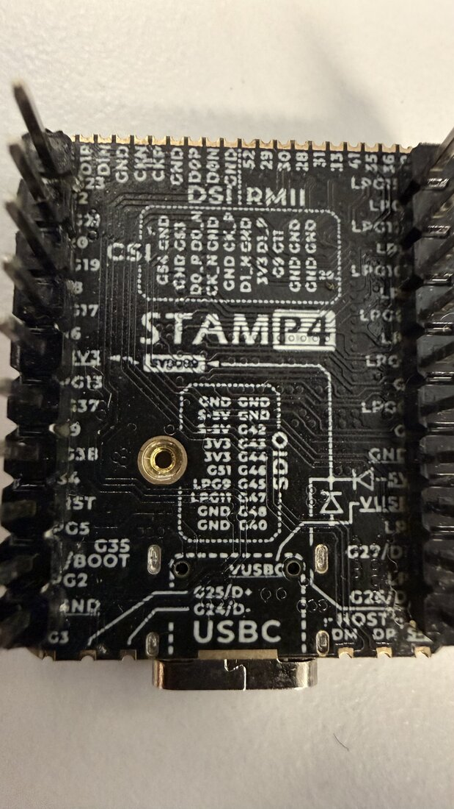
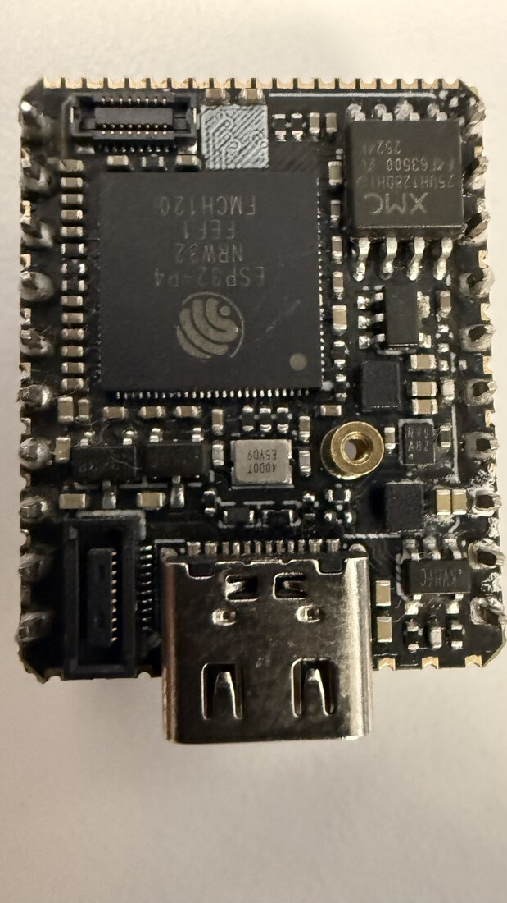
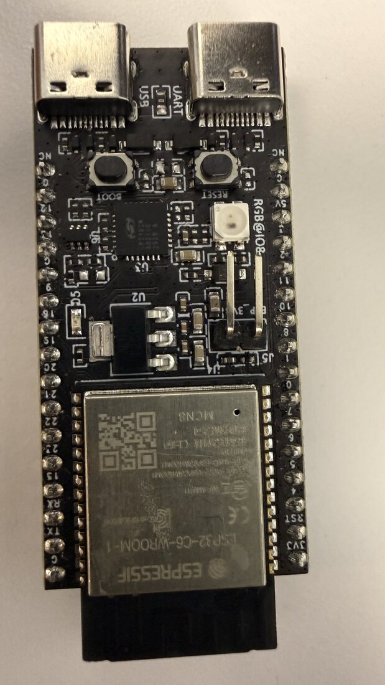
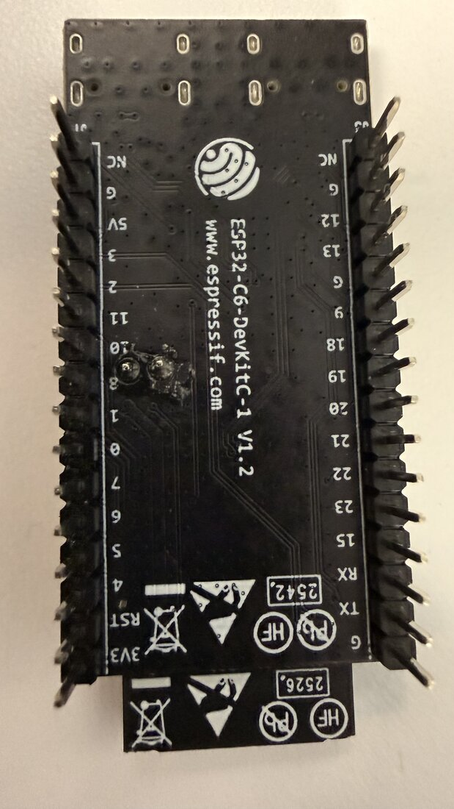
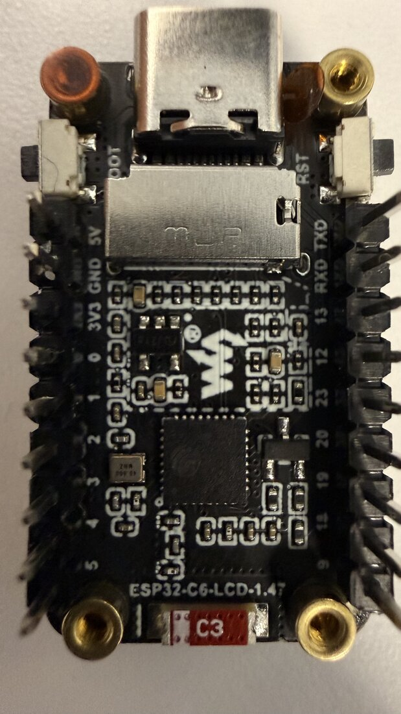
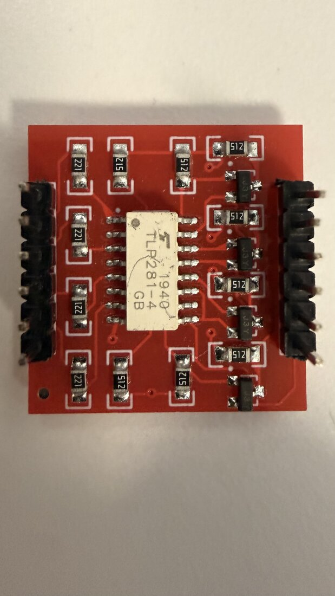
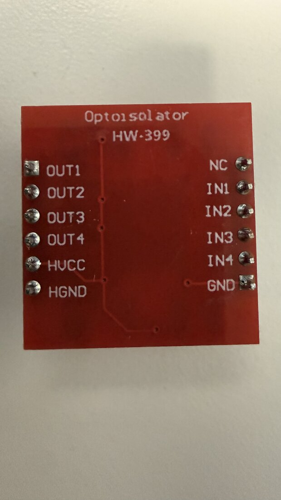
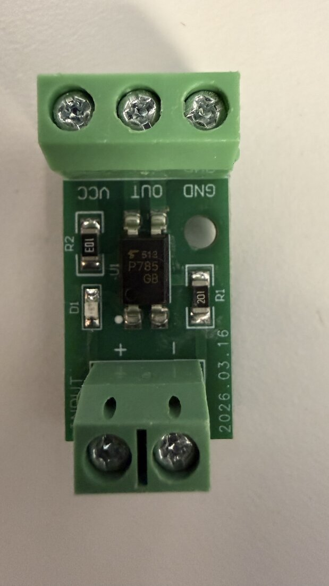
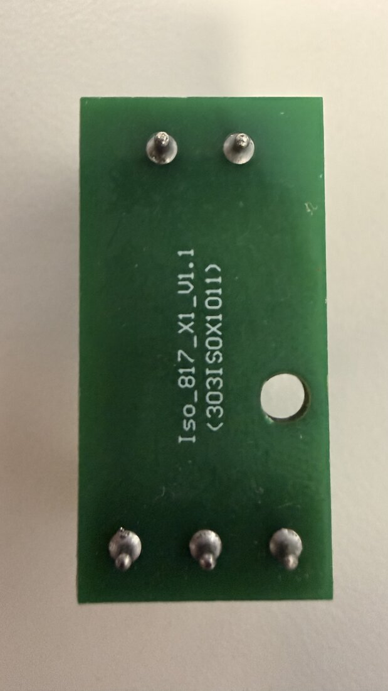

# In the pile

Gear on hand for new projects, read off the owner's photographs. Each
entry says what was READ off the part (silkscreen, chip marking,
resistor code) and what comes from the part family's documentation,
which is not a measurement. Nothing here has been powered on this bench
unless it says so.

The cartridge pile (the 65C02 set, the static RAM, the mask ROM
adapter) is in `cal-cart-build.md`; the bridge's own parts are in
`parts.md`.

## Photographed 2026-10-05: three ESP32 boards and two opto boards

| item | marking read | what it is | fits |
|---|---|---|---|
| Stamp P4 | STAMP P4; ESP32-P4NRW32; XMC 25QH128 | ESP32-P4 core board, no radio, no buttons, castellated | pad-usb (it runs it now); camera/display work |
| C6 DevKitC | ESP32-C6-DevKitC-1 V1.2; ESP32-C6-WROOM-1 MCN8 | Espressif's C6 devkit, two USB-C | nothing: dead, set aside |
| C6 LCD | ESP32-C6-LCD-1.47 (Waveshare) | C6 board with a 1.47 in LCD and a card slot | the TRNG emitter (geiger TM-TRNG-001) |
| HW-399 | Optoisolator HW-399; TLP281-4 GB | four isolated channels, slow | isolating buttons, relays, slow logic |
| Iso_817_X1 | Iso_817_X1_V1.1; P785 GB | one isolated channel, terminals | the TRNG case's stand-in opto |

### Stamp P4: the board that boots straight into the pad firmware

- **Read:** ESP32-P4NRW32 (the P4 with 32 MB of PSRAM in the package),
  flash XMC 25QH128 (128 Mbit, 16 MB), STAMP P4 on the silkscreen. The
  maker's name is not printed on the board.
- **Silkscreen groups:** CSI (camera, FPC connector on the part side),
  DSI (display), RMII (Ethernet MAC pins), SDIO, LPG (low-power GPIO),
  5V, 3V3, RST, and **G35/BOOT** on the left edge.
- **USB:** one Type-C, wired to **G24/G25 (D-/D+)**, the full-speed port
  that is normally the P4's USB serial/JTAG. HOST DM/DP pads at the
  bottom edge are the high-speed port.
- **No buttons.** To reach the ROM bootloader, hold G35/BOOT to GND
  while RST is pulled low and released (or while it powers up).
- **This is very likely LITTLEGUY** (the office machine, 2026-10-05): a P4, no
  buttons, enumerating as `303a:0002 tinymachines NES Pad`.
  `firmware/pad-usb` swaps exactly this port (PHY 0, GPIO24/25) to the
  OTG controller, which is why the board shows no serial port: its only
  socket is the pad. Unconfirmed until the bootloader answers.
- **From the family's documentation, not measured:** no Wi-Fi or BLE
  on any P4; dual RISC-V high-performance cores plus a low-power core.

### C6 DevKitC: the board that died, set aside

- **Read:** ESP32-C6-DevKitC-1 V1.2, module ESP32-C6-WROOM-1 marked
  MCN8 (8 MB flash), date codes 2542 and 2526 on the back. Two Type-C
  sockets marked **USB** (the C6's own USB serial/JTAG) and **UART**
  (through the bridge chip U3). BOOT and RESET buttons, **RGB LED on
  IO8**, jumper J5.
- **Dead, and set aside (owner, 2026-10-05).** This is the C6 devkit
  the pad sheets were drawn around, found dead on 2026-09-29 (no ROM
  banner on either socket); the flux and solder at the header pins
  labelled 10 and 8 on the back are from that build. Nothing is planned
  on it.
- **From the family's documentation:** Wi-Fi 6 (2.4 GHz), BLE 5,
  802.15.4 (Thread, Zigbee), one RISC-V core.

### C6 LCD: a C6 with a screen and a card slot

- **Read:** ESP32-C6-LCD-1.47, Waveshare logo, a 40.000 MHz crystal,
  one Type-C, **BOOT** and **RST** buttons, a card slot under the metal
  cage, header pins 0 to 5, 9, 18, 19, 20, 23, 12, 13, RXD, TXD, 3V3,
  GND, 5V. A red label reads C3 (someone's tag; the chip is a C6).
- **The screen** is on the other face; the photograph of it is out of
  focus and is not kept. Its size is in the product name, 1.47 in.
- **Measured 2026-10-05** (`esp-reset --characterize` on the bench
  head): ESP32-C6FH8 (QFN32) rev v0.2, **8 MB flash in the package**,
  40 MHz crystal, base MAC b0:a6:04:8b:48:58, secure boot and flash
  encryption off, every key block empty. It enumerates as `303a:1001`,
  the C6's own USB serial/JTAG.
- **What it was running:** `firmware/pad-ble` (it printed "advertising
  as NES Pad"), which never lights the screen: that is the dark screen,
  not a fault.
- **From the vendor's wiki** (waveshare.com/wiki/ESP32-C6-LCD-1.47,
  read 2026-10-05): ST7789 panel, 172 by 320; LCD on GPIO6 (MOSI),
  7 (SCLK), 14 (CS), 15 (DC), 21 (RST), 22 (backlight); the card slot on
  4 (CS) and 5 (MISO) sharing 6 and 7; the RGB LED on GPIO8. The wiki
  says 4 MB of flash; the chip says 8.
- **Its job:** the TRNG emitter, capture on GPIO18 (geiger
  `docs/HARDEN-PLAN.md`).

### HW-399: four channels, for slow signals

- **Read:** Optoisolator HW-399, Toshiba **TLP281-4 GB** (four
  phototransistor optocouplers in one package, date 1940), resistors
  coded 221 (220 ohm, one per input) and 512 (5.1 k), and four SOT-23
  transistors marked J3Y. Pins: IN1 to IN4, GND, NC on the input side;
  OUT1 to OUT4, HVCC, HGND on the isolated side.
- **Not measured:** the output polarity (whether OUTn goes high or low
  when INn is driven) and its edge times. A phototransistor part like
  this one switches in microseconds; it is for buttons, relays and slow
  logic, not for timestamps.

### Iso_817_X1: one channel, screw terminals

- **Read:** Iso_817_X1_V1.1 (303ISOX1011) on the back, 2026.03.16 on
  the front, and a Toshiba **TLP785 GB** on it, not a PC817 (the TLP785
  is the same four-pin phototransistor class). Input terminals + and -,
  output terminals VCC, OUT, GND; indicator D1.
- **The resistors, read with the board's own text turned upright:**
  **R1 = 102, 1 k** on the input side and **R2 = 103, 10 k** on the
  output side. The markings are printed at right angles to the
  terminals' labels, and read the other way they would say 201 and E01;
  a meter settles it in seconds.
- **The same model** is the NES head's reset opto (`wiring.md`,
  `Iso_817_X1`), so this R1 is the best reading so far of that one's
  input resistor too, and of the TRNG drawing's stand-in (geiger
  TM-TRNG-001 sheet 3 assumed 1 k).
