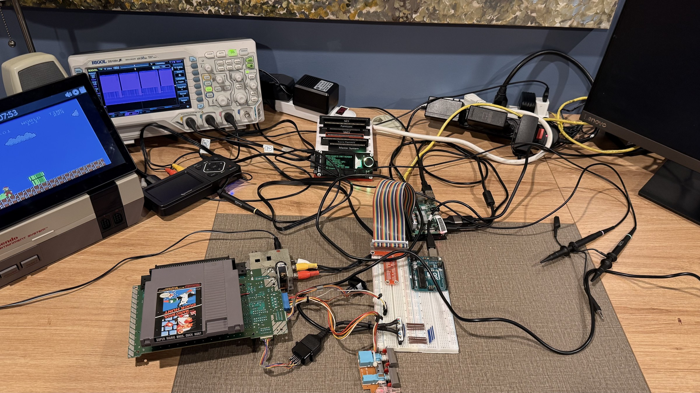
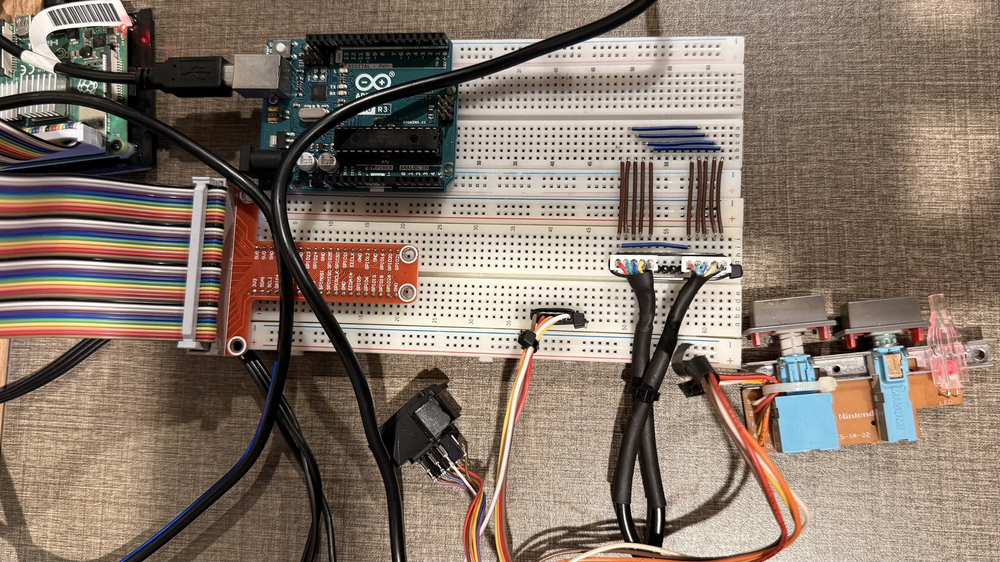
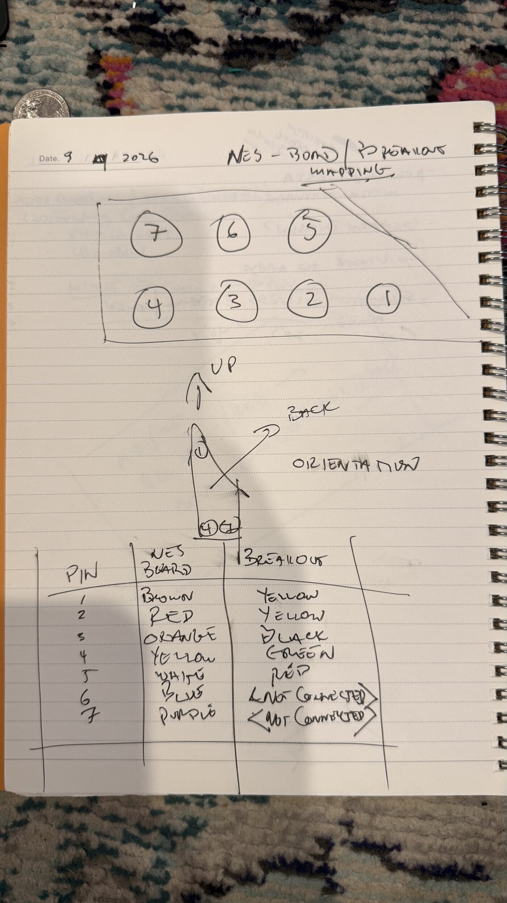
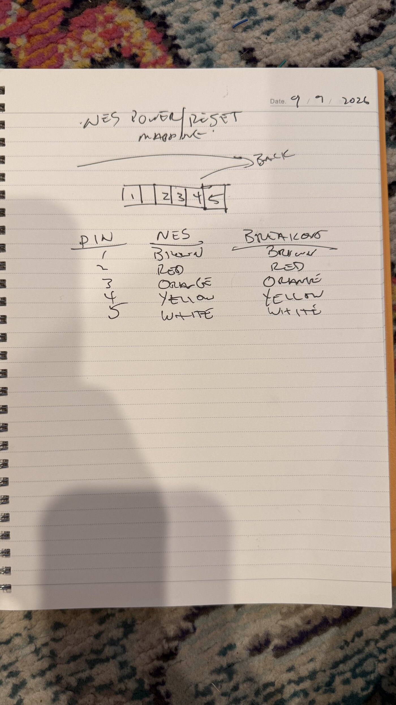
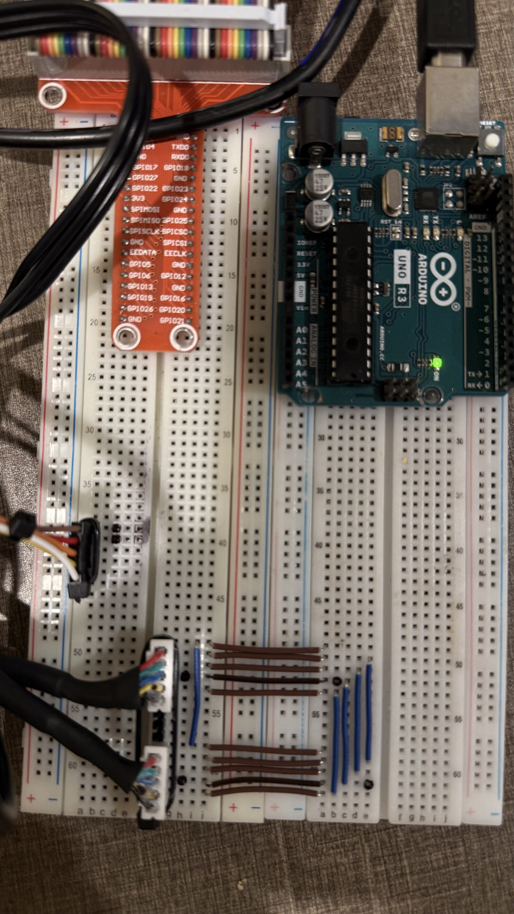

# 2026-09-08: sitting 2, the console measured

**State: open.** Sitting 1 holds. Step 1.1 holds, from the connector's
moulded pin numbers. The cut cable is fully rung out as of 2026-09-09,
out of circuit. What is left is one ohms check to say which lead is
ground, then two probes, and then the tools can run.

Nothing in this sitting is soldered onto the console and nothing of the
bridge is built. It is a meter, two probes and a game.

## The bench as of 2026-09-09

The board is out of its shell with Super Mario Bros running, the cart
reader is beside it, the Pi and the Uno are on the breadboard, and two
breakouts have been made: one for controller port 1 and one for the
power and reset switches.

## What the tools can see from here

Asked of the scope directly, not read off a photograph:

- **The console is on.** CH3, the video probe, reads 1.138 Vpp and the
  scope triggers on it.
- **CH1 and CH2 are flat at zero**, 0.08 and 0.12 Vpp, at both 1x and
  10x. Both OUT0 and CLK idle **high**, so a probe on either would read
  about 5 V, not nothing.
- The photograph agrees: **both probes are lying on the desk**, tips
  bare and ground clips dangling.

That is the only thing standing between here and the measurement.

## The colour map, for use at the bench

From the port housing's own moulded numbers
(`docs/lab/01-port-housing-*`):

| pin | signal | wire |
|---|---|---|
| 1 | GND | brown |
| 2 | CLK | red |
| 3 | OUT0, the latch | orange |
| 4 | D0, the data | yellow |
| 5 | D3 | white |
| 6 | D4 | blue |
| 7 | +5 V | purple |

This is the housing telling you its own numbering. It does not prove the
harness reaches the board header unswapped, and it does not prove the
published function table is right for this board. Step 1.2 tests both,
and the test is that **purple reads about 5 V**.

## The breakouts, mapped

Probing inside a controller socket is fiddly and a slipped tip shorts
two pins. A breakout on the breadboard is a row of holes, and a probe
clips to a link wire and stays there. So the probing moves to the
breadboard, and the four meter readings can be taken there too, with
one exception named below.

Answered 2026-09-09 from the bench notebook, photographed rather than
retyped, so the sheet and the table can be compared:

| pin | signal | NES harness | breakout lead |
|---|---|---|---|
| 1 | GND | brown | yellow |
| 2 | CLK | red | yellow |
| 3 | OUT0, the latch | orange | black |
| 4 | D0, the data | yellow | green |
| 5 | D3 | white | red |
| 6 | D4 | blue | not connected |
| 7 | +5 V | purple | not connected |

The NES column is step 1.1's, unchanged. Three things fall out of the
breakout column, and two of them change what happens next.

**Pins 1 and 2 are both yellow.** Ground and clock, the same colour,
adjacent, and they are exactly the two leads a probe's ground clip and
a probe's tip are about to go on. A ground clip on CLK is a short to
ground every time the console drives that line high. So this is the
first thing at the bench, before any probe touches anything:

- console **off**,
- meter on continuity,
- one lead on the board header's **brown**,
- touch each **yellow** in turn.

The one that beeps is pin 1, GND. Mark it, physically. The other is
CLK. This also does what `wiring.md`'s measure-first item 1 asked for
and step 1.1 could not: 1.1 read the pin numbers moulded into the port
housing, which is the housing's claim about itself and says nothing
about whether the harness reaches the board header unswapped. A beep
from brown to a breakout lead says it does.

**+5 V is not brought out.** So step 1.2's guard reading, purple about
5 V, cannot be taken at the breakout. It has to be taken at the port
housing or at the board header. Everything else in 1.2 can be read at
the breakout.

**That is not a rework item.** The bridge does not need the console's
+5 V. v1b powers the 74HC chain from the UNO's own 5 V, fed from the Pi
over USB: the last row of the pin table in `bench-v1b-uno.md`. One
supply feeding the chain is better than two joined at the breadboard.
What the port does still have to share is **ground**, and it does: pin
1 is on the breakout. All four lines the bridge actually touches are
there, GND, CLK, OUT0 and D0. D3 arrives as a bonus. D4 does not, and
D4 is not used.

**Correcting a reading of the photograph.** An earlier version of this
document said the breakout carried "red, cyan, blue and yellow". That
was me reading colours off `02-breadboard-and-breakouts.jpg` at the
header, where the leads vanish into heat shrink an inch later; the
count was wrong as well, there are five. The notebook is the record.
Colours read off a photograph are not evidence either.

### The power and reset breakout

Five ways, straight through, colour for colour:

| pin | NES harness | breakout lead |
|---|---|---|
| 1 | brown | brown |
| 2 | red | red |
| 3 | orange | orange |
| 4 | yellow | yellow |
| 5 | white | white |

Nothing to disambiguate here. What each of the five *does* is still
unknown, and that is sitting 5's question, not this one:
`wiring.md`'s measure-first item 5 asks which reset pad is ground and
what level the other sits at.

## The continuity check, run 2026-09-09

**One beep, and it is the one that mattered.** Meter on continuity, one
lead on the NES harness's **brown** at the board header, the other on
each breakout lead in turn: a **yellow** beeps. That lead is port pin 1,
GND. It is marked on the board.

That is worth more than a colour. It is the first thing in this build
that connects a breadboard hole to a numbered pin on the console through
a wire somebody actually rang out, and it is where the scope's ground
clips go.

### What the three connectors actually are

Answered by the operator 2026-09-09, and it is not what the earlier
paragraph in this file guessed. Corrected here rather than quietly:

- **The two white headers in black heat shrink are one controller
  cable, cut in half and broken out at both ends.** They carry the same
  five conductors because they are the same cable, which is why they
  look identical at the breadboard and why nothing about their colours
  distinguishes them.
- **The third, standalone connector is the power and reset breakout**,
  colour for colour with the power module, as the second notebook page
  says.

So the earlier warning here, that a brown could have come off either
harness, does not apply. There is only one harness in play.

### What that changes about the build, and it is an improvement

`wiring.md` has the bridge tapping the console's own port harness at the
board header (J1), and borrowing the console's second port housing for
the pad (J2), with nothing cut. A controller cable cut in half gives
both of those from one sacrificed cable and touches nothing inside the
console:

- the **plug half** goes into port 1 and is the console side, which is
  what the 74HC165 answers as;
- the **pad half** has the pad on the end of it, which is what the UNO
  polls on D6, D7 and D8.

The console's own harness stays plugged into its board header, and the
second port stays free. That is worth having: the one irreversible thing
on this bench is now a cable that cost nothing, rather than a connector
inside a working console.

`wiring.md` and `bench-v1b-uno.md` still describe J1 and J2 the old way,
and the schematic still draws them that way. They are not amended yet on
purpose: the cut cable's own map is the thing being rung out right now,
and amending a sheet to match a map that has not held would put the
guess into the drawing. They get amended when step 1.1 holds with the
meter.

**Which half is which is already answered**, if the plug was in port 1
for the continuity check. A beep from the console's board header to a
breakout lead can only reach the **plug half**: the pad half is on the
far side of the cut. So the header you marked is the console side.

### The colours still have to be rung out, and now there are seven

The notebook page lists the cable's conductors as yellow, yellow, black,
green, red. The photograph of the header shows red, teal, blue, yellow
and a dark fifth. The most likely explanation is that the page describes
the cable's own wires and the photograph shows a ribbon pigtail spliced
onto them under that heat shrink, in which case both are true and the
mapping between them is what nobody has written down. It is not worth
deciding by looking. The meter is in your hand.

**So ring out all seven**, console **off**, plug in port 1, one lead of
the meter on each of the console harness's wires in turn at the board
header, the other hunting for the beep on the breakout:

| moulded pin | NES harness | breakout lead | purpose, published | purpose on this board |
|---|---|---|---|---|
| 1 | brown | **yellow** | GND | GND or +5 V |
| 2 | red | **blue** | CLK | CLK |
| 3 | orange | **black** | OUT0, the latch | OUT0 |
| 4 | yellow | **green** | D0 | D0 |
| 5 | white | **red** | D3 | the other of GND and +5 V |
| 6 | blue | not carried | D4 | not carried |
| 7 | purple | not carried | +5 V | not carried |

All seven rung out 2026-09-09, with the cable **out of the console**.

### The first pass was toning through the console, and it lied

The earlier table had pins 1 and 2 both on yellow. They are not. Pin 2
is blue. The first pass was rung with the cable still plugged into the
NES, and a tone through a connected console goes through the console's
own pull-ups and port buffers, so pins that share nothing beep anyway.

That is the whole two yellow scare, invented by the instrument. It is
the same failure as a stale server on a port or a `/usr/bin/node` that
is v12: the measurement was of the wrong circuit, and it was perfectly
repeatable. **Ring a cable out of circuit or do not ring it out.**

The notebook page was right about four of five and wrong about pin 2 for
the same reason. Nothing in this document guesses at a colour again.

### The published pinout does not describe this board

Two of the five conductors have no purpose yet, and it is not a small
gap. A pad runs a 4021, and the five wires it needs are GND, CLK, OUT0,
D0 and **+5 V**. Pins 2, 3 and 4 are the middle three on every published
NES pinout and nothing here disturbs them. So **pins 1 and 5 are ground
and the supply, in one order or the other**, and the published table,
which calls pin 1 ground, pin 5 D3 and pin 7 the supply, cannot be right
on this housing's numbering: pin 7 carries nothing, and a pad has no use
for D3.

The likely story is that the moulded numbers on the top row of this
housing read the other way from the reference drawing, which would make
the moulded 5 the reference's 7. That is a guess and it is not needed.
One measurement settles it.

### Do this before a probe ground clip touches anything

If pin 1 is the supply rather than ground, a probe's ground clip on it
shorts the console's 5 V rail to the scope's earth. So the order
matters:

1. Console **off and unplugged from the wall**.
2. Meter on ohms or continuity, one lead on the console's **metal
   shielding**, which is ground beyond argument.
3. Touch the **yellow** lead, then the **red** lead.
4. The one that reads near zero is **GND**. The other is **+5 V**.

Write both into the table above. Then the ground clips go on the one
that read zero, and nothing else on this bench is ambiguous again.

### Settling it, cheapest first

**1. The ohms check above**, which names ground and the supply and takes
one touch.

**2. Let the scope confirm all five.** This is the good part: the five
conductors of a controller cable identify themselves by shape, and no
numbering has to be trusted at all. Console on, a game running, the plug
back in port 1, probe grounds on the lead already marked as ground:

| what the scope shows | what the lead is |
|---|---|
| flat at 0 V | GND |
| flat at 5 V | +5 V, the supply |
| one wide pulse per frame | OUT0, the latch |
| a burst of eight narrow pulses after it | CLK |
| data between the clocks | D0 |

Five leads, four channels on this scope, and one of the five is already
known. There is no ambiguity left in that table: only one line is flat
high, only one has a single wide pulse, only one has eight.

This is what step 2.1 does anyway, and the identification falls out of
the same capture. Put the probes on, read the shapes against the table,
then leave CH1 on black and CH2 on blue and let the tool take the
measurement.

The scope is also the second opinion on the ohms check, and it is the
one that decides: whichever of yellow and red is flat at 5 V is the
supply, and the other is flat at 0 V. If those two disagree with the
meter, stop and say so, because then something is wrong that neither
instrument has named yet.

## The 4.96 V, placed

The reading reported as "4.96 V between black and red" can now be put
somewhere, and it is not the supply either way.

- If those were the breakout's own **black** and **red** leads, that is
  OUT0 against D3: the latch line measured against a pulled-up input.
- If they were the meter's black and red leads, the reading has no
  location recorded at all.

The console's supply is **purple**, pin 7, and purple is not on the
breakout. So 4.96 V stands as an observation and not as a result, and
step 1.2's guard is still unanswered.

## Step A, you: the two probes

Once the seven are rung out and marked, nothing here needs a colour
name. On the **plug half**, the one that beeps to the board header:

- **CH1** on **black**, which is OUT0.
- **CH2** on **blue**, which is CLK.
- Both probe grounds on whichever of **yellow** and **red** the ohms
  check called ground.
- **CH4** on the other of those two, to see the supply flat at 5 V, and
  **CH3** stays on video as the liveness check.
- Probes at **1x** if they have a switch.
- A pad on the **pad half**, and that half's plug is not in the console.
  The console polls port 1 through the cut cable's plug either way, so
  the game runs and the port is driven whether or not the pad answers.

The lead that beeps against the harness's yellow is D0, and step 2.1
does not need it.

## Step B, the tools: step 2.1

This is the one that matters. It arms both channels, waits for a latch
pulse, reads twelve million points and measures four things:

- the latch pulse width,
- the clock pulse width,
- the gap between clocks,
- the polls per second.

Those four are marked **authored** across `docs/wiring.md` and the
timing sheet, and have been since before any of this was built. This
step retires them.

## Step C, you: four readings with the meter

Meter's black lead on **GND**. Nothing plugged into the port being
measured. Three of the four can be taken at the breakout; the supply
cannot, because purple is not brought out.

| read | where | expect |
|---|---|---|
| the supply | breakout, whichever of yellow and red is not ground | about 5 V |
| pin 3, OUT0 | breakout, black | as the scope found it |
| pin 2, CLK | breakout, blue | as the scope found it |
| pin 4, D0 | breakout, green | high, pulled up |

**If purple is not about 5 V, stop.** Either the map is wrong or the
console's supply is. This is the reading 4.96 V did not give.

## Step D, the tools: step 1.2

The four readings go into the log with the guard on the supply pin.

## Observations

- 2026-09-09: the console was off when 2.1 was first called for, and is
  on again now. Worth knowing that the video probe on CH3 is a free
  liveness check: 1.1 Vpp and a 3.58 MHz burst means the console is
  running, and 0.03 Vpp means it is not.
- 2026-09-09: the mapping arrived as two notebook pages rather than as
  a message, which is the better artefact: it is dated, it is in the
  operator's hand, and it is now in `docs/lab/` beside the port-housing
  photographs. The two-yellow collision is a property of the build, not
  a mistake in it, and it is only dangerous because nothing else on
  that header is labelled.
- The board is out of its shell. Nothing in the plan assumed a shell, but
  the reset and power switches are now on a loose board rather than
  under the case, which makes sitting 5 easier, not harder.

## Outcome

Open. The cable is fully rung out, out of circuit, and the map holds for
five of seven pins with two carrying nothing. One question is left and
it takes one touch of an ohmmeter: which of yellow and red is ground.
Then the probes go on and step 2.1 runs.
