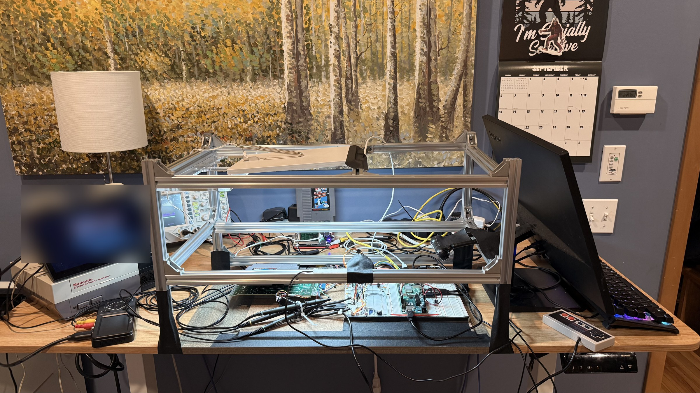
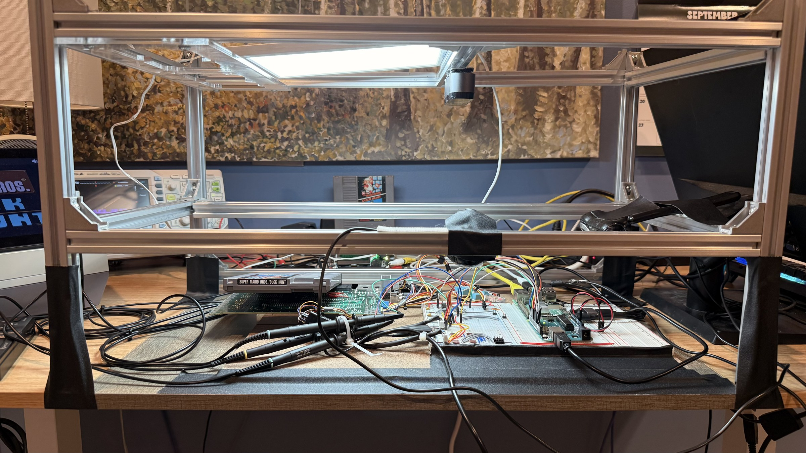
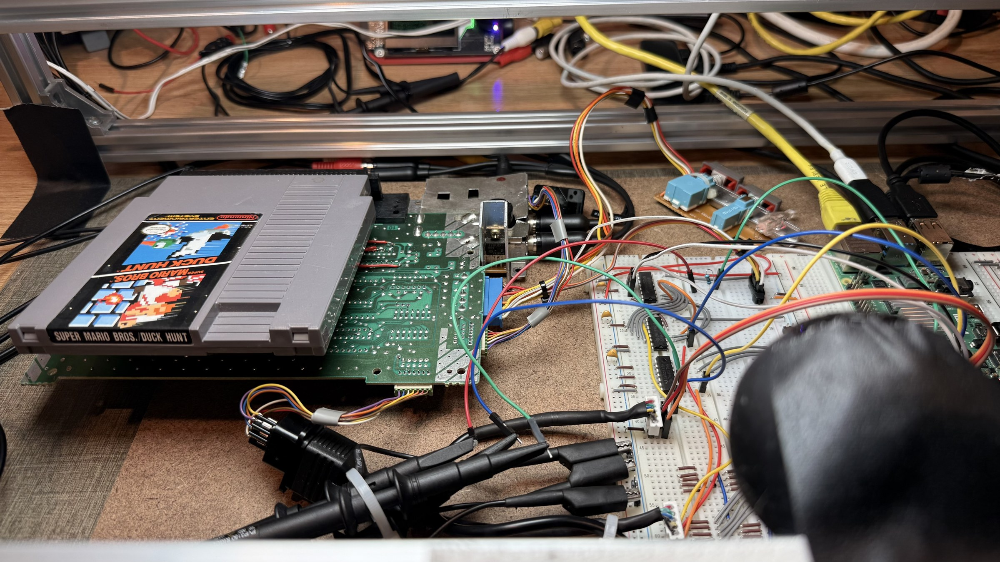
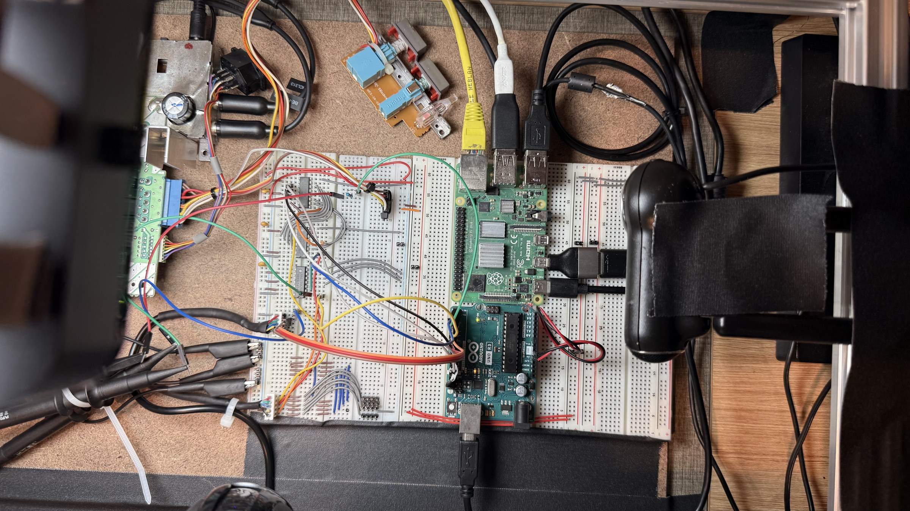

# The QA rig: the cameras and the boards, in inches and pixels

The bench's eyes are fixed to a metal frame over a backing board, and
this file is what "fixed" means: where each thing is, so a moved camera
or board is a number to check against rather than a map to re-read.
Dimensions from the user, 2026-09-15; pixel scales MEASURED off the
frames named. `tools/board-overlay.py --read` reads the hole map off a
frame at a known pose; `docs/board-map.json` names the pose it was read
at.

## The backing board and the breadboards

| item | size | where |
|---|---|---|
| backing board | 12 by 18 in | under everything; the frame's uprights at its long edges |
| breadboard block | 6.5 by 10 in (three boards and a rail strip, side by side) | flush against the backing board's right short edge, centred, 3 in of board above and below it |
| the chip board | one of the three | the one nearest the backing board's edge (position as photographed: read off the frame, `docs/board-map.json` `band`) |

The breadboard's hole pitch is 0.1 in, which is what every pixel scale
below is measured against.

## The cameras

| camera | device (by-id) | job | mount | frame | scale |
|---|---|---|---|---|---|
| Logitech BRIO | `usb-046d_Logitech_BRIO_1C8D6975` | the board eye: the hole map, the named close-ups, the timed board grabs | on the frame's cross-bar over the breadboards, straight down, raised and levelled 2026-09-15, gaffer-taped and velcroed | 1920 by 1080, MJPG (USB 2: 4K is not on offer) | LOCKED 2026-09-15 (`captures/b15-all.jpg`): 11.1 px per hole at zoom 100, the same along columns and rows (level: no foreshortening), 28 at zoom 250, 53 at zoom 500; focus 18; the whole backing board in frame. The map is read per board off a zoom-250 frame (`docs/board-map.json` names each board's frame, aim and band) and the as-built photograph is drawn on those frames |
| Logitech QuickCam Pro 9000 | `usb-046d_0990_08DF0A45` | the side eye across the board: the three chips and the UNO's leads in profile from the Pi's side | on the backing board's Pi side, low, looking across the breadboards toward the console | 1600 by 1200, MJPG | LOCKED 2026-09-15 (`docs/lab/rig-side-eye-9000.jpg`): the chips at about a third of the frame's width; a housing's pins show in profile at about 4 px each |
| Logitech QuickCam Communicate Deluxe | `usb-046d_09a2_ABAD8310` | the second side eye, along the chip board's rails side from the cable end: the probe clips, the console cable's housing, U3's rails-side landings | on the frame's upright at the cable end, low | 1280 by 960, MJPG | LOCKED 2026-09-15 (`docs/lab/rig-side-eye-communicate.jpg`): column numbers legible to about column 25, the Q lines' arc and the housings in profile |
| Roxio capture (em28xx) | `usb-1b80_Roxio_Video_Capture_USB_...` | the console's picture | on the splitter with the scope's CH3 | 720 by 480 NTSC | not a camera |

## The bench, photographed

Four phone photographs of the whole rig, 2026-09-15, after the lock
(phone metadata stripped; the TV's picture blurred, since the site
carries no commercial game screenshots):









## The pose, locked

All three cameras and the boards were gaffer-taped and velcroed on 2026-09-15 night, the BRIO levelled (the tilt of the first raised pose, 9.2 px a hole along the rows against 11.1 along the columns, is gone: both read 11.1). Every named close-up lands on its target and the map's rings sit on the holes across both boards to column 56 (`captures/views-20260915T152127`). This is the baseline: a moved thing shows as a frame that differs from `captures/b15-all.jpg` by more than sensor noise (the timed grabs' worst 40 px block against it), and the fix is `--read` again, not a new tool.

## What a pose costs and buys

At the earlier height the BRIO's close-ups put 120 px on a hole and a
wire end reads beside its column number without effort; at the raised
height they put 53 px on a hole, half that, and the column numbers are
still legible. What the raised pose buys is the whole rig in one
frame: the UNO, the Pi, the console's mainboard and the modulator,
which is what the timed grabs want as a record. What it costs is the
fine read of a housing across two columns, which the side eye is for.

## After every change: the regression check

```
python3 tools/rig-check.py --pi HOST
```

Four checks, each PASS or FAIL with the number that decided it: **light**
(the whole-board frame's level near the baseline's, the exposure under the
camera's cap: a dark room pins it at 312, seen 2026-09-15 when the sliding
bar took the light with it), **still** (the frame differs from the
baseline frame by sensor noise only: the worst 40 px block under 60, where
noise measures about 20 and a moved board or camera 120 and up; a FAIL
names the region in map coordinates), **board right** and **board middle**
(each read afresh off a zoom-250 frame at the aim the map records, and
held to the map within half a hole; a FAIL means the map is stale), and
the two **side eyes** (lit, and correlating with their baseline frames at
0.85 or better). Exit 1 on any FAIL. The frames it took are in
`captures/rig/`, so a FAIL can be looked at.

When a change was meant (a board added, the camera slid), the sequence is:
the check (it fails, and says where), the map re-read off the frames it
just took (`tools/board-overlay.py --read-boards --frames
right=captures/rig/right.jpg,middle=captures/rig/middle.jpg`, with
`--aims` and `--bands` when a board no longer sits in its frame), the
overlay (`tools/board-overlay.py captures/rig/all.jpg`) looked at with
the rings on the holes, and then the check again with `--baseline`, which
refuses if any check fails on the frames the baseline would be made of.
The baseline's measurements are `docs/rig-baseline.json`, dated; its
frames are `captures/rig/baseline-*.jpg`.

### The signal paths, the same way

```
python3 tools/bench-check.py
```

The eye's check says nothing about the electrons. This one runs the
measurements the bring-up and the register walk held: the bridge answers
STATUS, the scope answers *IDN?, the console's polls come at about sixty
a second with eight clocks in every one (B0's gate 1), TRIG 20 stops the
scope on CH1, and fifteen bytes set into the register read back off D0 at
the eight mid-slots, pressed LOW, every one as set. It needs the console
on with a game polling; without polls the checks that need them are
SKIPPED with that reason, not failed. The scope's settings are read
first and put back after. A byte that differs is taken again before it
counts, because the game does not clock every poll alike (one poll in
fifteen came with its eight clocks in 68 us against the usual 98,
2026-09-15), and a retake is reported. Screenshots in `captures/bench/`.
First run 2026-09-15 23:35: bridge, scope, polls (1212 in 20 s, all
eight clocks), trigger and walk 15 of 15, no regression.

With `--hands manual` or `--hands head` it also checks the two hands,
reset and power, by the poll stream: the game stops polling while the
CPU is held or the power is off and polls again after, and the polls are
counted per quarter second (the Pi's bridge hands lines over in batches
of about 100 ms, so arrival times cannot see the 17 ms cadence). Manual
means your hand on the front panel, the button held two seconds, the
switch off for a count of three; head means the Pi's GPIO17 through OK1
and GPIO27 through K1, the same two measurements. The front panel's own
button stays wired in parallel with OK1 and its switch in series with
K1, so a wiring that works by hand and not from the head shows as
exactly that. The relay module's input is active low: the head daemon
drives it so (fixed 2026-09-16), and the Pi's GPIO27 rests as an input
with a pull-down until something claims it, which is the relay ON. A
`gpio=27=op,dh` line in the Pi's config.txt is the cure, to be set once
the relay is in and its rest state measured.

## When something moves

1. `python3 tools/eye.py sweep NAME --pi HOST --from 10 --to 40 --step 4`: the focus.
2. `python3 tools/eye.py grab bN-all --pi HOST --preset board`: the frame.
3. `python3 tools/board-overlay.py --read captures/bN-all.jpg`: the map and the views, if the pose is the rig's (straight down, `frame_rotate` set and the boards in their `band`s); otherwise the bands first.
4. `python3 tools/eye.py views --pi HOST` and `tools/view-rings.py` on the set: are the rings on the holes.
5. `python3 tools/board-overlay.py captures/bN-all.jpg`: the as-built photograph.
